## Objectius d'aprenentatge

::: {.resultat title="En acabar aquesta sessió seràs capaç de..."}
-   Descriure què és l'Administració de Sistemes i quin és el rol de la persona que l'exerceix.
-   Identificar les tasques i responsabilitats típiques d'un administrador de sistemes, incloent-hi els perfils moderns (DevOps, SRE) en què pot evolucionar aquest rol.
:::

## Què significa que un sistema «funciona»?

::: center
Aquesta és la pregunta clau que ens acompanyarà durant tota la unitat i que ens ajudarà a entendre què és l'administració de sistemes.
:::

::: fragment
Un sistema funciona quan...

-   està **disponible** quan l'usuari el necessita
-   té un **rendiment** adequat
-   és **segur** davant d'accessos i atacs
-   és **fiable**, sense fallar constantment
-   pot **créixer** (escalar) si cal
-   es pot **mantenir** al llarg del temps
:::

::: notes
Comencem la unitat amb una pregunta senzilla però que ens servirà de fil conductor durant tot el curs: què significa que un sistema "funcioni"? A primera vista sembla una pregunta trivial, però darrere hi ha totes les dimensions que un administrador de sistemes ha de garantir: disponibilitat, rendiment, seguretat, fiabilitat, escalabilitat i mantenibilitat. Cadascuna d'aquestes paraules és, en realitat, un concepte tècnic que definirem amb precisió al llarg de la unitat. Al final tornarem a aquesta mateixa pregunta i veurem que la resposta s'ha tornat molt més rica.
:::

## Què és l'Administració de Sistemes?

::::: columns
::: {.column width="20%"}

:::

::: {.column width="80%"}
L'administració de sistemes és la *disciplina tècnica* que implica la **configuració, la gestió, la supervisió i el manteniment** **continu** **d'infraestructures informàtiques (servidors, xarxes, emmagatzematge de dades, programari, seguretat, etc.)**, per garantir la seva **disponibilitat, rendiment, seguretat i funcionalitat**, amb l'objectiu de **satisfer** les necessitats *operacionals* i *estratègiques* de l'organització.
:::
:::::

:::::: fragment

------------------------------------------------------------------------

::::: columns
::: {.column width="20%"}

:::

::: {.column width="80%"}
Un **administrador** és una persona que té cura, gestiona o dirigeix els béns o els interessos d'una altra persona o entitat. En aquest cas, configurar, gestionar, supervisar i mantenir **sistemes** informàtics.
:::
:::::
::::::

::: notes
Si preguntem a ChatGPT que ens defineixi formalment què és l'Administració de Sistemes, ens dirà que és la disciplina tècnica que implica la configuració, la gestió, la supervisió i el manteniment continu d'infraestructures informàtiques (servidors, xarxes, emmagatzematge de dades, programari, seguretat, etc.), per garantir la seva disponibilitat, rendiment, seguretat i funcionalitat, amb l'objectiu de satisfer les necessitats operacionals i estratègiques de l'organització.

Segons la RAE, un **administrador** és una persona que té cura, gestiona o dirigeix els béns o els interessos d'una altra persona o entitat. En aquest cas, configurar, gestionar, supervisar i mantenir sistemes informàtics. Això implica que la primera part de la definició de ChatGPT està en línia amb la definició de l'administrador.
:::

## Què és un sistema?

::::: columns
::: {.column width="20%"}

:::

::: {.column width="80%"}
Un **sistema** és un conjunt d'elements interconnectats que treballen junts per aconseguir un objectiu comú. El **Sistema Informàtic** està format per maquinari, programari, dades, xarxes, persones, etc., que treballen junts per processar informació.
:::
:::::

::: notes
Segons la RAE, un **sistema** és un conjunt d'elements interconnectats que treballen junts per aconseguir un objectiu comú. El **Sistema Informàtic** està format per maquinari, programari, dades, xarxes, persones, etc., que treballen junts per processar informació. Això implica que la segona part de la definició de ChatGPT necessita ser més específica per reflectir la complexitat i diversitat dels sistemes informàtics i no únicament la infraestructura.
:::

## Què hem de garantir en un sistema?

::::: columns
::: {.column width="50%"}
-   **Disponibilitat**: proporció del temps en què el servei és operatiu i accessible.
    -   Es pot expressar com a percentatge o *uptime*.
-   **Rendiment**: com respon el sistema davant una càrrega concreta.
    -   **Latència**, **throughput**, **IOPS**, temps de resposta, utilització de CPU/memòria.
:::

::: {.column width="50%"}
-   **Seguretat**: protegir el sistema i la informació segons la tríada **CIA**:
    -   **Confidencialitat**: només hi accedeixen els autoritzats.
    -   **Integritat**: la informació no és alterada indegudament.
    -   **Disponibilitat**: els recursos són accessibles quan es necessiten.
-   **Funcionalitat**: el sistema fa allò que els requisits especifiquen.
    -   Es verifica amb **requisits i proves d'acceptació**, no amb una única mètrica.
:::
:::::

::: {.concepte .fragment}
No existeix una única *mètrica de rendiment* ni una única *mètrica de seguretat*: primer cal definir **què volem observar i quin objectiu volem assolir**.
:::

::: notes
Aquí és important corregir una simplificació habitual: disponibilitat, rendiment, seguretat i funcionalitat no són quatre mètriques equivalents.

La **disponibilitat** sí que es pot expressar directament com una proporció de temps operatiu. La veurem quantitativament més endavant amb MTBF i MTTR.

El **rendiment** és multidimensional. Depenent del sistema ens interessaran mètriques diferents: latència o temps de resposta, throughput o nombre d'operacions per unitat de temps, IOPS en sistemes d'emmagatzematge, amplada de banda en xarxes o utilització de CPU i memòria. Dir simplement "eficiència" no ens permetria mesurar ni comparar el sistema.

La **seguretat** es pot introduir amb la tríada CIA: confidencialitat, integritat i disponibilitat. La disponibilitat apareix també com a propietat general del servei perquè, en seguretat, la mateixa propietat forma part del model CIA. Més endavant podrem afegir autenticació, autorització, xifratge i auditoria com a mecanismes per assolir aquests objectius.

La **funcionalitat** tampoc és una mètrica. És el conjunt de comportaments que el sistema ha de proporcionar. Per això es concreta mitjançant requisits i es comprova amb proves d'acceptació o altres criteris verificables.

La idea important per als estudiants és: **abans de mesurar, hem de definir què volem observar i quin nivell considerem acceptable.**
:::

## Com mesurem el rendiment?

::::: columns
::: {.column width="50%"}
-   **Latència**: temps que triga una operació a completar-se.
-   **Throughput**: quantitat de treball processat per unitat de temps.
-   **IOPS**: operacions d'entrada/sortida per segon.
:::

::: {.column width="50%"}
-   **Utilització**: percentatge de capacitat consumida d'un recurs.
-   **Temps de resposta**: latència percebuda pel client.
-   **Errors / saturació**: senyals que el sistema no pot assumir la càrrega.
:::
:::::

::: {.exemple .fragment}
Un servidor pot tenir **baixa utilització de CPU** i, alhora, una **latència molt alta** perquè el coll d'ampolla és la xarxa, el disc o una dependència externa.
:::

::::::: fragment
:::::: columns
::: {.column width="50%"}
### Percentils de latència

-   **p50** — mediana; representa l'experiència típica.
-   **p95** — el 5% de les peticions és més lent.
-   **p99** — l'1% de les peticions és més lent.
-   **p99.9** — el 0,1% de les peticions és més lent.
:::

:::: {.column width="50%"}
::: {.exemple .fragment title="De la mètrica a l'SLO"}
Si definim: **99,9% de les peticions en menys de 200 ms**, estem establint, un objectiu equivalent a **p99.9 ≤ 200 ms**, sempre que la finestra temporal i la població mesurada estiguin definides de la mateixa manera.
:::
::::
::::::
:::::::

::: notes
El rendiment no és una única xifra. Depèn del tipus de sistema i de la pregunta que vulguem respondre.

La **latència** ens diu quant triga una operació; el **throughput**, quantes operacions podem processar per unitat de temps; les **IOPS** són especialment útils per caracteritzar emmagatzematge; i la **utilització** ens indica quina part de la capacitat d'un recurs està ocupada.

Aquestes mètriques s'han d'interpretar juntes. Una CPU al 40% no implica necessàriament que el sistema tingui bon rendiment: pot existir un coll d'ampolla en el disc, la xarxa o una dependència externa.
:::

## Quines són les necessitats a satisfer?

::::: columns
::: {.column width="50%"}
### Operacionals

Condicions necessàries perquè el servei funcioni **avui**:

-   disponibilitat i SLO
-   rendiment i capacitat
-   seguretat i control d'accés
-   còpies de seguretat i recuperació
-   monitorització i resposta a incidents
:::

::: {.column width="50%"}
### Estratègiques

Decisions que permeten que el sistema continuï sent viable **demà**:

-   escalabilitat i creixement
-   costos i eficiència
-   mantenibilitat i automatització
-   adaptació a nous requisits
-   continuïtat del negoci i compliment normatiu
:::
:::::

::: notes
La distinció entre necessitats operacionals i estratègiques només és útil si la podem concretar.

Les **necessitats operacionals** descriuen les condicions que hem de satisfer per mantenir el servei en funcionament: disponibilitat, rendiment, seguretat, backups, monitorització i resposta als incidents.

Les **necessitats estratègiques** tenen un horitzó més llarg: poder créixer, controlar els costos, reduir el treball manual, adaptar-nos a nous requisits i mantenir la continuïtat del negoci.

La frontera no és absoluta. Per exemple, l'escalabilitat és una propietat tècnica però també una decisió estratègica quan sabem que la càrrega creixerà.
:::

## Una definició més completa

L'administració de sistemes no consisteix només a gestionar màquines.

::: {.definicio .fragment title="...basada en la meva experiència"}
És la disciplina tècnica que implica la configuració, gestió, supervisió i manteniment continu d'infraestructures informàtiques (servidors, xarxes, emmagatzematge de dades, programari, seguretat, etc.) **així com la coordinació de les persones usuàries, polítiques, procediments i dades associades**, per garantir la disponibilitat, rendiment, seguretat i funcionalitat del sistema, amb l'objectiu de satisfer les necessitats operacionals i estratègiques de l'organització.
:::

::: {.concepte .fragment title="paraules clau"}
Infraestructura + Persones + Processos + Dades + Polítiques
:::

::: notes
Les definicions inicials (la "de manual" i la de la RAE) no són incorrectes, però són una mica limitades: un sistema no només està format per infraestructura (maquinari, programari, xarxes, etc.), sinó que també inclou altres elements com les persones usuàries, les polítiques, els procediments i les dades que hi estan relacionades. Aquesta definició més completa incorpora aquests elements per donar una visió més realista de l'administració de sistemes: no és només "tenir cura de les màquines", és coordinar tot un ecosistema al voltant d'elles.
:::

## Analogia amb Matrix

::: center
Quants de vosaltres heu vist la pel·lícula **Matrix**?
:::

::: fragment
-   **Qui controla el sistema?**
-   **Qui coneix el sistema per dins?**
-   **Qui és capaç de canviar-lo sense que la resta ho noti?**
:::

::: {.fragment style="text-align:center;"}

:::

::: notes
Abans de mostrar el vídeo, llancem tres preguntes a la classe: Qui controla el sistema? Qui el coneix per dins? Qui pot canviar-lo sense que la resta se n'adoni? Aquestes preguntes són exactament les que defineixen el rol d'un administrador de sistemes, i per això Matrix és una bona metàfora: els personatges principals són capaços de controlar i manipular el món virtual de Matrix, canviant la realitat a voluntat, de la mateixa manera que un administrador de sistemes configura, supervisa i manté la infraestructura que la resta d'usuaris només veu "des de fora". La pel·lícula ofereix la clàssica elecció entre la pastilla blava (seguir sent usuari, sense veure el sistema) i la vermella (veure'l tal com és, amb totes les responsabilitats que això comporta). És una manera amena d'introduir la diferència entre "usar" un sistema i "administrar-lo".
:::

## Evolució

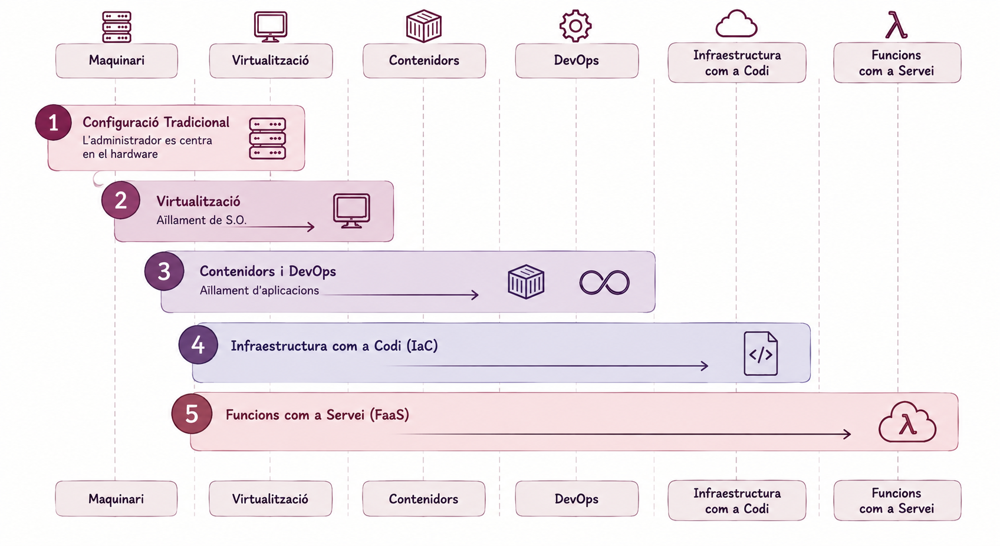

::: notes
Fa una dècada, el món del programari i el maquinari era molt diferent del que coneixem avui en dia. Els servidors eren físics, les aplicacions s'executaven en un únic servidor i la infraestructura era estàtica i difícil de modificar. Els administradors de sistemes treballaven en un entorn dominat pel maquinari i els cables, dedicant moltes hores a configurar i mantenir els servidors. Al mateix temps, els desenvolupadors de programari operaven en un univers separat, on les aplicacions s'executaven en servidors físics i tenien poc control sobre la infraestructura. Aquesta separació va generar una divisió notable entre els dos grups, amb escassa comunicació i col·laboració.

La situació va canviar radicalment amb l'arribada de la virtualització. Aquesta tecnologia va permetre als administradors de sistemes crear màquines virtuals i clons de servidors, simplificant enormement la gestió i configuració de la infraestructura. La virtualització va marcar un punt d'inflexió, transformant la manera de gestionar els sistemes i permetent als desenvolupadors provar i desplegar aplicacions en entorns aïllats, millorant així la qualitat i fiabilitat del programari i apropant els dos grups.

L'aparició dels contenidors va suposar un altre gran avanç en l'administració de sistemes. Aquesta tecnologia va permetre als desenvolupadors empaquetar aplicacions i les seves dependències en contenidors lleugers i portàtils, que podien ser executats en qualsevol entorn. Això va impulsar el concepte de DEVOPS, facilitant la col·laboració entre els equips de desenvolupament i operacions per automatitzar i millorar els processos de desplegament, monitorització i gestió de la infraestructura.

DEVOPS va emergir com a resposta a aquest canvi, promovent la col·laboració, comunicació i integració entre els equips de desenvolupament i operacions, amb l'objectiu de millorar la qualitat del programari i accelerar el desplegament d'aplicacions. Aquesta metodologia va permetre als equips treballar conjuntament per automatitzar i perfeccionar els processos relacionats amb la infraestructura.

La pràctica de Infrastructure as Code (IaC) va completar aquest procés, permetent gestionar la infraestructura de manera programàtica mitjançant codi. Això va permetre als equips de desenvolupament i operacions tractar la infraestructura com a codi, aplicant les mateixes pràctiques de desenvolupament de programari en la seva gestió. Com a resultat, la col·laboració, integració i automatització dels processos van millorar, augmentant la fiabilitat i escalabilitat de la infraestructura.

Finalment, amb l'aparició dels conceptes *serverless* i *Function as a Service (FaaS)*, una part de la infraestructura queda amagada darrere d'abstraccions gestionades pel proveïdor. Això **difumina** la frontera entre desenvolupament i operacions, però no la fa desaparèixer: continuen existint decisions sobre arquitectura, identitat i permisos, observabilitat, costos, disponibilitat, capacitat i resposta davant incidents. Els administradors de sistemes han evolucionat de tècnics centrats exclusivament en infraestructura física a perfils d'enginyeria que poden treballar en diversos nivells d'abstracció.

És important remarcar el missatge clau d'aquesta diapositiva: l'administrador de sistemes no ha desaparegut amb tota aquesta evolució, simplement ha pujat de nivell d'abstracció. Abans gestionava cables i màquines físiques; ara pot estar gestionant polítiques d'infraestructura com a codi o configuracions serverless. Però en cada un d'aquests nivells (maquinari, sistema operatiu, màquina virtual, contenidor, IaC, cloud, serverless) segueix havent-hi algú que ha de prendre decisions, configurar, supervisar i respondre quan alguna cosa falla. Aquesta pregunta —què continua havent de gestionar algú a cada nivell?— és la que ens acompanyarà a les properes unitats del curs.
:::

## Sortides Professionals

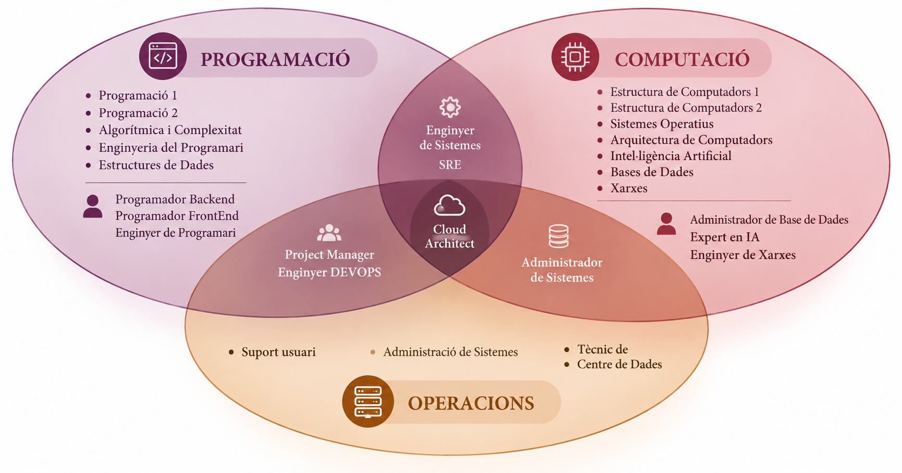

::: notes
L'administració de sistemes és una disciplina àmplia i diversa, que no segueix una única via d'aprenentatge. Aquesta professió inclou una gran varietat de rols i especialitzacions, però no compta amb un itinerari professional clarament establert, fet que dificulta l'ensenyament de tots els seus aspectes en una sola assignatura. Si observeu el pla d'estudis del Grau en Enginyeria Informàtica, veureu que inclou assignatures orientades a la programació, amb sortides professionals com a desenvolupadors de programari en diferents àmbits. Alhora, també ofereix formació en computació (xarxes, sistemes operatius, bases de dades), amb possibilitats laborals com a enginyer de xarxes o administrador de bases de dades.

Tradicionalment, l'administració de sistemes ha estat vinculada a les operacions, amb sortides professionals com a tècnic de suport o tècnic de centre de dades, sovint allunyades dels perfils d'un enginyer informàtic. No obstant això, avui en dia, l'administració de sistemes ha evolucionat significativament, donant lloc a perfils més avançats i tècnics com DevOps, SRE (Site Reliability Engineer), i Cloud Engineer, que ofereixen oportunitats laborals molt més atractives i alineades amb les necessitats del mercat actual.

Aquesta assignatura té com a objectiu introduir-vos al món de l'administració de sistemes i aplicacions, així com a la seva gestió i manteniment. Ho farem amb una visió actualitzada, orientada cap a les sortides professionals més demandades en el mercat laboral, preparant-vos per a perfils amb més responsabilitat i especialització dins del camp de les tecnologies de la informació.
:::

# La feina de l'administrador de sistemes {.smaller}

## El rol de l'administrador de sistemes - *Similituds amb un bomber*

> Els administradors de sistemes han de tenir coneixements tècnics profunds i una actitud proactiva per anticipar problemes i, si cal, resoldre'ls sota pressió, tal com ho faria un bomber en una emergència.

::: center-container

:::

::: notes
El rol tradicional de l'administrador de sistemes pot ser semblant al d'un bomber. Ha de treballar per prevenir incendis, però quan hi ha un incendi ha de córrer per apagar-lo i restaurar la situació el més ràpid. No importa l'hora, el lloc o el dia, l'administrador de sistemes ha de ser capaç de respondre a les emergències i solucionar els problemes de manera eficient i efectiva. Això requereix una gran habilitat tècnica, coneixements profunds dels sistemes i una actitud proactiva per anticipar-se als problemes i resoldre'ls ràpidament. Els administradors de sistemes han de ser tant proactius com reactius, prevenint problemes i responent ràpidament davant els imprevistos per garantir la continuïtat del servei. Poden utilitzar eines com Nagios, Zabbix, Prometheus per monitoritzar els sistemes i detectar problemes abans que es converteixin en emergències reals. Però, han d'intervenir i improvisar quan calgui per resoldre els problemes i restaurar la normalitat.
:::

## El rol de l'administrador de sistemes - *Similituds amb un científic*

-   Els administradors de sistemes han de ser capaços de resoldre problemes complexos i trobar solucions creatives.
-   Això pot ser semblant al treball d'un científic, que ha de plantejar hipòtesis, realitzar experiments i analitzar dades per arribar a conclusions.

::::::: {.exemple .fragment title="Touch a Banana to get WiFi Access"}
:::::: columns
:::: {.column width="30%"}
::: center-container

:::
::::

::: {.column width="70%"}
Per exemple, una empresa pot necessitar donar codis d'accés temporals als usuaris per connectar-se a la xarxa Wifi. En lloc de gestionar-ho manualment, un administrador de sistemes va crear un sistema que generava codis d'accés temporals quan els usuaris tocaven un plàtan connectat a un Raspberry Pi.
:::
::::::
:::::::

::: notes
Una altra característica de l'administrador de sistemes és la seva capacitat per resoldre problemes complexos i trobar solucions creatives. Això pot ser semblant al treball d'un científic, que ha de plantejar hipòtesis, realitzar experiments i analitzar dades per arribar a conclusions.

Per exemple, una empresa pot necessitar donar codis d'accés temporals als usuaris per connectar-se a la xarxa Wifi. En lloc de gestionar-ho manualment, un administrador de sistemes va crear un sistema que generava codis d'accés temporals quan els usuaris tocaven un plàtan connectat a un Raspberry Pi. Aquesta solució creativa i inesperada va permetre automatitzar una tasca manual i millorar l'experiència de l'usuari. Això demostra la capacitat de l'administrador de sistemes per trobar solucions innovadores i eficients als problemes que es presenten.
:::

## Salari *Administrador de Sistemes* {.center}

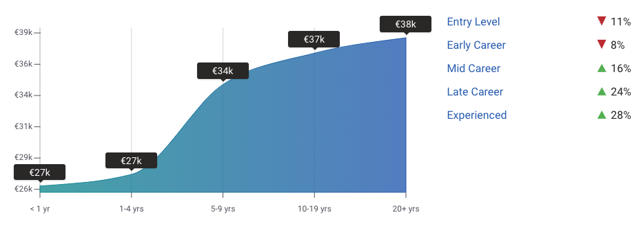{width="70%" style="align:center;"}

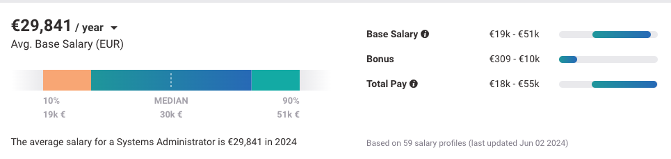{width="80%" style="text-align:center;"}

::: notes
El salari base segons el portal payscale a Espanya és de mitjana 30k amb un potencial de creixement a futur de 10k. Aquesta dada és orientativa i pot variar segons la ubicació, l'experiència, les habilitats i la formació del professional. Però, en comparativa amb altres sortides professionals, l'administrador de sistemes igual no és una opció interessant. Analitzem ara sortides professionals més especialitzades.
:::

## Especialitzacions en Administració de Sistemes

::::: columns
::: {.column width="45%"}
-   Administradors de Xarxa, Emmagatzematge, Seguretat
-   Operadors de Xarxa
-   Arquitectes de Sistemes
-   Tècnics de Suport
-   Tècnics de Centre de Dades
-   Enginyers de Sistemes
-   Enginyer DEVOPS
-   Enginyer SRE (Site Reliability Engineer)
:::

::: {.column width="45%"}
[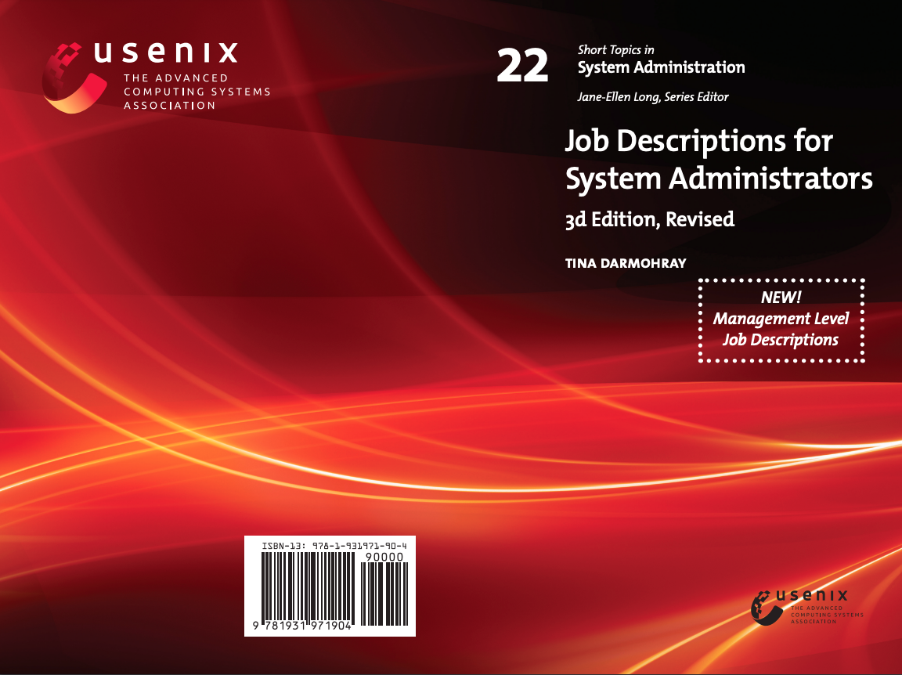](https://2459d6dc103cb5933875-c0245c5c937c5dedcca3f1764ecc9b2f.ssl.cf2.rackcdn.com/books/22_jobs3rd_complete.pdf)
:::
:::::

::: notes
Hi ha una gran varietat d'especialitzacions dins l'àmbit de l'administració de sistemes, cada una amb responsabilitats úniques que poden influir en el salari i els rols. A continuació, detallem algunes d'aquestes especialitzacions:

-   Administradors de Xarxa: S'encarreguen de la configuració, gestió i manteniment de routers, switches, firewalls i altres dispositius de xarxa en entorns físics i virtuals. La seva tasca és garantir la connectivitat i seguretat de les xarxes de l'empresa.

-   Administradors de Emmagatzematge: Gestionen sistemes de fitxers, solucions de còpies de seguretat i tecnologies d'emmagatzematge de dades com NETAPP o EMC. Són responsables d'assegurar que les dades estiguin segures i accessibles.

-   Administradors de Seguretat: Protegeixen els sistemes informàtics contra amenaces i atacs cibernètics. Implementen polítiques de seguretat, gestionen certificats digitals i realitzen auditories de seguretat per protegir la informació sensible.

-   Operadors de Xarxa: Supervisionen el funcionament diari de les xarxes, gestionant el trànsit de dades i resolent problemes de connexió o rendiment. S'asseguren que les xarxes funcionin sense interrupcions.

-   Arquitectes de Sistemes: Dissenyen i planifiquen la infraestructura tecnològica de l'empresa. Són responsables d'assegurar que els sistemes compleixin els requisits de rendiment, seguretat i escalabilitat.

-   Tècnics de Suport: Ofereixen assistència tècnica als usuaris, resolent problemes i incidents a través de sistemes de tickets. La seva tasca és garantir que els usuaris puguin utilitzar les tecnologies sense problemes.

-   Tècnics de Centre de Dades: Gestionen i mantenen els servidors, xarxes i altres equips físics en els centres de dades. S'asseguren que el centre de dades funcioni amb alta disponibilitat i rendiment.

-   Enginyers de Sistemes: Són responsables de dissenyar, implementar i mantenir la infraestructura informàtica de l'empresa. La seva tasca és assegurar que els sistemes compleixin els requisits operatius i tècnics.

Ara veurem dues especialitzacions més avançades i amb més demanda en el mercat laboral actual: Enginyer DEVOPS i Enginyer SRE (Site Reliability Engineer) amb detall. També us deixo un enllaç a un llibre que parla de les diferents especialitzacions.
:::

## Què és un Site Reliability Engineer (SRE)?

Els **Site Reliability Engineers (SRE)** són enginyers que apliquen principis de programari i d'enginyeria a l'operació de serveis, amb un focus explícit en **fiabilitat, disponibilitat, latència, rendiment i capacitat**. L'automatització i el programari són mitjans per reduir el treball manual i fer que l'operació escali amb el servei.

-   **Fiabilitat del Sistema**: Nagios, Zabbix, Prometheus.
-   **Escalabilitat**: Kubernetes, Docker, Terraform.
-   **Monitorització i Alertes**: Grafana, ELK Stack, PagerDuty.
-   **Gestió d'Incidents**: Jira, ServiceNow, Slack.
-   **Optimització de Rendiment**: New Relic, Datadog, AppDynamics.
-   **Automatització de Processos**: Ansible, Puppet, Chef.

::: notes
La formulació clàssica de Ben Treynor Sloss, creador del terme SRE a Google, és que SRE és el que passa quan demanes a un enginyer de programari que dissenyi una funció d'operacions. La idea important no és la frase en si, sinó el canvi de mentalitat: aplicar enginyeria i programari a problemes que tradicionalment es resolien manualment. A Google, les responsabilitats d'SRE inclouen disponibilitat, latència, rendiment, eficiència, gestió del canvi, monitorització, resposta a emergències i planificació de capacitat. [Font: Ben Treynor Sloss, Google SRE — In Conversation](https://sre.google/in-conversation/). Això implica centrar-se en la millora de la fiabilitat i l'escalabilitat dels sistemes, així com en la implementació de pràctiques d'integració i lliurament continu (CI/CD), reforçar la seguretat i optimitzar els costos operatius.

Els SREs aprofiten el programari com una eina per gestionar i automatitzar els sistemes, identificar i resoldre problemes, i automatitzar processos amb l'objectiu final de construir infraestructures escalables i fiables que responguin als objectius de negoci.

Les funcions principals d'un SRE inclouen la monitorització constant dels sistemes, la gestió d'alertes i resposta a incidents, l'automatització de tasques rutinàries, i l'optimització de l'escala i adaptabilitat dels recursos tecnològics. A més, col·laboren estretament amb els equips de desenvolupament per assegurar la millora contínua de la fiabilitat i el rendiment dels sistemes.
:::

## Salari d'un Site Reliability Engineer {.center}

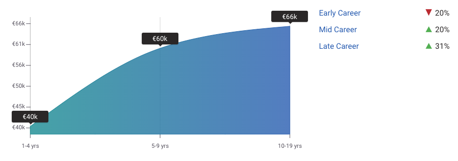{width="70%"}

{width="80%"}

::: notes
Els Site Reliability Engineers (SREs) experimenten un increment salarial substancial en comparació amb els administradors de sistemes. Un SRE pot començar guanyant fins a 50.000 € durant el seu primer any, i amb l'experiència, arribar fins als 70.000 € o més en un termini de cinc anys. Aquest diferencial salarial reflecteix la creixent importància i demanda de professionals especialitzats en la fiabilitat i escalabilitat dels sistemes informàtics. A diferència dels administradors de sistemes, els SREs no només es dediquen a mantenir la infraestructura, sinó que també se centren en optimitzar la resiliència i eficiència dels serveis digitals, assegurant que compleixin els Acords de Nivell de Servei (SLA). Per tant, si t'interessa un rol amb responsabilitats més tècniques i un potencial de creixement major, el camí d'SRE pot ser una opció molt atractiva dins del mercat laboral actual. Les seves responsabilitats dins de l'empresa són molt importants i tenen un impacte directe amb els objectius de negoci.
:::

## Com mesurem la fiabilitat?

:::::: columns
::: {.column width="33%"}
### SLI

*Service Level Indicator*

**Què mesurem.**

La mètrica concreta observada (p. ex. % de peticions correctes).
:::

::: {.column width="33%"}
### SLO

*Service Level Objective*

**Quin nivell volem.**

L'objectiu intern de fiabilitat (p. ex. 99,9% de peticions correctes).
:::

::: {.column width="33%"}
### SLA

*Service Level Agreement*

**Què comprometem.**

L'acord (sovint contractual) amb el client; pot establir compensacions si no es compleix.
:::
::::::

::: {.exemple .fragment title="Error de pressupost"}
Si l'SLO és 99,9%, el marge que queda fins al 100% (0,1%) és el teu **pressupost d'error** (*error budget*): quant *et pots permetre fallar* abans d'incomplir l'objectiu.
:::

::: notes
Un dels conceptes fonamentals de la pràctica SRE —i que sovint queda amagat darrere de la paraula "fiabilitat"— és la distinció entre SLI, SLO i SLA. No cal desenvolupar-ho amb profunditat avui, però sí que el reconegueu com a vocabulari bàsic del rol.

-   **SLI (Service Level Indicator)**: la mètrica que realment mesurem sobre el sistema, per exemple el percentatge de peticions que responen correctament, o la latència mitjana.
-   **SLO (Service Level Objective)**: l'objectiu intern que ens marquem per a aquell indicador, per exemple "el 99,9% de les peticions han de respondre en menys de 200ms". És un objectiu de fiabilitat, normalment intern a l'equip.
-   **SLA (Service Level Agreement)**: el compromís, sovint contractual, que fem amb el client o usuari final, normalment amb penalitzacions econòmiques si no es compleix. Sol ser una mica menys exigent que l'SLO intern, per deixar marge de seguretat.

Un concepte derivat molt important en la cultura SRE és l'**error budget** (pressupost d'error): si el nostre SLO és 99,9%, això vol dir que tenim un marge del 0,1% de "fallades permeses" abans d'incomplir l'objectiu. Aquest pressupost es pot "gastar" en desplegaments arriscats, experiments o canvis ràpids; quan s'esgota, l'equip prioritza estabilitat per sobre de noves funcionalitats. Aquesta idea connecta directament amb el que veurem més endavant a la unitat quan parlem de disponibilitat, MTBF i MTTR: SLI/SLO/SLA són, en el fons, la manera com les organitzacions professionalitzen i formalitzen aquells mateixos conceptes.
:::

## Què és un DevOps Engineer?

Els DevOps Engineers són professionals clau en la integració i col·laboració entre els equips de desenvolupament (Dev) i operacions (Ops), amb l'objectiu principal de millorar l'eficiència i agilitat dels processos de desenvolupament de programari. El seu treball se centra en accelerar el desplegament d'aplicacions, millorar la qualitat del programari i optimitzar els fluxos de treball, fent ús intensiu de l'automatització, la integració contínua (CI) i el lliurament continu (CD).

-   **Automatització**: Jenkins, GitLab CI, Bamboo.
-   **Gestió d'infraestructura com a codi (IaC)**: Terraform, Ansible, CloudFormation.
-   **Contenidors i orquestració**: Docker, Kubernetes.
-   **Monitorització i registre**: Prometheus, Grafana, ELK Stack.
-   **Col·laboració i comunicació**: Slack, Jira, Confluence.

::: notes
Mentre que els Sysadmins tradicionalment s'ocupen de la gestió i manteniment de la infraestructura, com ara servidors, xarxes i sistemes operatius, els DevOps Engineers van més enllà d'aquestes tasques. El seu rol inclou l'automatització de processos, la implementació de pipelines de CI/CD, la gestió de contenidors (com Docker) i la infraestructura com a codi (IaC), com Terraform o Ansible. En lloc d'enfocar-se només en el manteniment i la disponibilitat dels sistemes, els DevOps Engineers treballen per integrar millor el desenvolupament i les operacions, assegurant que els nous llançaments de programari siguin ràpids, segurs i consistents.

Tot i que hi ha solapaments entre DevOps i SRE, les diferències clau radiquen en l'enfocament i les prioritats. Mentre que els DevOps Engineers se centren en l'optimització dels processos de desenvolupament i operacions a través de la col·laboració i l'automatització, els SREs estan més orientats a la fiabilitat i escalabilitat dels sistemes en producció. El SRE té un enfocament més específic en mantenir els serveis en línia, gestionant incidents, optimitzant el rendiment i assegurant-se que es compleixen els SLA. Tot i que ambdós rols treballen amb eines similars, com CI/CD i contenidors, els SREs tenen més responsabilitats en la resolució d'incidents crítics i en la millora de la resiliència del sistema.

Com podeu veure les eines tecnològiques que utilitzen els DevOps Engineers són molt similars a les dels SREs, però la seva aplicació i objectius són diferents. Per tant, apunteu-vos aquestes eines i tecnologies, ja que són essencials pel món laboral actual.
:::

## Salari d'un DevOps Engineer {.center}

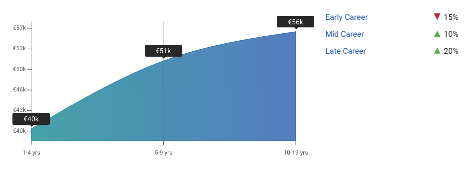{width="70%"}

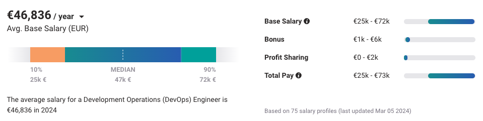{width="80%"}

::: notes
Els DevOps Engineers, igual que els SREs, gaudeixen d'un salari més alt i d'un major potencial de creixement professional en comparació amb els administradors de sistemes tradicionals. Si t'apassiona l'administració de sistemes enfocada a l'automatització del desplegament de programari, el disseny i la gestió de pipelines de CI/CD, l'ús de contenidors i la implementació d'infraestructura com a codi, el rol de DevOps Engineer pot oferir-te una carrera més atractiva i plena d'oportunitats. En l'actualitat, moltes empreses busquen professionals amb habilitats en DevOps.
:::

## DevOps vs SRE

::::: columns
::: {.column width="50%"}
### DevOps

**Com col·laborem i lliurem software?**
:::

::: {.column width="50%"}
### SRE

**Com aconseguim que els serveis siguin fiables a escala?**
:::
:::::

::: {.fragment .concepte .center}
Les **fronteres** entre aquests perfils *i el sysadmin tradicional* són cada vegada menys rígides.
:::

::: notes
Després de veure les definicions detallades de DevOps i SRE, val la pena quedar-nos amb una síntesi molt simple i memorable: un DevOps Engineer es pregunta principalment com col·laborem i lliurem software més ràpid i millor; un SRE es pregunta principalment com aconseguim que els serveis siguin fiables a gran escala. En la pràctica, ambdós rols comparteixen moltes eines (CI/CD, contenidors, IaC) i, cada vegada més, també comparteixen responsabilitats amb el sysadmin tradicional. No busqueu fronteres estrictes entre aquests perfils: al mercat laboral real, sovint es barregen.
:::

# Terminologia bàsica

## Arquitectura Client-Servidor

Una arquitectura **client-servidor** involucra uns sistemes que necessiten serveis i uns servidors que processen i responen a aquestes peticions.

::::: columns
::: {.column width="40%"}
### Client

Un ordinador o dispositiu capaç de rebre informació o utilitzar un servei o proveïdor.

### Servidor

Un ordinador o dispositiu remot capaç de proveir accés a un servei o a informació.
:::

::: {.column width="60%"}
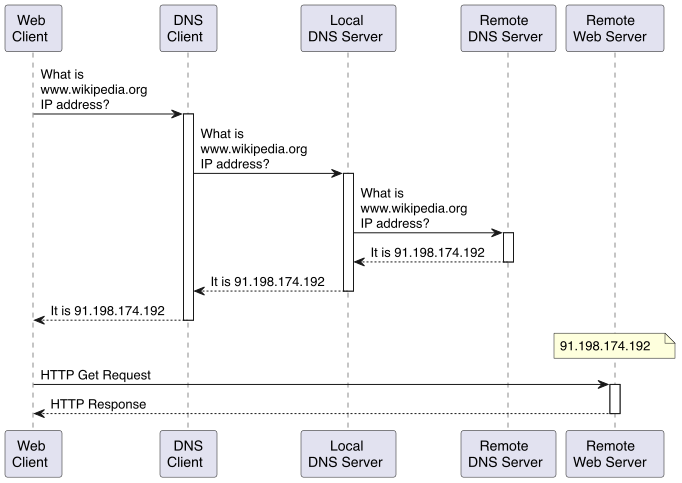
:::
:::::

::: {.reflexio .fragment}
Client i servidor descriuen **rols** dins d'una comunicació, no tipus de màquina. Un mateix sistema pot actuar com a client i com a servidor simultàniament.
:::

::: notes
Un dels conceptes més importants en l'administració de sistemes és l'arquitectura client-servidor. Aquesta arquitectura implica la interacció entre dos tipus de sistemes: els clients, que sol·liciten serveis o informació, i els servidors, que processen i responen a aquestes peticions. Aquesta arquitectura és àmpliament utilitzada en entorns informàtics, com ara la web, les xarxes d'ordinadors i les aplicacions empresarials.

Per exemple, quan un usuari accedeix a una pàgina web, el seu navegador actua com a client i sol·licita la pàgina al servidor web. El servidor de DNS consulta la URL i retorna l'adreça IP del servidor web. El navegador envia una petició HTTP o HTTPS al servidor web, que respon amb els fitxers necessaris per mostrar la pàgina al navegador. Aquest procés implica la comunicació entre el client i el servidor per proporcionar la informació sol·licitada a l'usuari.

És important remarcar davant la classe una idea que sovint es perd en la primera presa de contacte: "client" i "servidor" no són tipus de màquina, sinó **rols** que un sistema exerceix dins d'una comunicació concreta. Un mateix ordinador pot ser servidor en una comunicació i client en una altra, fins i tot alhora. Per exemple, el servidor web que respon les peticions dels navegadors és, alhora, client del servidor de base de dades quan li demana informació per construir la pàgina; i també pot ser client d'un servidor DNS, d'un servidor d'autenticació, etc. Aquesta idea de "rol" és la mateixa que reprendrem més endavant quan parlem dels diferents tipus de servidor: no és el maquinari el que determina si una màquina és client o servidor, sinó la funció que exerceix en una comunicació concreta.
:::

## Característiques *Client-Servidor*

:::::: columns
::: {.column width="45%"}
### Avantatges

-   Sistema centralitzat → Totes les dades en un lloc.
-   Polítiques de recuperació de dades.
-   Separació de la lògica.
:::

::: {.column width="10%"}
:::

::: {.column width="45%"}
### Limitacions del disseny centralitzat

-   **Punt únic de fallada** (*single point of failure*): si el servidor cau, tots els clients perden el servei alhora.
-   **Coll d'ampolla d'escalabilitat**: el servidor ha de créixer (o replicar-se) per atendre més clients; el rendiment del sistema depèn de la seva capacitat.
-   **Concentració de recursos**: tota la lògica i les dades depenen d'un mateix punt.
:::
::::::

::: {.exemple .fragment title="Consideracions de seguretat"}
La concentració de dades i lògica en un punt també fa del servidor un objectiu atractiu per a atacs: denegació de servei (DoS), *man-in-the-middle*, *phishing* o usurpació d'identitat (*spoofing*). Cal autenticació, autorització i xifratge per mitigar-ho —qüestions que no són exclusives d'aquesta arquitectura, però que hi són especialment rellevants.
:::

::: notes
Aquesta arquitectura té avantatges i inconvenients. Entre els avantatges es troba la centralització de les dades, ja que tota la informació es troba en un únic lloc, el que facilita la gestió i la recuperació de les dades. A més, permet establir polítiques de recuperació de dades i separar la lògica de negoci de la interfície d'usuari, el que facilita la gestió i el manteniment del sistema. D'aquesta manera, els desenvolupadors poden centrar-se en la lògica de negoci sense preocupar-se de la interfície d'usuari. Per exemple, en una aplicació web, la lògica de negoci es pot gestionar al servidor, mentre que la interfície d'usuari es pot gestionar al client.

És important distingir dos nivells diferents en els inconvenients d'aquesta arquitectura. D'una banda, hi ha limitacions pròpies del disseny: com que les dades i la lògica es concentren en el servidor, aquest es converteix en un **punt únic de fallada** (*single point of failure*) — si cau, tots els clients perden el servei simultàniament, a diferència, per exemple, d'una arquitectura P2P on la caiguda d'un node no atura la resta. També apareix un **coll d'ampolla d'escalabilitat**: per atendre més clients cal fer créixer o replicar el servidor, i el rendiment global del sistema queda limitat per la seva capacitat.

D'altra banda, hi ha consideracions de seguretat que, tot i no ser exclusives d'aquesta arquitectura, hi són especialment rellevants perquè la centralització la fa un objectiu atractiu per a atacs: un atac de denegació de servei (DoS) envia moltes peticions al servidor per saturar-lo i fer-lo caure; un atac de l'home al mig (*man-in-the-middle*) intercepta les comunicacions entre el client i el servidor per obtenir informació sensible; el *phishing* enganya els usuaris amb correus falsos per obtenir informació confidencial; i la usurpació d'identitat (*spoofing*) consisteix a fer-se passar per una altra persona o sistema per obtenir accés no autoritzat. Aquestes amenaces no són exclusives del client-servidor — qualsevol sistema connectat a una xarxa n'és susceptible —, però la centralització de dades i lògica en un únic punt en fa un objectiu especialment rendible per a un atacant. Per tant, cal implementar mesures com l'autenticació, l'autorització i el xifratge per protegir el sistema i les dades dels usuaris.

A la figura s'observa com múltiples clients es comuniquen amb un servidor central per obtenir informació o serveis. I com múltiples servidors poden comunicar-se amb altres servidors per obtenir informació o serveis. També 1 client pot comunicar-se amb múltiples servidors. Per exemple, un client pot accedir a un servidor web per obtenir informació i a un servidor de correu per enviar correus electrònics. El servidor web pot comunicar-se amb el servidor de correu per enviar notificacions als usuaris.
:::

## Un servidor és un rol

::: reflexio
Client i servidor són rols, no tipus de màquina.
:::

::: fragment
-   **ofereix** un servei
-   **rep** peticions
-   **consumeix o proporciona** recursos
:::

::: {.fragment .center}
Un mateix ordinador pot exercir diversos rols alhora.
:::

::: notes
Abans d'enumerar tipus de servidors, val la pena fixar-nos en el que tenen tots en comú: un servidor no és un tipus de màquina, és un rol que exerceix una màquina (física o virtual) —exactament la mateixa idea que hem introduït a la diapositiva de client-servidor. Aquest rol consisteix a oferir un servei concret, rebre peticions relacionades amb aquest servei, i consumir o proporcionar els recursos necessaris per atendre-les. És important entendre que "servidor" no és sinònim de "màquina dedicada": un mateix ordinador pot exercir simultàniament el rol de servidor web i de servidor de base de dades, per exemple, encara que en entorns de producció sovint se separen per motius de rendiment i seguretat.
:::

## Servidors més comuns

::::: columns
::: {.column width="45%"}
-   Servidor d'autenticació.
-   Servidor de fitxers.
-   Servidor d'emmagatzematge (*storage server*).
-   Servidor de correu.
-   Servidor de base de dades.
:::

::: {.column width="45%"}
-   Servidor SSH.
-   Servidor Web.
-   Servidor d'aplicacions.
-   Servidor de backups.
-   Servidor de còmput.
:::
:::::

::: notes
Hi ha molts tipus de servidors en funció de l'objectiu que tenen. Alguns dels servidors més comuns són els servidors d'autenticació, que s'encarreguen de gestionar l'accés dels usuaris als sistemes; els servidors de fitxers, que emmagatzemen i gestionen els fitxers i documents de l'empresa; els servidors d'emmagatzematge, que proporcionen recursos d'emmagatzematge a altres sistemes; segons l'arquitectura, poden exposar fitxers (NAS) o blocs (SAN); els servidors de correu, que gestionen el correu electrònic de l'empresa; els servidors de base de dades, que emmagatzemen i gestionen les dades de l'empresa; els servidors SSH, que permeten l'accés remot als servidors; els servidors web, que allotgen les pàgines web de l'empresa; els servidors d'aplicacions, que executen les aplicacions de l'empresa; els servidors de backups, que realitzen còpies de seguretat de les dades de l'empresa; i els servidors de còmput, que realitzen càlculs i processos computacionals entre altres. Recordeu la diapositiva anterior: cadascun d'aquests noms és només una etiqueta per a un rol concret (oferir un servei, rebre peticions, consumir/proporcionar recursos), no pas un tipus diferent de maquinari.
:::

## Exemple d'arquitectura escalable {.smaller}

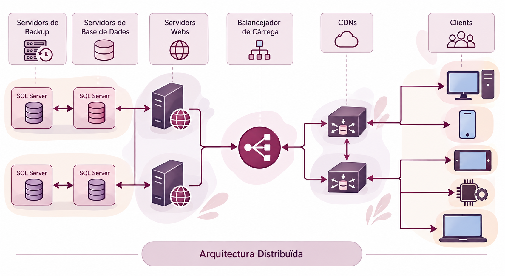{style="text-align:center;"}

::: notes
A la figura proporcionada es mostra una arquitectura típicament utilitzada per al desplegament d'una web escalable i fiable. En aquesta arquitectura, el punt d'entrada és un balancejador de càrrega, que distribueix les peticions entre els diversos servidors web. Els servidors web, que poden ser rèpliques, allotgen les pàgines web i gestionen les peticions dels usuaris. Aquestes pàgines web necessiten accedir a un servidor de base de dades per emmagatzemar i gestionar les dades associades. Cada base de dades està protegida per un servidor de backups, que realitza còpies de seguretat per garantir la recuperació en cas de fallades. A més, per millorar la velocitat de càrrega de les pàgines web, es fa servir un dispositiu CDN (Content Delivery Network) que redirigeix les peticions als servidors més propers a l'usuari.

Aquesta arquitectura és àmpliament utilitzada per allotjar llocs webs, ja que ofereix una combinació d'escalabilitat i fiabilitat, assegurant un rendiment òptim i una alta disponibilitat per als usuaris finals.
:::

## Les preguntes que ha de respondre un administrador

::: center
Aquestes són les preguntes que intentareu respondre durant tota l'assignatura.
:::

## Problemes més comuns servidors (I)

-   **Qui i com accedeix a la informació?**
    -   Determinar qui (usuari, procés o servei) pot accedir a quins fitxers i directoris i com ho pot fer (lectura, escriptura, execució).
    -   Permisos, ACLs, polítiques de seguretat.
-   **Com protegeixo la informació?**
    -   Determinar com protegir la informació sensible i confidencial.
    -   Xifratge, contrasenyes, autenticació, autorització, auditoria, backups.
-   **Com asseguro el sistema?**
    -   Protegir el sistema contra atacs i amenaces.
    -   Firewall, IDS/IPS, antivirus, actualitzacions, patches, hardening.

::: notes
Un dels problemes més comuns en els servidors és determinar qui i com accedeix a la informació. Això implica definir qui (usuari, procés, servei) pot accedir a quins fitxers i directoris i com ho pot fer (lectura, escriptura, execució). Per fer-ho, es poden utilitzar permisos, llistes de control d'accés (ACLs) i polítiques de seguretat per garantir que només els usuaris autoritzats puguin accedir a la informació.

Un altre problema comú és com protegir la informació sensible i confidencial. Això implica determinar com protegir la informació per evitar l'accés no autoritzat. Per fer-ho, es poden utilitzar tècniques com el xifratge, les contrasenyes, l'autenticació, l'autorització, l'auditoria i els backups per garantir la seguretat i la privacitat de la informació.

Un altre problema és com assegurar el sistema contra atacs i amenaces. Això implica protegir el sistema contra atacs externs i interns que puguin comprometre la seguretat i la integritat del sistema. Per fer-ho, es poden utilitzar eines com el firewall, els sistemes de detecció i prevenció d'intrusions (IDS/IPS), l'antivirus, les actualitzacions, els patches i el hardening per garantir la seguretat del sistema.
:::

## Problemes més comuns servidors (II)

-   **Com puc saber si el client és qui diu ser?**
    -   Autenticar els usuaris i els dispositius.
    -   Contrasenyes, certificats digitals, autenticació multifactorial.
-   **Quins avantatges/inconvenients té un disseny respecte a un altre?**
    -   Determinar quin disseny és més adequat per a les necessitats de l'empresa.
    -   Escalabilitat, rendiment, seguretat, disponibilitat, fiabilitat.
-   **Com asseguro el bon funcionament?**
    -   Garantir que el sistema funcioni correctament i sense problemes.
    -   Monitorització, alertes, backups, redundància, tolerància a fallades.

::: notes
Un altre problema és com autenticar els usuaris i els dispositius per garantir que siguin qui diuen ser. Això implica autenticar els usuaris i els dispositius per garantir que només els usuaris autoritzats puguin accedir a la informació. Per fer-ho, es poden utilitzar tècniques com les contrasenyes, els certificats digitals i l'autenticació multifactorial per garantir la seguretat i la privacitat de la informació.

Un altre problema comú és determinar quins avantatges i inconvenients té un disseny respecte a un altre. Això implica determinar quin disseny és més adequat per a les necessitats de l'empresa en termes d'escalabilitat, rendiment, seguretat, disponibilitat i fiabilitat. Per fer-ho, es poden avaluar els avantatges i inconvenients de cada disseny per garantir que s'adeqüi a les necessitats de l'empresa.

Un altre problema és com assegurar el bon funcionament del sistema. Això implica garantir que el sistema funcioni correctament i sense problemes. Per fer-ho, es poden utilitzar tècniques com la monitorització, les alertes, els backups, la redundància i la tolerància a fallades per garantir que el sistema funcioni correctament i sense problemes.
:::

## Problemes més comuns servidors (III)

-   **Com dissenyo polítiques i plans d'emergència si tot falla?**
    -   Preparar-se per a situacions d'emergència i desastres.
    -   Plans de contingència, plans de recuperació, plans de resposta a incidents.
-   **Com analitzo post-mortem les causes d'un atac?**
    -   Identificar les causes d'un atac i prendre mesures correctives.
    -   Anàlisi forense, auditoria, millora contínua.

::: notes
Un altre problema és com dissenyar polítiques i plans d'emergència si tot falla. Això implica preparar-se per a situacions d'emergència i desastres per garantir la continuïtat del negoci. Per fer-ho, es poden utilitzar plans de contingència, plans de recuperació i plans de resposta a incidents per garantir que l'empresa pugui respondre de manera eficaç a situacions d'emergència i desastres.

Finalment, un altre problema és com analitzar post-mortem les causes d'un atac per identificar les causes i prendre mesures correctives. Això implica realitzar una anàlisi forense, una auditoria i una millora contínua per identificar les causes d'un atac i prendre mesures correctives per evitar que es repeteixin en el futur.

Aquestes dues diapositives (I i II) són, probablement, les més importants de tota la unitat: no us demano que us les memoritzeu, sinó que reconegueu que són exactament les preguntes que anireu responent, unitat rere unitat, al llarg de tota l'assignatura. Quan parlem de permisos, xifratge, monitorització o plans de contingència, ho fem perquè donen resposta a alguna d'aquestes preguntes.
:::

## Del concepte a la infraestructura real {.center}

### Sistema → Servei → Servidor → Rack → CPD

::: notes
Fins ara hem parlat de sistemes, serveis i servidors en abstracte. Però tot això s'acaba materialitzant en maquinari real, en un espai físic concret: un servidor s'instal·la en un rack, i els racks s'agrupen en un centre de dades (CPD). Les properes diapositives mostren exactament això amb fotografies reals, incloent el propi CPD de la UdL, per connectar els conceptes que hem après amb la infraestructura que hi ha darrere del Campus Virtual i dels serveis que useu cada dia.
:::

## Què és un centre de dades?

És una instal·lació que allotja un conjunt de servidors i equipament de xarxa (**recursos heterogenis**) per proporcionar recursos informàtics a diverses aplicacions i serveis (**càrregues de treball diverses**).

::: {style="text-align:center;"}
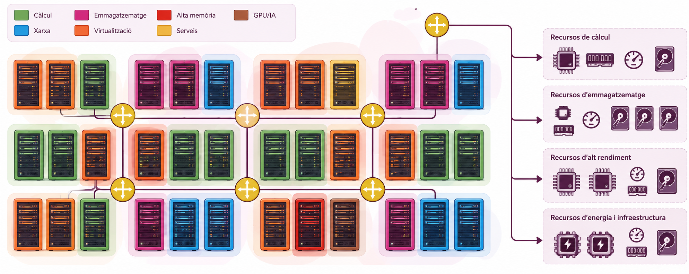
:::

::: notes
Un centre de dades o data center és un espai físic on s'allotgen els servidors, els dispositius de xarxa i altres equips informàtics necessaris per emmagatzemar, processar i distribuir la informació. Aquests centres de dades poden ser propis de l'empresa o externs, i poden ser gestionats per l'empresa o per un proveïdor de serveis. Els centres de dades són essencials per a les empreses que necessiten emmagatzemar i processar grans quantitats de dades, ja que proporcionen l'espai, la infraestructura i els recursos necessaris per garantir el funcionament dels sistemes informàtics.

Un exemple notable de reutilització d'estructures per a centres de dades és l'ús d'edificis històrics com esglésies i mines abandonades. Aquests espais, amb les seves condicions úniques i sovint amb una infraestructura sòlida, són adaptats per allotjar servidors i equips. Per exemple, l'antiga església de Saint-Ouen a França ha estat convertida en un centre de dades, aprofitant la seva estructura i espai per complir amb els requisits tecnològics moderns. D'altra banda, la mina de carboni de Pionen a Suècia ha estat transformada en un centre de dades subterrani, oferint una protecció física addicional contra desastres naturals i atacs.

Microsoft, amb el seu *Project Natick*, ha submergit centres de dades sencers al fons del mar (a la costa d'Escòcia), aprofitant la temperatura freda i estable de l'aigua per refredar-los passivament i reduir el consum energètic; a més, l'atmosfera de nitrogen segellada dins la càpsula va reduir la taxa de fallades respecte als servidors equivalents en terra. Google segueix una estratègia diferent, però també basada en l'aigua de mar: al seu centre de dades de Hamina (Finlàndia), utilitza aigua freda del mar Bàltic per refrigerar els servidors sense submergir-los. Aquestes iniciatives mostren la diversitat de solucions i enfoques per a la gestió de centres de dades, adaptant-se a les necessitats i condicions específiques de cada empresa.
:::

## Què és un rack?

Un **rack** és una estructura metàl·lica que allotja servidors, switches, routers i altres equips informàtics en un centre de dades.

::: {style="text-align:center;"}
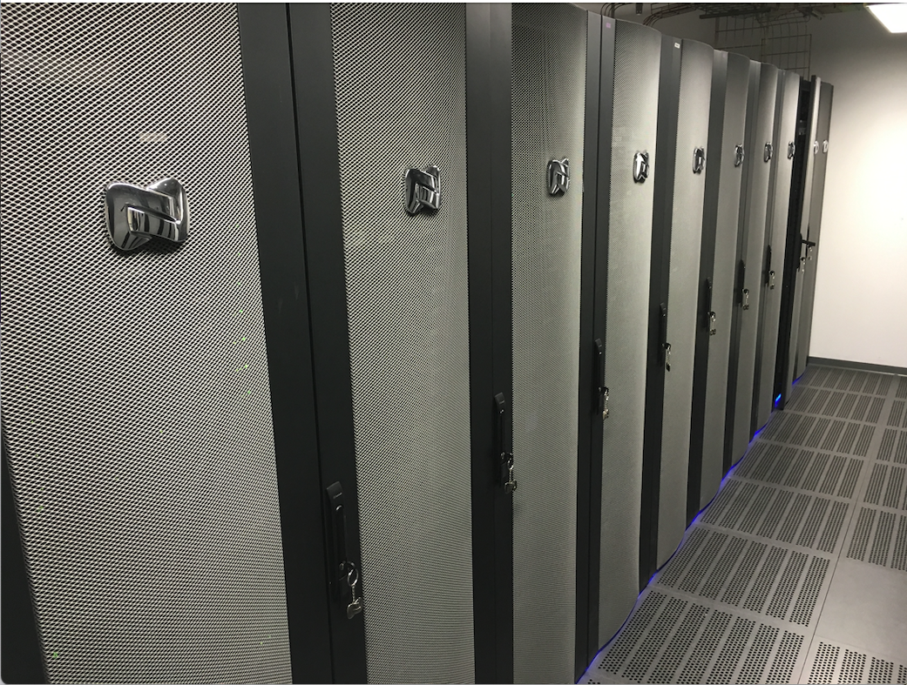{width="50%"}
:::

::: notes
Un rack és una estructura metàl·lica que allotja servidors, switches, routers i altres equips informàtics en un centre de dades. Aquests racks permeten organitzar i protegir els equips informàtics, així com facilitar la gestió dels cables i la refrigeració dels equips. Cada rack pot contenir diversos servidors, switches i altres equips, i es pot apilar verticalment per aprofitar l'espai disponible al centre de dades. A més, els racks disposen de panells laterals i portes per protegir els equips i garantir la seguretat dels servidors i altres equips informàtics.

Per exemple, a la imatge us mostro els racks d'un passadís del centre de dades de la Universitat de Lleida, on es poden aquests armaris, penseu que cada rack pot contenir diversos servidors, switches i altres equips informàtics, i únicament es veu un dels múltiples passadissos del centre de dades. En aquest centre de dades és on tenim el Campus Virtual, les eines i dades dels estudiants i professors, així com els servidors de recerca dels grups de recerca de la UdL, entre d'altres.
:::

## Exemple de racks

:::::::: columns
:::: {.column width="40%"}
::: {style="text-align:center;"}
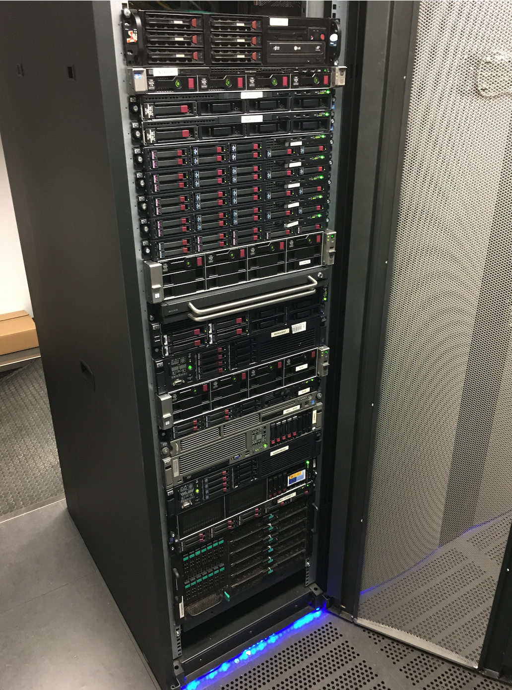{width="70%"}
:::
::::

::: {.column width="20%"}
:::

:::: {.column width="40%"}
::: {style="text-align:center;"}
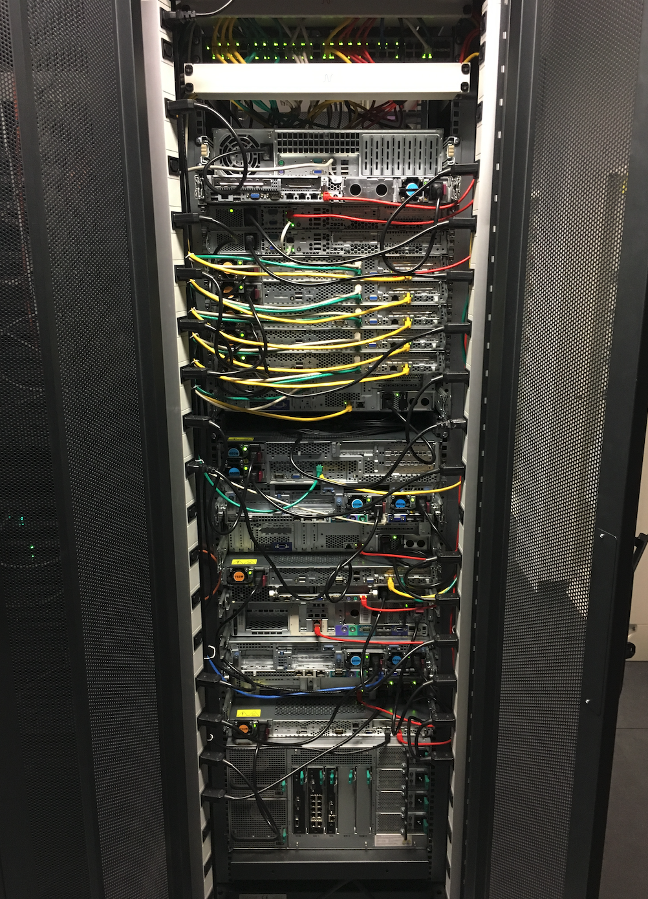{width="70%"}
:::
::::
::::::::

::: notes
Ara us mostro un rack, en concret els servidors són del grup de recerca en computació distribuïda. A la part de dalt es pot veure un switch, i la resta són servidors. A la part de davant es poden veure els servidors i a la part de darrera els cables de xarxa i alimentació. En aquest cas, hi ha diferents colors de cables per identificar la xarxa a la qual pertanyen i la seva funció.
:::

## Exemple de servidor {.smaller}

:::::::: columns
:::: {.column width="40%"}
::: {style="text-align:center;"}
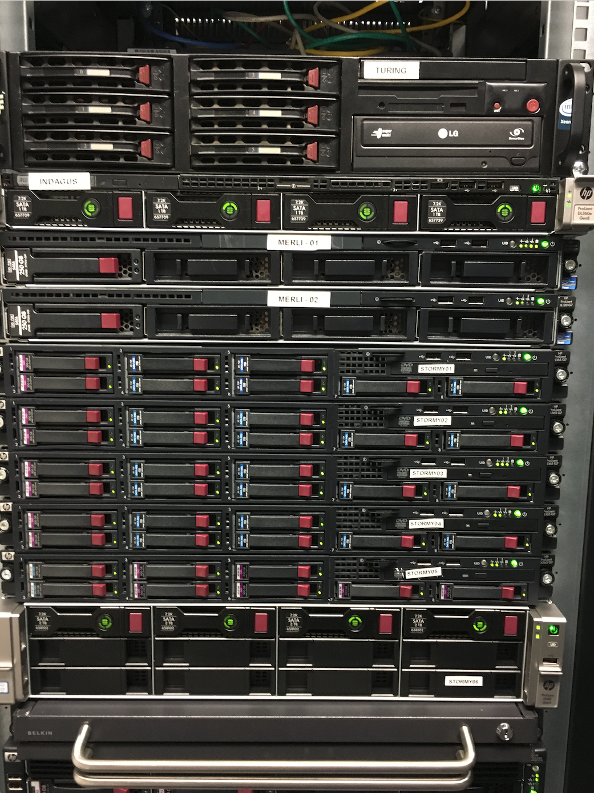{width="70%"}
:::
::::

::: {.column width="20%"}
:::

:::: {.column width="40%"}
::: {style="text-align:center;"}
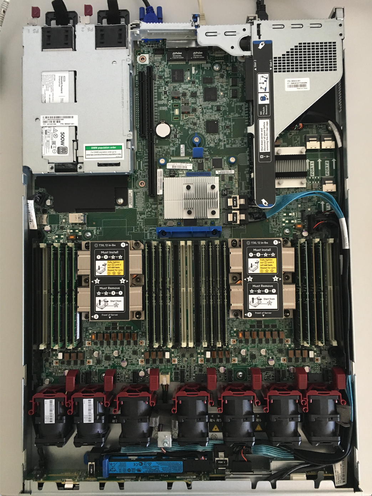{width="70%"}
:::
::::
::::::::

::: notes
En aquestes imatges podem fer zoom i veure els components exteriors i interiors d'un servidor. A la imatge 8 es pot veure com cada disc té un indicador de color per identificar el disc en cas de fallada. A la imatge 9 es pot veure la placa base, els discos durs, la font d'alimentació, la memòria RAM i el processador.
:::

## Què és un **switch**? {.smaller}

Un **switch** és un dispositiu de xarxa que connecta diversos equips informàtics per permetre la comunicació entre ells.

::: {style="text-align:center;"}
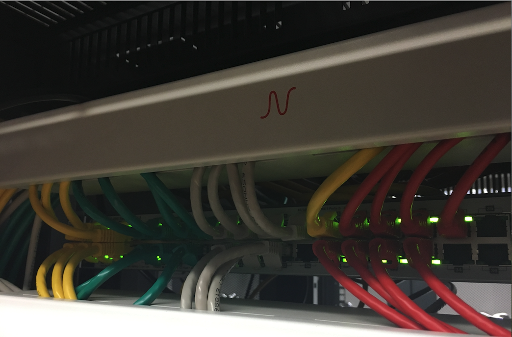{width="60%"}
:::

::: notes
Un switch Ethernet tradicional treballa principalment a **capa 2**: rep trames Ethernet i utilitza la seva taula de commutació per decidir per quin port les ha de reenviar segons l'adreça MAC de destinació.

Un router treballa principalment a **capa 3**: rep paquets IP i utilitza una taula de rutes per decidir cap a quina xarxa s'han d'encaminar. Aquesta distinció conceptual és més útil que memoritzar simplement "switch = xarxa local" i "router = Internet", perquè explica què està fent realment cada dispositiu.

Els switches gestionats també poden incorporar funcionalitats de capa 3; per tant, "L2 vs L3" és el model conceptual de base, no una frontera absoluta de tots els dispositius comercials. Les VLAN introdueixen segmentació lògica a capa 2 i permeten crear dominis de broadcast separats.
:::

# Disseny de sistemes informàtics

## Característiques d'un sistema

1.  Simplicitat
2.  **Mantenibilitat**
3.  Escalabilitat
4.  Seguretat
5.  Fiabilitat
6.  Disponibilitat
7.  Rendiment
8.  Facilitat d'ús

::: {.fragment .center}
*(Més endavant treballarem també l'observabilitat: la capacitat de saber què està passant dins d'un sistema.)*
:::

::: notes
En el disseny de sistemes informàtics, és important tenir en compte diverses característiques per garantir que el sistema sigui eficient, segur i fiable. Algunes de les característiques més importants d'un sistema són la simplicitat, la mantenibilitat, l'escalabilitat, la seguretat, la fiabilitat, la disponibilitat, el rendiment i la facilitat d'ús. En una assignatura que porta per nom "Administració i Manteniment", val la pena remarcar explícitament la mantenibilitat: la facilitat amb què un sistema es pot corregir, actualitzar o adaptar al llarg del temps. Més endavant al curs també parlarem d'observabilitat, és a dir, la capacitat de saber en tot moment què està passant dins d'un sistema mitjançant mètriques, logs i traces. Ara bé, sovint intentem dotar sistemes amb característiques que no es poden afegir després de la seva construcció. Per exemple, intentar aplicar "seguretat" després que les interfícies del sistema hagin estat definides produeix restriccions i limitacions; intentar fer un sistema amb limitacions intrínseques funcionar en circumstàncies per les quals no va ser dissenyat produeix "hacks" i "workarounds" i el resultat final sovint sembla més una casa de cartes fràgil que una estructura sòlida i fiable.

Per tant, quan discutim sobre el disseny de sistemes informàtics, és important tenir en compte aquestes característiques i assegurar-nos que el sistema compleixi els objectius de l'empresa i sigui capaç de respondre a les necessitats dels usuaris
:::

## Què és l'escalabilitat?

:::::: columns
::: {.column width="50%"}
L'**escalabilitat** és la capacitat d'un sistema per gestionar un augment de la càrrega de treball sense afectar el rendiment.

-   **Vertical**: augmentar la capacitat d'un servidor afegint més recursos (CPU, memòria, disc).
-   **Horitzontal**: augmentar la capacitat d'un sistema afegint més servidors.
:::

:::: {.column .fragment .center-container width="50%"}
::: {style="text-align:center;"}
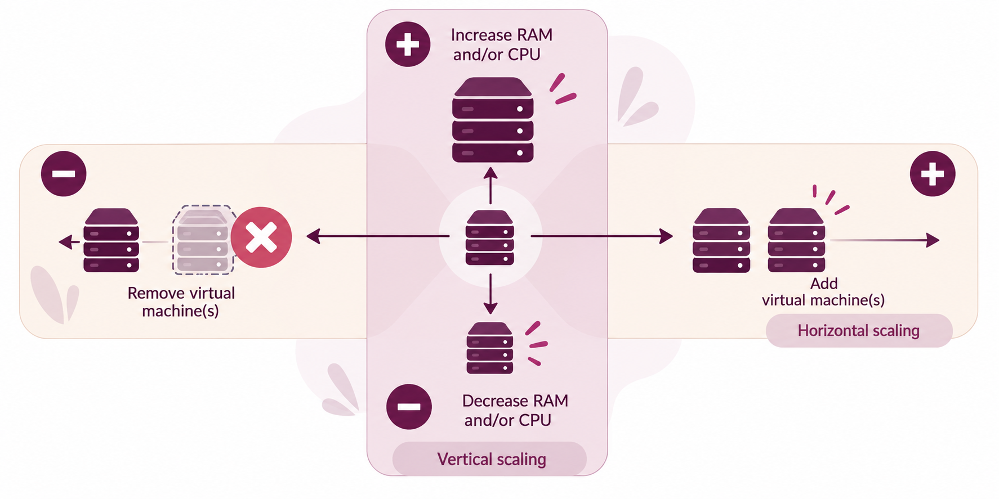
:::
::::
::::::

::: {.column width="5%"}
:::

::: {.exemple .fragment title="Costos d'escalabilitat"}
El cloud computing permet adaptar la capacitat disponible a la càrrega de treball real, pagant només pels recursos que s'utilitzen en cada moment.
:::

::: notes
Escalabilitat es refereix a la capacitat d'un sistema per gestionar un augment en la càrrega de treball sense que el seu rendiment es vegi afectat. És un concepte clau en el disseny de sistemes informàtics, especialment en entorns amb variacions en la demanda. Aquesta capacitat s'aconsegueix mitjançant dues estratègies principals:

-   Escalabilitat Vertical: Consisteix en millorar la capacitat d'un servidor afegint més recursos com CPU, memòria o disc. Això permet que un servidor maneje una càrrega de treball més gran sense necessitat de maquinari addicional.

-   Escalabilitat Horitzontal: Consisteix en augmentar la capacitat del sistema afegint més servidors. Això distribueix la càrrega de treball entre diversos servidors, millorant la capacitat global del sistema.

En l'entorn de cloud computing, aquest concepte es relaciona sovint amb elasticitat, que és la capacitat d'un sistema per adaptar-se de manera dinàmica a les fluctuacions de la càrrega de treball. Per exemple, una botiga en línia podria experimentar un augment significatiu de trànsit durant el Black Friday. Un sistema escalable i elàstic podria gestionar aquest augment de demanda sense perdre rendiment, i després reduir la capacitat quan la demanda torna a nivells normals.

L'objectiu és garantir que el sistema pugui mantenir un rendiment òptim i evitar problemes com temps d'espera llargs, errors o caigudes, que podrien afectar negativament l'experiència de l'usuari i els resultats comercials.
:::

## Què és la fiabilitat?

La **fiabilitat** és la capacitat d'un sistema de complir la seva funció durant un període determinat sense fallar, sota unes condicions de funcionament especificades.

El **MTBF** (*Mean Time Between Failures*) és una mesura habitual per caracteritzar el comportament de sistemes reparables.

::: {.concepte .fragment}
**Definició estadística:** el MTBF és el temps mitjà entre fallades del procés de fallades considerat.

**Estimació a partir de dades observades:**

$$
\widehat{MTBF} =
\frac{\text{temps total de funcionament}}
{\text{nombre de fallades}}
$$

Aquesta fórmula és un **estimador empíric**, no la definició formal del MTBF.
:::

::: {.exemple .fragment title="Un model simplificat"}
Si durant 10.000 hores de funcionament observem 10 fallades:

$$
\widehat{MTBF} = \frac{10.000}{10}=1.000\ h
$$

Això descriu el comportament mitjà observat; **no significa que la propera fallada es produirà d'aquí a 1.000 hores**.
:::

::: notes
La distinció entre magnitud estadística i estimador és important.

En un **model exponencial** amb taxa de fallada constant $\lambda$, el temps entre fallades segueix una distribució exponencial i:

$$
MTBF = \frac{1}{\lambda}
$$

Aquesta hipòtesi és útil per modelar la fase de vida útil d'un sistema, però no és universal.

La **corba de banyera (*bathtub curve*)** descriu qualitativament tres règims habituals de taxa de fallada:

1.  **Mortalitat infantil:** taxa inicial elevada, sovint associada a defectes de fabricació, configuració o desplegament.
2.  **Vida útil:** taxa aproximadament constant; és el règim on el model exponencial resulta especialment útil.
3.  **Desgast:** la taxa de fallada augmenta amb l'envelliment o el deteriorament.

Per tant, el MTBF observat és una mitjana condicionada al règim i a la població estudiats. Sense conèixer el model de fallades, l'edat del sistema i les seves condicions d'operació, **el MTBF per si sol no permet predir la propera fallada**.

Una forma de millorar la fiabilitat és introduir **redundància**, però això no elimina necessàriament les fallades: pot permetre que el servei continuï o reduir el temps de recuperació.
:::

## Redundància i tolerància a fallades

::: fragment
Algunes estratègies habituals són:

-   **Cold standby**: la reserva no està activa; cal iniciar-la o preparar-la després de la fallada.
-   **Warm standby**: la reserva està parcialment preparada.
-   **Hot standby / active-passive**: la reserva està preparada per assumir ràpidament el servei.
-   **Active-active**: diverses instàncies donen servei simultàniament.
:::

::: notes
La classificació cold/warm/hot és una simplificació útil per introduir el compromís entre **cost, temps de recuperació i grau de preparació**.

No hi ha una configuració universalment millor. La decisió depèn del SLO, del cost assumible, de la capacitat de detectar la fallada i de les dependències del servei.
:::

## HA, DR i Fault Tolerance

-   **Redundància** és un mecanisme de disseny
-   **HA, DR i FT** són conceptes més específics sobre com volem respondre a les fallades.

| Concepte | Objectiu | Exemple |
|------------------------|------------------------|------------------------|
| **HA — Alta Disponibilitat** | Minimitzar la interrupció del servei | Failover entre instàncies dins d'un entorn |
| **DR — Disaster Recovery** | Recuperar el servei després d'un desastre | Recuperació des d'una altra ubicació |
| **FT — Fault Tolerance** | Continuar funcionant davant d'una fallada | Components redundants amb continuïtat perceptiblement ininterrompuda |

::: notes
HA i FT no són sinònims. Una arquitectura **HA** acostuma a acceptar una petita finestra d'interrupció durant el failover; **fault tolerance** busca que la fallada d'un component no sigui perceptible per al servei.

**DR** tracta especialment els escenaris en què una ubicació o un entorn complet deixa d'estar disponible. Per això sovint implica una estratègia geogràficament separada.

Els termes tenen matisos diferents segons el marc o fabricant, però aquesta distinció és una bona base operativa per al curs.
:::

## Redundància i MTTR

La redundància pot reduir el **MTTR efectiu percebut pel servei** o, en una arquitectura tolerant a fallades, evitar que una fallada provoqui indisponibilitat.

| Estratègia | Ordre de magnitud de la interrupció [^1] | Efecte sobre el servei |
|----|---:|----|
| **Cold standby** | minuts → hores | Cal preparar/iniciar la reserva |
| **Warm standby** | segons → minuts | Reserva parcialment preparada |
| **Hot standby / active-passive** | segons → minuts | Failover ràpid |
| **Active-active** | segons → gairebé zero | El servei pot continuar mentre es redistribueix la càrrega |

[^1]: **Ordres de magnitud orientatives**, no valors universals: depenen de detecció, automatització, dependències i arquitectura.

::: notes
Ara podem connectar quantitativament redundància i disponibilitat:

$$
A = \frac{MTBF}{MTBF+MTTR}
$$

Si mantenim constant el MTBF, reduir el MTTR augmenta directament la disponibilitat.

Per exemple, amb MTBF = 1.000 h: - MTTR = 1 h → $A \approx 99,90\%$ - MTTR = 0,1 h → $A \approx 99,99\%$

Això converteix la redundància en una decisió quantitativa: no es tracta simplement de «tenir una còpia», sinó de decidir **quant temps d'interrupció podem permetre'ns i quin cost té reduir-lo**.

Els valors de la taula són orientatius. Un active-active mal dissenyat pot tenir una recuperació pitjor que un hot standby ben automatitzat.
:::

## Què és la disponibilitat? (I)

La **disponibilitat** d'un sistema es refereix a la seva capacitat per estar operatiu i accessible per als usuaris durant un període de temps determinat.

::: {.concepte .fragment}
**Atenció al terme «disponibilitat»:** aquí parlem de la disponibilitat del **servei** com a proporció de temps operatiu. En el model **CIA**, *Availability* és una propietat de seguretat: la informació i els serveis han d'estar accessibles quan són necessaris.
:::

::: fragment
La disponibilitat depèn de dues magnituds: el MTBF (com de sovint falla el sistema) i el MTTR (Mean Time To Repair, com de ràpid es repara). Un sistema pot fallar sovint però ser molt disponible si es repara gairebé instantàniament, i viceversa. Per exemple, si un sistema té un MTTR de 2 hores, això vol dir que, de mitjana, es triga 2 hores a reparar-lo després d'una fallada.
:::

::: fragment
$$ Disponibilitat = \frac{Temps\ de\ funcionament}{Temps\ de\ funcionament + Temps\ de\ reparar} $$
:::

## Què és la disponibilitat? (II)

::::::: columns
:::: {.column width="60%"}
::: {.exemple .fragment title="Exemple numèric"}
Amb MTBF = 999 h i MTTR = 1 h:

$$ A = \frac{999}{999+1} = 99,9\% $$

**99,9% ≠ 99,99%.** Quants minuts d'indisponibilitat anual implica cadascun?
:::
::::

:::: {.column width="40%"}
::: {.exemple .fragment title="SLA i acords de servei"}
Alguns serveis cloud ofereixen SLA del 99,99% o superior, segons el servei contractat i les condicions concretes. Si el proveïdor no compleix el SLA acordat, el contracte pot establir compensacions, sovint en forma de crèdits de servei.
:::
::::
:::::::

::: notes
La **disponibilitat** d'un sistema es refereix a la seva capacitat per estar operatiu i accessible per als usuaris durant un període de temps determinat. Depèn conjuntament del MTBF (amb quina freqüència falla) i del MTTR (Mean Time To Repair, com de ràpid es repara): Disponibilitat = MTBF / (MTBF + MTTR). Per exemple, si un sistema té un MTTR de 2 hores, això vol dir que, de mitjana, es triga 2 hores a reparar el sistema després d'una fallada. No confondre amb fiabilitat, que es refereix a la capacitat d'un sistema per operar sense interrupcions durant un període determinat.

Per exemple, un sistema pot tenir una alta fiabilitat, però una baixa disponibilitat si el temps de reparació després d'una fallada és llarg. D'altra banda, un sistema pot tenir una baixa fiabilitat, però una alta disponibilitat si es pot reparar ràpidament després d'una fallada.

Val la pena treballar un exemple numèric a classe: amb un MTBF de 999 hores i un MTTR d'1 hora, la disponibilitat és del 99,9%. Aquí és on convé aturar-se i preguntar als alumnes: 99,9% i 99,99% semblen números molt semblants, però a quants minuts d'indisponibilitat anual equival cadascun? (99,9% equival a uns 8,76 hores d'inactivitat l'any; 99,99% equival a poc més de 52 minuts). Aquesta diferència d'un sol "nou" té un impacte enorme en termes pràctics, i és un bon exercici per fer reflexionar sobre per què les empreses inverteixen tants recursos en pujar d'un "nou" al següent.

Pel que fa als SLA (Service Level Agreement), cal evitar presentar-los com una propietat fixa d'un proveïdor concret: els nivells de disponibilitat garantits depenen del servei específic contractat i de les condicions del contracte, i poden variar amb el temps. El que sí és consistent és el principi: si el proveïdor no compleix el SLA acordat, sol haver-hi compensacions en forma de crèdits de servei.

Aquest és un bon moment per tancar el cercle amb la diapositiva de SLI/SLO/SLA que vam veure a la secció d'SRE: la disponibilitat que acabem de calcular és exactament un SLI (la mètrica que mesurem), el percentatge que ens fixem com a objectiu (99,9%, 99,99%...) és el SLO, i el que finalment es compromet contractualment amb el client és el SLA. Val la pena que els alumnes vegin que aquests conceptes "moderns" de la cultura SRE no són res més que una formalització i professionalització d'idees que ja hem introduït amb MTBF i MTTR.
:::

## Principi de disseny: Keep It Simple (KISS)

::: {.concepte .fragment}
La **complexitat és un cost operatiu**: cada component, dependència i excepció afegeix configuració, punts de fallada i càrrega de manteniment.
:::

### Com es tradueix en sistemes?

-   **Prefereix mecanismes estàndard** abans que solucions pròpies si resolen el mateix problema.
-   **Redueix components i dependències** que no aporten valor.
-   **Fes explícita la configuració** i evita passos manuals ocults.
-   **Automatitza allò repetitiu**, però sense introduir una plataforma més complexa que el problema.
-   **Documenta les decisions i els casos excepcionals**.

::: {.exemple .fragment title="Exemple: desplegar un servei web"}
Per a dos servidors, pot ser més mantenible una configuració estàndard + una eina d'automatització que introduir una plataforma d'orquestració completa sense necessitat real.

**KISS no vol dir *fer-ho simple a qualsevol preu*** : vol dir evitar complexitat que no està justificada pels requisits.
:::

::: notes
KISS no és simplement "fer coses senzilles". En administració de sistemes, la complexitat té un cost operatiu concret: més components que actualitzar, més dependències que monitoritzar, més configuracions que entendre i més possibles modes de fallada.

Per això és útil preguntar-se: quants components necessitem?, quantes dependències tenim?, quants passos manuals cal executar?, què passa si un component falla?, qui serà capaç de mantenir-ho d'aquí a dos anys?

L'exemple no pretén afirmar que una tecnologia concreta sigui "dolenta". Si necessitem orquestració, alta disponibilitat o una escala determinada, la complexitat addicional pot estar perfectament justificada. El principi KISS ens obliga a justificar-la.
:::

# Eines i tecnologies

## Del problema a l'eina

| Problema | Categoria | Exemples |
|----|----|----|
| Aïllar recursos | Virtualització / Hypervisor | VMs, Contenidors |
| Consum sota demanda | Cloud Computing | IaaS, PaaS, SaaS |
| Configurar molts servidors | Configuration management | Ansible, Puppet, Chef |
| Definir infraestructura amb codi | Infrastructure as Code | Terraform, CloudFormation |
| Saber què passa al sistema | Monitoring / Logging | Nagios, Zabbix, Prometheus |
| Construir i desplegar codi | Delivery pipeline (CI/CD) | Jenkins, GitLab CI |
| Protegir la xarxa | Security tooling | PfSense, Suricata, Snort |
| Escalar contenidors | Container orchestration | Kubernetes, Docker Swarm |

::: notes
En el món de l'administració de sistemes, hi ha una gran varietat d'eines i tecnologies que es poden utilitzar per gestionar i mantenir els sistemes informàtics. Els noms concrets de les eines canvien amb el temps —una eina de moda avui pot quedar obsoleta d'aquí a pocs anys—, però les categories de problemes que resolen són molt més estables. Per això aquesta taula està organitzada de problema a categoria, i només després a exemples concrets: el que val la pena retenir és la categoria (què resol) més que la marca concreta (amb què ho resol). No cal memoritzar-les totes avui: l'objectiu d'aquesta diapositiva és únicament que reconegueu els noms quan els tornem a trobar més endavant al curs.

-   **Virtualització**: crear màquines virtuals i contenidors per aïllar i gestionar els recursos del sistema. Ho tractarem en detall a la **Unitat 5**.
-   **Cloud Computing**: lliurament sota demanda de recursos informàtics a través d'internet. Ho tractarem en detall a la **Unitat 6**.
-   **Configuration management**: Ansible, Puppet i Chef permeten gestionar la configuració de molts servidors de manera eficient i reproduïble, sense executar les mateixes ordres manualment a cadascun.
-   **Infrastructure as Code**: eines com Terraform i CloudFormation permeten definir i desplegar infraestructura mitjançant fitxers de codi versionables, en lloc de configurar-la manualment.
-   **Monitoring/Logging**: Nagios, Zabbix i Prometheus permeten supervisar l'estat dels sistemes en temps real i detectar problemes abans que afectin el servei.
-   **Delivery pipeline (CI/CD)**: la integració contínua (CI) i el desplegament continu (CD) automatitzen la construcció, les proves i el desplegament de codi. Eines com Jenkins i GitLab CI implementen aquestes pràctiques.
-   **Security tooling**: PfSense, Suricata i Snort protegeixen els sistemes contra atacs i amenaces a nivell de xarxa.
-   **Container orchestration**: Kubernetes i Docker Swarm gestionen i escalen automàticament conjunts de contenidors. Ho tractarem en detall a la **Unitat 5**.
:::

## Què significa administrar un sistema?

::::: columns
::: {.column width="50%"}
### Garantir que el servei fa el que ha de fer

-   **Funcionalitat** → requisits i proves
-   **Rendiment** → latència, throughput, capacitat
-   **Disponibilitat** → uptime i SLO
-   **Seguretat** → confidencialitat, integritat i disponibilitat
:::

::: {.column width="50%"}
### Fer-ho sostenible en el temps

-   **Fiabilitat** → reduir i tolerar fallades
-   **Mantenibilitat** → corregir i evolucionar
-   **Observabilitat** → saber què està passant
-   **Automatització** → reduir treball manual i errors
:::
:::::

::: {.resum .fragment title="Tot això convergeix en..."}
**Dissenyar → Mesurar → Operar → Aprendre → Millorar**
:::

::: {.reflexio .fragment}
Un sistema ben administrat **no és aquell que mai falla**.

És aquell del qual sabem **detectar**, **gestionar** i **aprendre** de les fallades.
:::

::: notes
Tanquem la unitat recuperant la pregunta inicial: què significa que un sistema "funcioni"?

Ara tenim una resposta més precisa. No n'hi ha prou que el sistema faci la funció correcta: hem de poder mesurar el rendiment, garantir nivells de disponibilitat, protegir la informació segons els objectius de seguretat, tolerar fallades, mantenir i evolucionar el sistema i saber què està passant quan alguna cosa no funciona.

Aquest és el model mental que volem conservar per a la resta de l'assignatura: **dissenyar, mesurar, operar, aprendre i millorar**. Cada eina o tècnica que veurem més endavant ha de poder relacionar-se amb algun d'aquests objectius.
:::

# Què ens emportem?

::: {.resum title="Take Home Message"}
Administrar sistemes és convertir requisits en serveis que puguem mesurar, operar, protegir, mantenir i millorar.
:::