## Objectius d'aprenentatge

::::: {.resultat title="En acabar aquesta sessió seràs capaç..."}
-   **Quin** codi s'executa primer després del *reset* i **com** arriba la CPU fins al primer codi del sistema d'arrencada.
-   **Qui** carrega el codi següent, **on** el carrega i **com** li transfereix el control fins arribar al *bootloader*.
-   En què difereix el **contracte** entre el firmware i el primer codi que carrega en **BIOS** i en **UEFI**.
-   Situar un símptoma d'arrencada (p. ex. `No bootable device`) en l'etapa on **probablement** ha fallat.
:::::

::: {style="text-align: center;" .fragment}
**De CPU *reset* a *bootloader***
:::

## Què passa quan premem el botó d'engegada?

::::::: columns
:::::: {.column width="80%"}
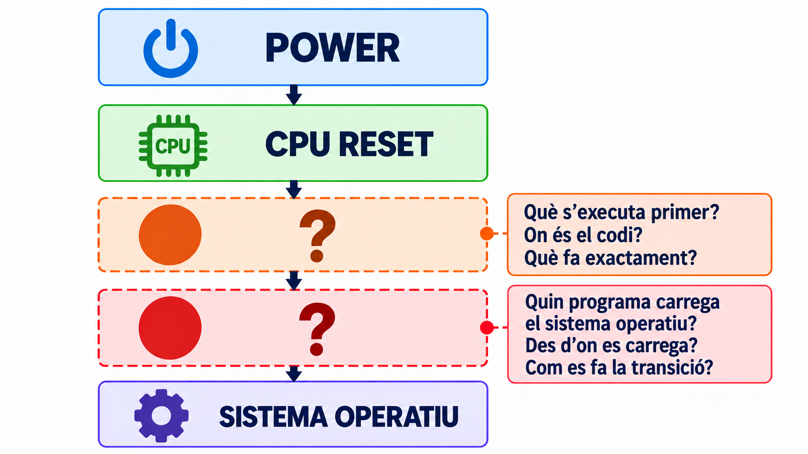{width="100%" fig-alt="Cadena POWER, CPU RESET, dues etapes desconegudes marcades amb un interrogant i SISTEMA OPERATIU. La primera pregunta és què s'executa primer i on és el codi; la segona, qui carrega el sistema operatiu, des d'on i com es fa la transició."}
::::::

:::::: {.column width="20%"}
::::: fragment
:::: {.concepte title="Bootstrap" style="text-align: center;"}
El sistema operatiu **no pot carregar-se a si mateix**. Algú l'ha de carregar primer.

**`CPU reset`**
**$$\Downarrow$$**
**`firmware`**
**$$\Downarrow$$**
**`bootloader`**
**$$\Downarrow$$**
**`kernel`**
::::
:::::
::::::
:::::::


## La CPU després del *reset*: on comença?

::::::: columns
:::::: {.column width="50%"}
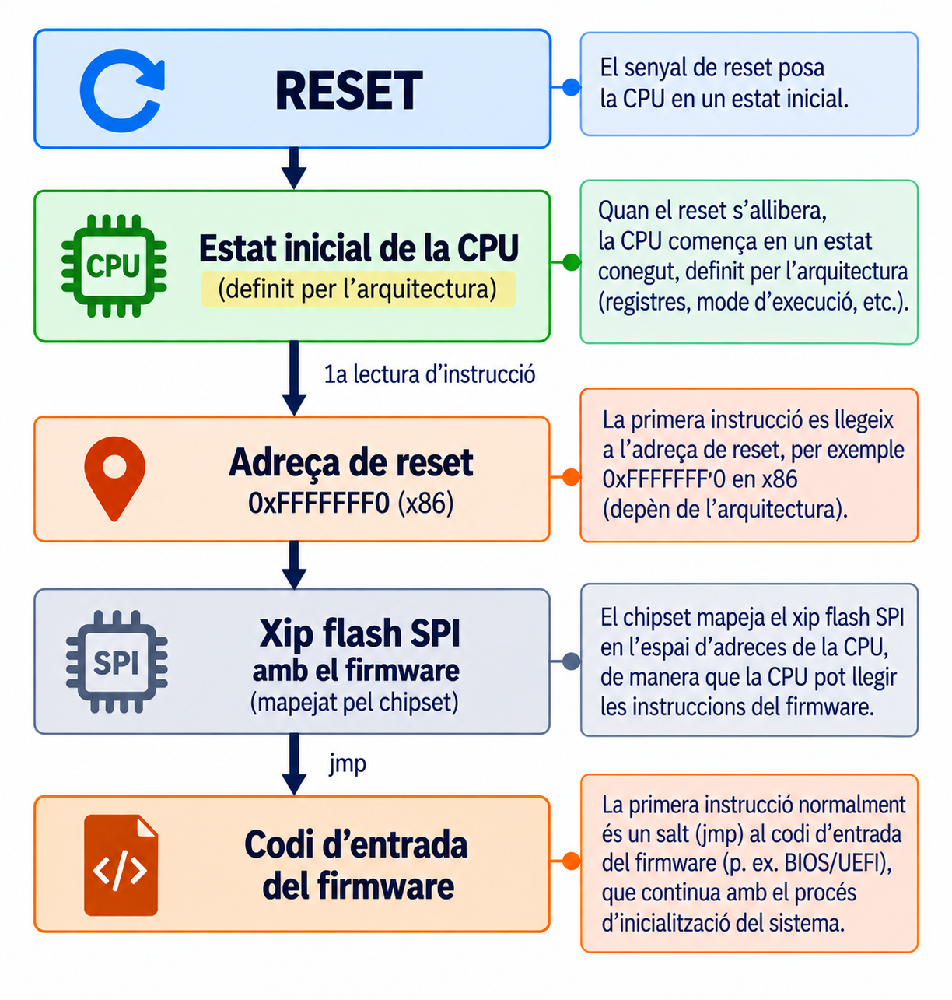{height="800px" fig-alt="Cadena vertical: RESET, estat inicial de la CPU definit per l'arquitectura, primera lectura d'instrucció a l'adreça 0xFFFFFFF0 (x86), xip flash SPI amb el firmware mapejat pel chipset, salt (jmp) al codi d'entrada del firmware."}
::::::

:::::: {.column width="50%"}
:::: {.definicio title="Reset vector"}
Adreça on la CPU busca la primera instrucció després d'un *reset*. La fixa l'**arquitectura** (o la implementació), no el sistema operatiu.
::::

::::: fragment
**x86, estat després del *reset*:**

```
CS.selector = 0xF000
CS.base     = 0xFFFF0000
EIP         = 0x0000FFF0
──────────────────────────────────────
1a instrucció a base + EIP = 0xFFFFFFF0
```
:::::

::::: fragment
Aquesta adreça la serveix el **xip flash SPI** que conté el firmware: el *chipset* el mapeja a l'espai d'adreces de la CPU. La primera instrucció sol ser un `jmp` al codi d'entrada del firmware.
:::::

::::: fragment
La CPU **no** comença executant el *kernel*. Comença executant **codi de firmware** en una ubicació definida per l'arquitectura.
:::::
::::::
:::::::


## Firmware: el primer programari que controla la màquina

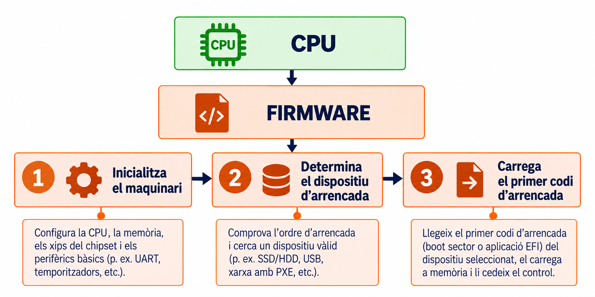{fig-align="center" height="640px" fig-alt="Esquema: la CPU executa el firmware, que fa tres tasques en ordre: 1) inicialitza el maquinari, 2) determina el dispositiu d'arrencada i 3) carrega el primer codi d'arrencada (boot sector o aplicació EFI) i li cedeix el control."}


## Dos contractes

::::::: columns
:::::: {.column width="50%"}

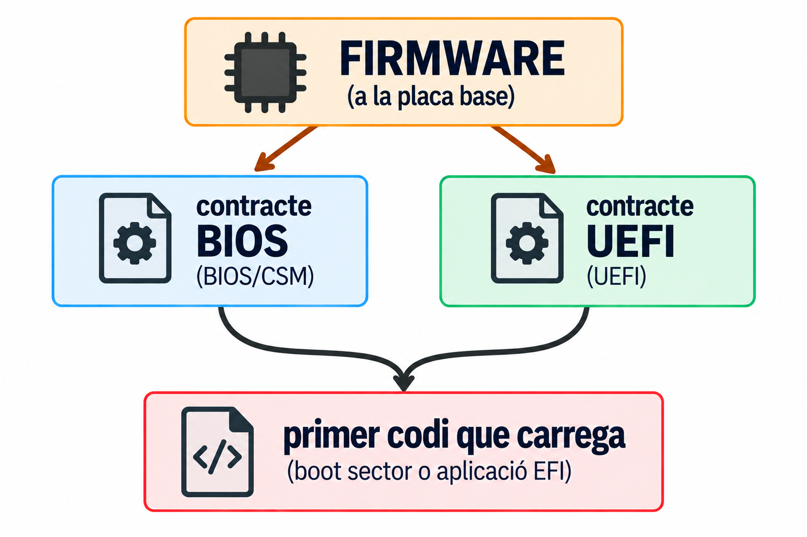{width="100%" fig-alt="Esquema: el firmware, a la placa base, ofereix dos contractes, el del BIOS i el d'UEFI, que convergeixen en el primer codi que carrega: un boot sector o una aplicació EFI."}
::::::

:::::: {.column width="50%"}
El firmware **no** és el sistema operatiu: prepara la màquina i cedeix el control al primer codi que carrega.

:::: {.concepte title="Dos contractes"}
BIOS i UEFI són **dos models de firmware i d'interfície d'arrencada**. Difereixen en:

::: nonincremental
-   **què** carrega,
-   **on** ho carrega,
-   **en quin estat** deixa la CPU,
-   **quins serveis** ofereix després.
:::
::::

::::: fragment
Respondrem aquestes quatre preguntes primer per al **BIOS** (bloc B) i després per a **UEFI** (bloc C).
:::::
::::::
:::::::


## BIOS: carregar un sector

::::::: columns
:::::: {.column width="60%"}
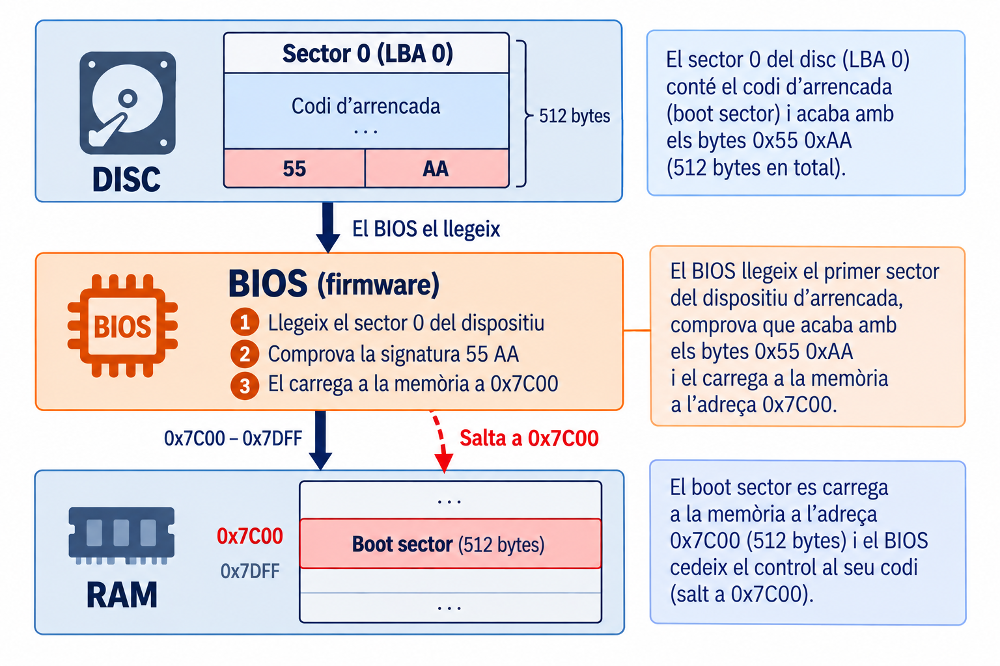{width="100%" fig-alt="Esquema: el BIOS llegeix el sector 0 del disc (LBA 0, 512 bytes, acabat en els bytes 55 i AA), en comprova la signatura, el carrega a la RAM a l'adreça 0x7C00 com a boot sector i hi salta (fletxa discontínua)."}
::::::

:::::: {.column width="40%"}
:::: {.definicio title="Boot sector"}
Primer sector (512 B, LBA 0) del dispositiu d'arrencada, acabat en la signatura `0x55 0xAA` (bytes 510 i 511).
::::

::: nonincremental
1.  **Llegeix** el sector 0 (LBA 0) del dispositiu triat segons l'ordre d'arrencada.
2.  **Comprova** la signatura `55 AA`.
3.  **Carrega** els 512 B a `0x7C00–0x7DFF`.
4.  **Salta** a `0x7C00`: transfereix el control al codi carregat.
:::

::::: fragment
::: {style="text-align: center;"}
**Load address = `0x7C00`**
:::

`0x7C00` és una **convenció del BIOS** de l'IBM PC, no una propietat de la CPU.
:::::
::::::
:::::::


## El problema dels 512 bytes

::::::: columns
:::::: {.column width="65%"}
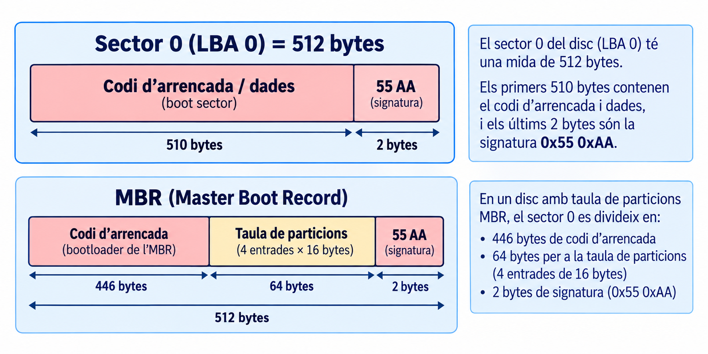{width="100%" fig-alt="Dos esquemes de 512 bytes. Dalt, el sector 0 com a boot sector: 510 bytes de codi d'arrencada i dades més 2 bytes de signatura 55 AA. A baix, el mateix sector com a MBR: 446 bytes de codi, 64 bytes de taula de particions (4 entrades de 16 bytes) i 2 bytes de signatura."}

```{.nasm code-line-numbers="false" }
    ; ... codi del boot sector ...

    times 510 - ($-$$) db 0   ; omple fins al byte 510
    dw 0xaa55                 ; signatura: bytes 55 AA
```
::::::

:::::: {.column width="35%"}


- `$` = posició actual, 
- `$$` = inici de la secció. 
- `dw 0xaa55` es guarda en *little-endian*: primer `55`, després `AA`.

::::: fragment
:::: {.errorcomu title="MBR ≠ els primers 512 bytes"}
En el model BIOS, el primer sector és el **boot sector**. Només quan el disc té taula de particions MBR, aquest sector és també l'**MBR**.
::::
:::::
::::::
:::::::


## Mapa de memòria en mode real

::::::: columns
:::::: {.column width="42%"}

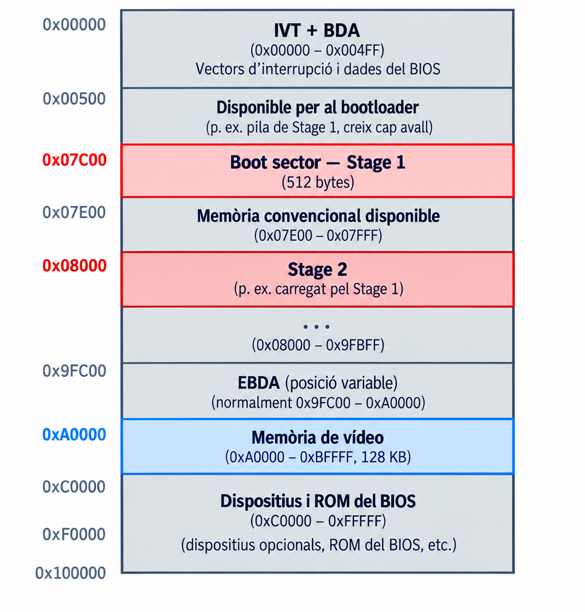{height="650px" fig-alt="Mapa de memòria en mode real x86, adreces baixes a dalt: IVT i BDA (0x00000–0x004FF), zona disponible per al bootloader amb la pila de Stage 1, boot sector de Stage 1 a 0x07C00, memòria convencional disponible, Stage 2 a 0x08000, EBDA de posició variable, memòria de vídeo a 0xA0000 (128 KB) i dispositius i ROM del BIOS fins a 0xFFFFF."}
::::::

:::::: {.column width="58%"}
Només tres adreces ens importen ara mateix:

::: nonincremental
-   `0x7C00` → **Stage 1** (on el carrega el BIOS)
-   `0x8000` → **Stage 2** (on el carregarem nosaltres)
-   `0xA0000` → **vídeo** (no hi escriurem per error)
:::

::::: fragment
:::: {.concepte title="Zona disponible"}
La regió entre el boot sector i l'EBDA és **convencionalment disponible** per al bootloader, **subjecta a les regions reservades** del sistema.
::::
:::::
::::::
:::::::


## Mode real: `segment:offset`

::::::: columns
:::::: {.column width="58%"}

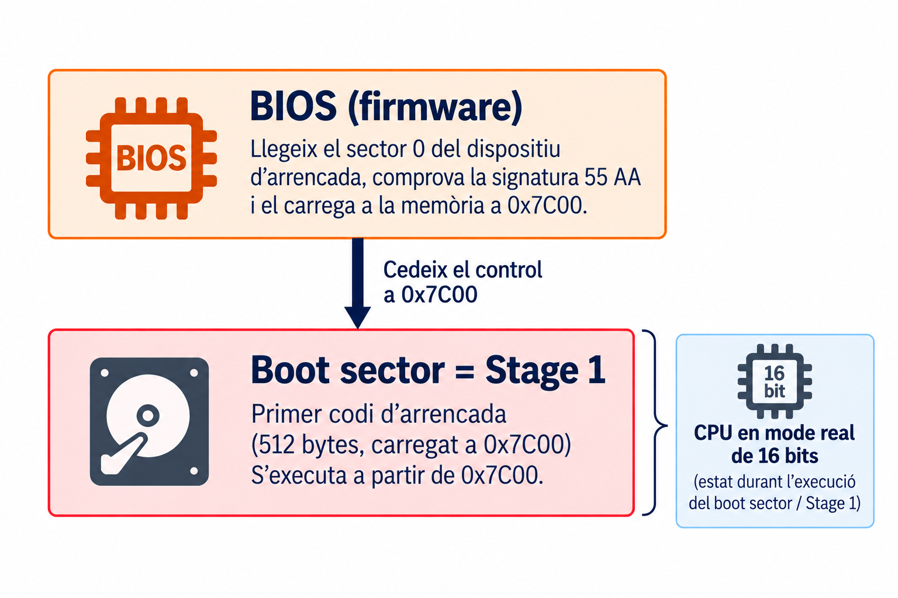{width="100%" fig-alt="Esquema: el BIOS (firmware) llegeix el sector 0, comprova la signatura 55 AA i el carrega a 0x7C00, i cedeix el control a 0x7C00. El boot sector és Stage 1: primer codi d'arrencada de 512 bytes que s'executa a partir de 0x7C00. La CPU està en mode real de 16 bits durant tota l'execució."}
::::::

:::::: {.column width="42%"}
:::: {.concepte title="Adreça física"}
`físic = segment × 16 + offset`
::::

```
0000:7C00  →  0x00000 + 0x7C00 = 0x07C00
07C0:0000  →  0x07C00 + 0x00000 = 0x07C00
```

::::: fragment
:::: {.errorcomu title="El BIOS pot arribar-hi de dues maneres"}
Les dues formes apunten a la mateixa adreça física, però el **BIOS no garanteix** quina d'elles fa servir. Amb `org 0x7c00`, els salts absoluts pressuposen `CS = 0`.
::::
:::::

::::: fragment
**Solució:** un *far jump* que fixa `CS`:

```{.nasm code-line-numbers="false" }
    jmp 0x0000:start   ; CS = 0x0000
start:
    ; ... a partir d'aquí, CS = 0
```
:::::
::::::
:::::::


## *Load address* vs. *link address*

::::::: columns
:::::: {.column width="60%"}
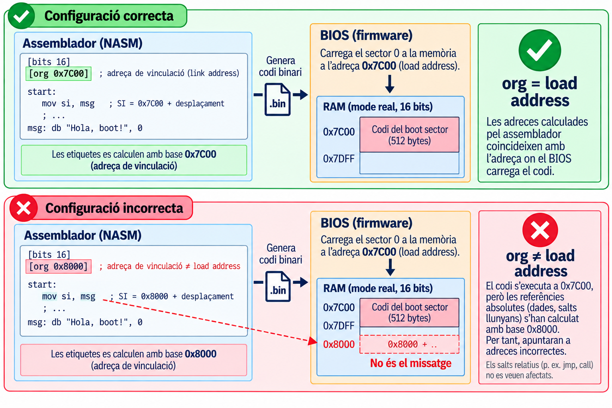{width="100%" fig-alt="A dalt, configuració correcta: el codi NASM porta [org 0x7C00] (link address), s'assembla a un .bin, el BIOS el carrega a 0x7C00 (load address) i les etiquetes calculades coincideixen amb l'adreça de càrrega. A sota, configuració incorrecta: el codi NASM porta [org 0x8000], però el BIOS continua carregant el boot sector a 0x7C00. Les etiquetes s'han calculat amb base 0x8000, de manera que mov si, msg apunta a 0x8000 més un desplaçament, una zona de la RAM fora del boot sector que no conté el missatge (fletxa vermella discontínua). Els salts relatius no es veuen afectats."}

::::::
:::::: {.column width="40%"}
:::: {.reflexio title="Pregunta a l'aula"}
Què passa si el programa assumeix `0x8000` però el firmware el carrega a `0x7C00`?
::::

::::: fragment
:::: {.errorcomu title="Link address ≠ load address"}
Les referències **absolutes** (dades, salts *far*) apunten a un altre lloc. Els salts **relatius** segueixen funcionant, per això l'error pot ser subtil.

El programa s'ha de construir **assumint l'adreça on serà carregat**.
::::
:::::
::::::
:::::::

## Què podem assumir quan el BIOS ens dona el control?

::::::: columns
:::::: {.column width="50%"}
:::: {.concepte title="Sabem"}
::: nonincremental
-   ✓ el boot sector s'ha carregat a `0x7C00`
-   ✓ la CPU està en mode real (model BIOS)
-   ✓ `DL` = número de la unitat d'arrencada (convenció)
:::
::::
::::::

:::::: {.column width="50%"}
::::: fragment
:::: {.errorcomu title="No assumim"}
::: nonincremental
-   ✗ un `CS:IP` concret (`0000:7C00` o `07C0:0000`)
-   ✗ `DS` i `ES` correctes per al nostre programa
-   ✗ `SS`/`SP` útils
-   ✗ valors concrets als registres generals
:::
::::
:::::
::::::
:::::::

::::: fragment
::: {style="text-align: center;"}
**La primera feina de Stage 1 és construir un entorn mínim conegut.**
:::
:::::

## Inicialitzar l'entorn mínim

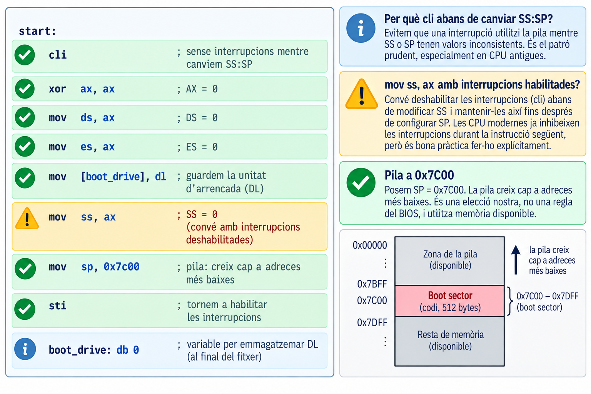{fig-align="center" height="650px" fig-alt="Codi NASM d'inicialització del boot sector, instrucció per instrucció: cli, xor ax ax, mov ds ax, mov es ax, mov [boot_drive] dl, mov ss ax (marcada amb una advertència: convé fer-ho amb interrupcions deshabilitades), mov sp 0x7c00, sti i la variable boot_drive al final del fitxer. Als costats: per què cli abans de canviar SS:SP, l'advertència sobre mov ss amb interrupcions habilitades, la pila a 0x7C00 com a elecció nostra i no una regla del BIOS, i un mini-mapa de memòria amb adreces baixes a dalt on la pila creix cap a adreces més baixes, per sobre del boot sector."}

## Stage 1: una feina molt concreta

::::::: columns
:::::: {.column width="48%"}
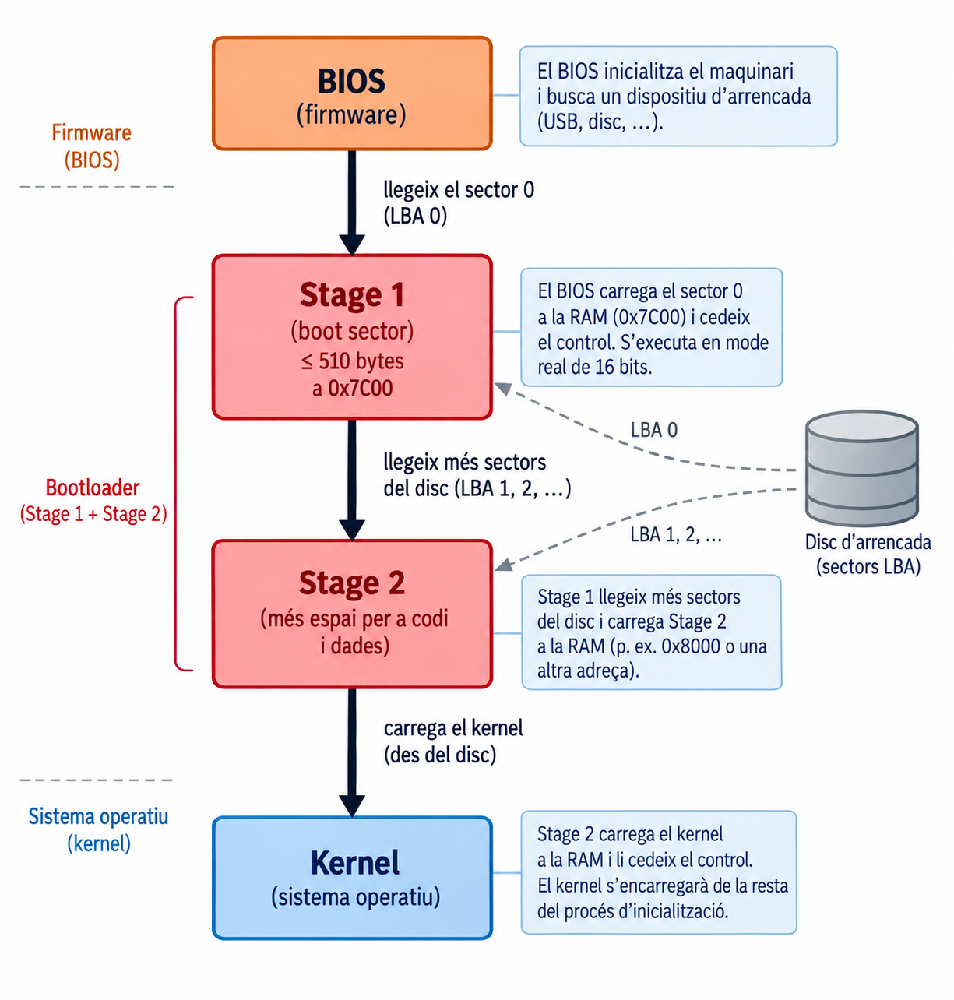{width="100%" fig-alt="Cadena vertical: el BIOS (firmware) llegeix el sector 0 (LBA 0) i el carrega com a Stage 1 (boot sector, com a màxim 510 bytes a 0x7C00). Stage 1 llegeix més sectors del disc i carrega Stage 2 (més espai per a codi i dades). Stage 1 i Stage 2 formen el bootloader. Stage 2 carrega el kernel, que és el sistema operatiu. El disc d'arrencada, a la dreta, alimenta Stage 1 (LBA 0) i Stage 2 (LBA 1, 2…)."}
::::::

:::::: {.column width="52%"}
**Stage 1:**

::: nonincremental
-   inicialitza l'entorn mínim,
-   pot utilitzar serveis del BIOS,
-   localitza més codi,
-   **transfereix el control**.
:::

::::: fragment
:::: {.concepte title="Bootloader en dues etapes"}
512 B no són suficients per a controladors de sistemes de fitxers, menús, etc. Stage 1 només carrega **la següent etapa**, no el sistema operatiu.
::::
:::::

::::::
:::::::


## LBA i adreça de memòria són coses diferents

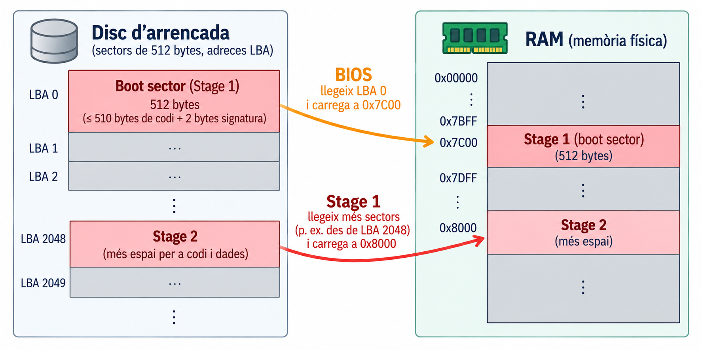{fig-align="center" height="540px" fig-alt="Dos espais d'adreces. A l'esquerra, el disc d'arrencada amb sectors de 512 bytes: LBA 0 és el boot sector (Stage 1) i LBA 2048 és Stage 2. A la dreta, la RAM amb adreces baixes a dalt: el BIOS llegeix LBA 0 i el carrega a 0x7C00 (fletxa taronja), i Stage 1 llegeix des de LBA 2048 i carrega Stage 2 a 0x8000 (fletxa vermella)."}

::: {style="text-align: center;" .fragment}
**`LBA 2048` no és l'adreça `0x2048`**: és el sector número 2048 del disc (`2048 × 512 B = 1 MiB`).
:::

::: {.reflexio .fragment}
`0x7C00` és la convenció del BIOS i **`0x8000` i `LBA 2048` són una elecció nostra.** El BIOS només carrega el sector 0.
:::


## El firmware encara ens ofereix serveis

::::::: columns
:::::: {.column width="56%"}
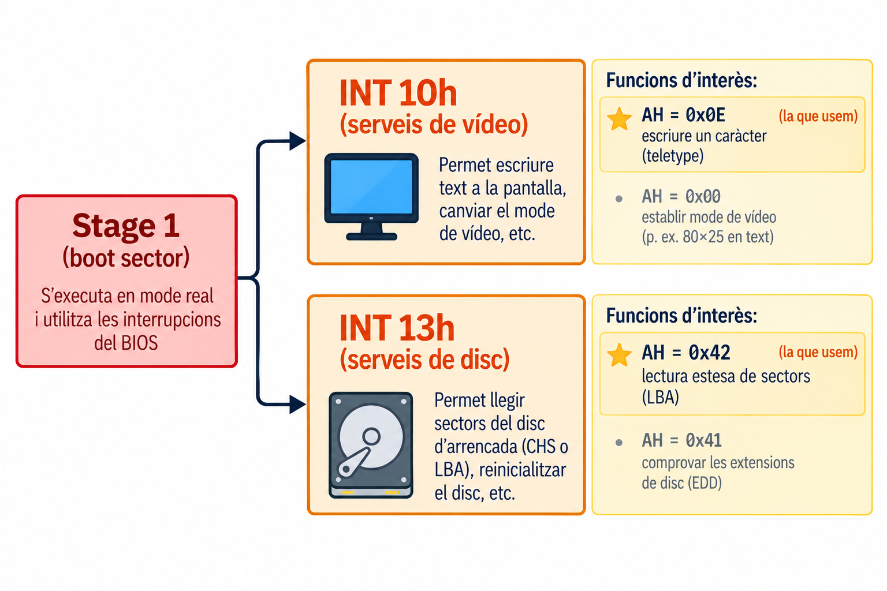{width="100%" fig-alt="Stage 1 (boot sector, mode real) utilitza les interrupcions del BIOS: INT 10h per als serveis de vídeo (funcions d'interès: AH 0x0E escriure un caràcter en mode teletip, marcada com la que usem, i AH 0x00 establir el mode de vídeo) i INT 13h per als serveis de disc (AH 0x42 lectura estesa de sectors amb LBA, marcada com la que usem, i AH 0x41 comprovar les extensions de disc)."}


::::::

:::::: {.column width="44%"}
**`INT 13h`, `AH = 0x42`** — lectura de disc estesa (LBA):

```{.nasm code-line-numbers="false" }
dap:                   ; Disk Address Packet
    db 0x10, 0         ; mida (16 B), reservat
    dw 1               ; nombre de sectors
    dw 0x8000, 0x0000  ; destí: offset, segment
    dq 2048            ; LBA inicial (64 bits)

    mov  si, dap       ; DS:SI → DAP
    mov  dl, [boot_drive]
    mov  ah, 0x42
    int  0x13
    jc   disk_error    ; CF = 1 → error
```
::::::
:::::::

**`INT 10h`, `AH = 0x0E`** — escriure un caràcter:

```{.nasm code-line-numbers="false" }
    mov  ah, 0x0e     ; teletype
    mov  al, 'A'      ; caràcter
    int  0x10
```

## Stage 1 → Stage 2

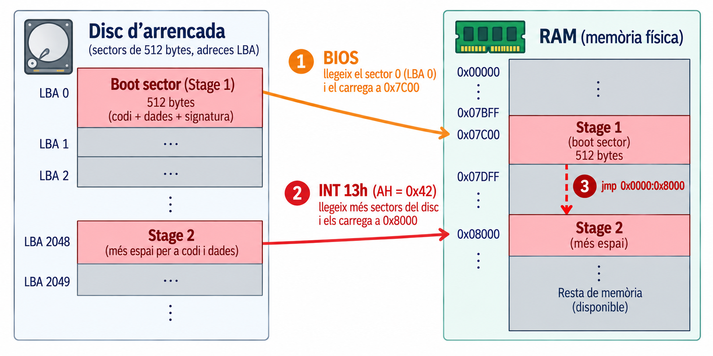{fig-align="center" height="550px" fig-alt="Esquema numerat de la càrrega en dues etapes. 1) El BIOS llegeix el sector 0 (LBA 0) del disc i el carrega a la RAM a 0x7C00 com a Stage 1 (fletxa taronja). 2) Stage 1 utilitza INT 13h amb AH 0x42 per llegir més sectors des de LBA 2048 i carregar Stage 2 a 0x8000 (fletxa vermella). 3) Dins la RAM, Stage 1 salta a 0x0000:0x8000 amb jmp (fletxa vermella discontínua) i s'executa Stage 2."}

::: fragment
**Stage 1** carrega **Stage 2** i li transfereix el control. Cada etapa s'assembla amb l'`org` de la seva adreça de càrrega: Stage 1 → `0x7C00`, Stage 2 → `0x8000`.
:::

## Diagnòstic: on s'ha trencat l'arrencada?

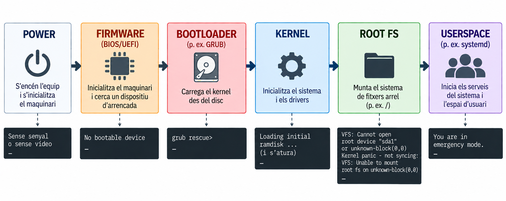{width="94%" fig-align="center" fig-alt="Cadena horitzontal d'etapes de l'arrencada amb el missatge típic sota cada una: Power (sense senyal o sense vídeo); Firmware (BIOS/UEFI) amb «No bootable device»; Bootloader (p. ex. GRUB) amb «grub rescue>»; Kernel, amb «Loading initial ramdisk…» i que s'atura; Root FS amb «VFS: Cannot open root device» seguit de «Kernel panic - not syncing: VFS: Unable to mount root fs»; Userspace (p. ex. systemd) amb «You are in emergency mode»."}

::::: fragment
:::: {.errorcomu title="Són indicacions, no diagnòstics exactes"}
Un missatge apunta al punt on **probablement** ha fallat l'arrencada, però **no determina** una única etapa. Per exemple, `No bootable device` pot ser: (a) sense signatura `55 AA` vàlida al sector 0, (b) ordre d'arrencada apuntant a un altre dispositiu, o (c) mode BIOS/UEFI incompatible amb el disc.
::::
:::::


## UEFI: un altre contracte

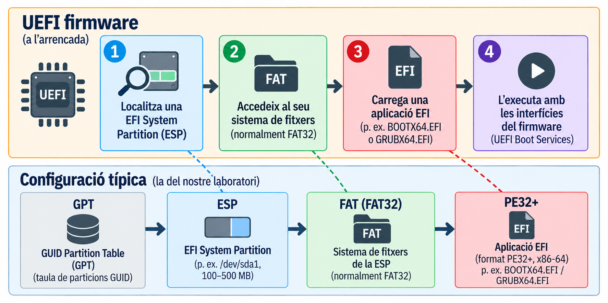{fig-align="center" height="500px" fig-alt="Dues bandes. A dalt, el contracte conceptual del firmware UEFI a l'arrencada en quatre passos: 1) localitza una EFI System Partition (ESP), 2) accedeix al seu sistema de fitxers (normalment FAT32), 3) carrega una aplicació EFI (p. ex. BOOTX64.EFI o GRUBX64.EFI), 4) l'executa amb les interfícies del firmware (UEFI Boot Services). A baix, la configuració típica del nostre laboratori: taula de particions GPT, ESP, sistema de fitxers FAT32 i aplicació EFI en format PE32+ per a x86-64. Línies discontínues amb el mateix color uneixen els passos 1, 2 i 3 amb l'ESP, el FAT i l'aplicació EFI."}

::: fragment
En el model BIOS que estudiem, el firmware carrega directament un **sector**. En UEFI, el firmware disposa d'una **interfície de sistema de fitxers** i pot carregar una **aplicació EFI**, que en x86-64 s'executa en **long mode** (64 bits).
:::


## UEFI: on és el *bootloader*?

::::::: columns
:::::: {.column width="64%"}
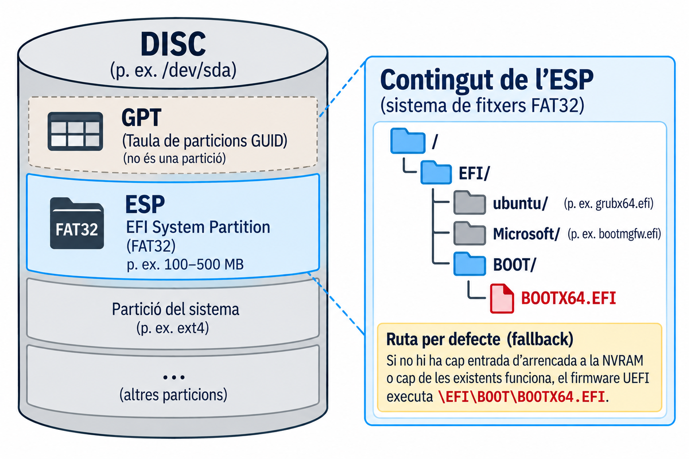{width="100%" fig-alt="A l'esquerra, un disc amb la taula de particions GPT (que no és una partició), l'ESP (EFI System Partition, FAT32, p. ex. 100–500 MB), una partició del sistema (p. ex. ext4) i altres particions. A la dreta, el contingut de l'ESP: la carpeta EFI amb les carpetes ubuntu i Microsoft en gris i la carpeta BOOT amb el fitxer BOOTX64.EFI en vermell. Ruta per defecte (fallback): si no hi ha cap entrada d'arrencada a la NVRAM o cap de les existents funciona, el firmware UEFI executa EFI/BOOT/BOOTX64.EFI."}
::::::

:::::: {.column width="36%"}
::: nonincremental
-   **ESP**: *EFI System Partition*, identificada per un GUID de tipus de partició.
-   **FAT**: el sistema de fitxers que el firmware sap llegir.
-   **`.EFI`**: executable en format PE/COFF.
-   **`BOOTX64.EFI`**: ruta de *fallback* per a x86-64.
:::

::::: fragment
En Linux, l'ESP sol muntar-se a `/boot/efi`. Les **entrades de NVRAM** (Part 2) tenen prioritat sobre la ruta de *fallback*.
:::::
::::::
:::::::


## Una aplicació EFI és un executable

::::::: columns
:::::: {.column width="66%"}
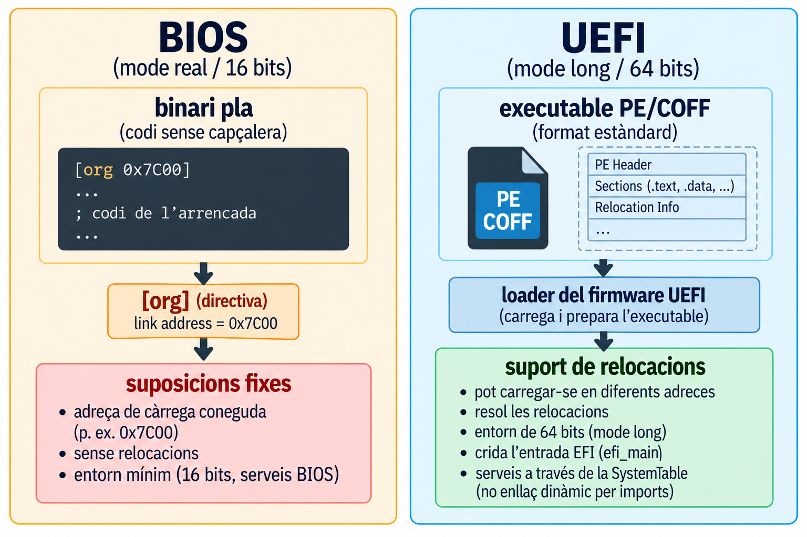{width="100%" fig-alt="Comparació. BIOS (mode real, 16 bits): un binari pla sense capçalera amb la directiva org 0x7C00 (link address = 0x7C00), que porta a suposicions fixes: adreça de càrrega coneguda, sense relocacions i entorn mínim de 16 bits amb serveis del BIOS. UEFI (long mode, 64 bits): un executable PE/COFF amb capçalera, seccions i informació de relocació, que el loader del firmware carrega i prepara, amb suport de relocacions: es pot carregar en diferents adreces, crida l'entrada EFI i obté els serveis a través de la SystemTable, sense enllaç dinàmic per imports."}
::::::

:::::: {.column width="34%"}
:::: {.concepte title="Aplicació EFI = PE/COFF"}
Una aplicació EFI és un executable **PE/COFF**. El format conté la informació perquè el *loader* pugui carregar-la en memòria i **aplicar relocacions** quan calgui.
::::
::::::
:::::::


## El firmware ofereix serveis: la `SystemTable`

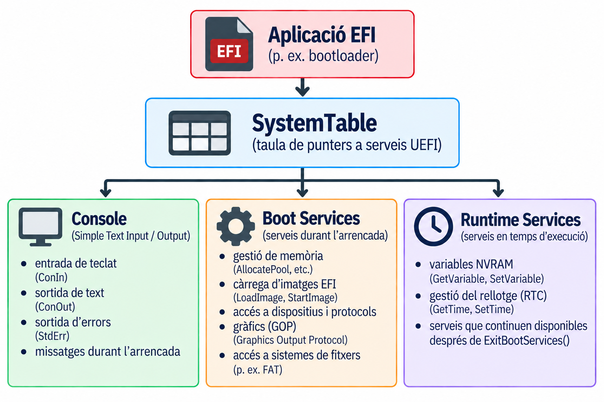{fig-align="center" height="580px" fig-alt="Una aplicació EFI (p. ex. un bootloader) rep la SystemTable, una taula de punters a serveis UEFI, que dona accés a tres grups: Console (Simple Text Input/Output: entrada de teclat ConIn, sortida de text ConOut, sortida d'errors StdErr), Boot Services (gestió de memòria, càrrega d'imatges EFI amb LoadImage i StartImage, accés a dispositius i protocols, gràfics amb el Graphics Output Protocol i accés a sistemes de fitxers) i Runtime Services (variables NVRAM, rellotge RTC i serveis que continuen disponibles després de ExitBootServices)."}

::: fragment
El firmware ofereix serveis mitjançant una **taula de punters**, no interrupcions.
:::


## Dos contractes de *boot*

::::::: columns
:::::: {.column width="50%"}
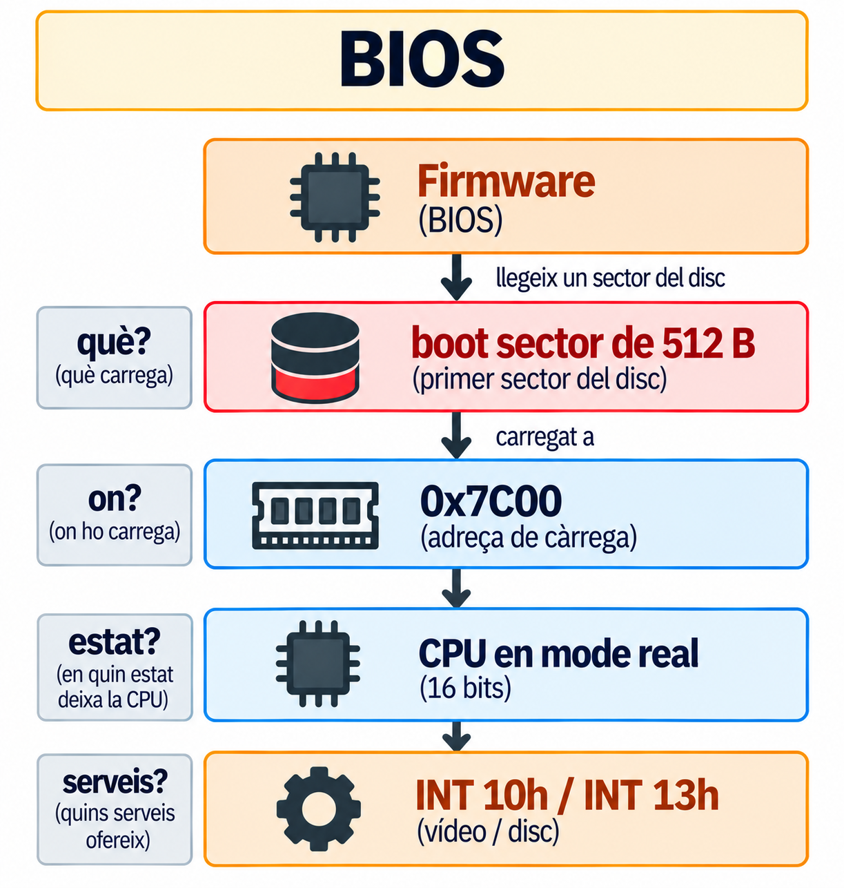{fig-align="center" height="570px" fig-alt="Contracte del BIOS en quatre preguntes. El firmware llegeix un sector del disc. Què carrega: un boot sector de 512 bytes, el primer sector del disc. On ho carrega: a 0x7C00, l'adreça de càrrega. En quin estat deixa la CPU: en mode real de 16 bits. Quins serveis ofereix: INT 10h per al vídeo i INT 13h per al disc."}
::::::

:::::: {.column width="50%"}
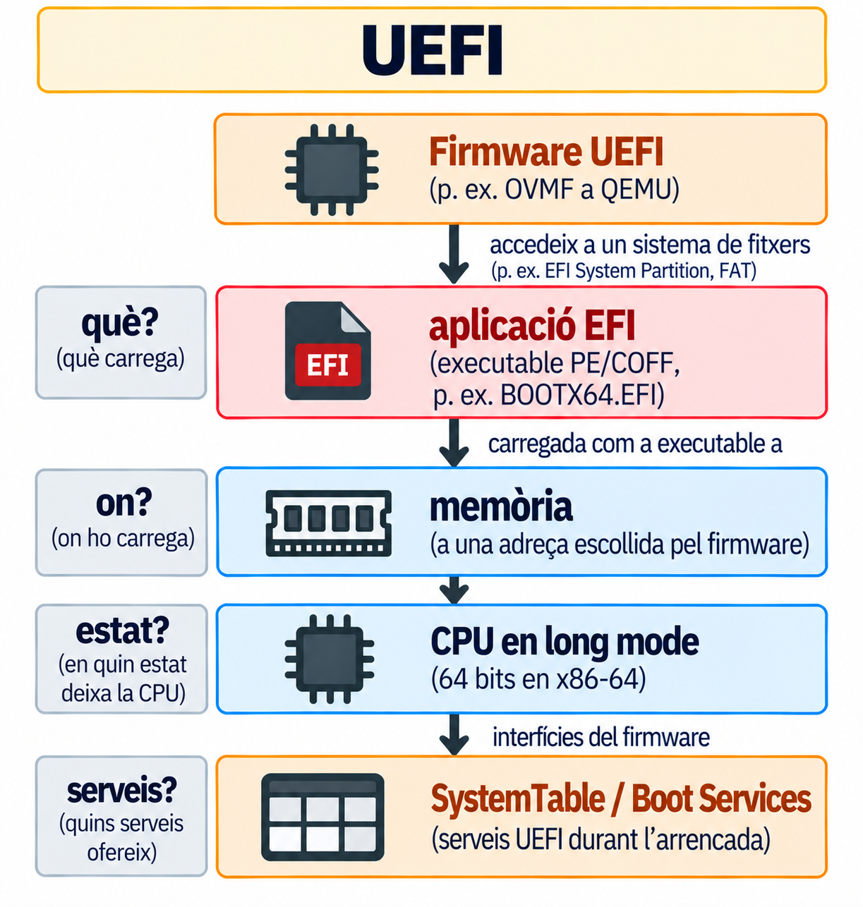{fig-align="center" height="570px" fig-alt="Contracte d'UEFI en quatre preguntes. El firmware UEFI (p. ex. OVMF a QEMU) accedeix a un sistema de fitxers (p. ex. l'EFI System Partition, FAT). Què carrega: una aplicació EFI, un executable PE/COFF (p. ex. BOOTX64.EFI). On ho carrega: a memòria, a una adreça escollida pel firmware. En quin estat deixa la CPU: en long mode, 64 bits en x86-64. Quins serveis ofereix: la SystemTable i els Boot Services, serveis UEFI durant l'arrencada."}
::::::
:::::::

::: {style="text-align: center;" .fragment}
**Mateix problema. Diferent contracte.**
:::

## Resum

::::: {.resum title="Les tres preguntes"}
::: nonincremental
-   **Quin codi s'executa primer i com hi arriba la CPU?** El de **firmware**: la CPU comença a l'adreça de *reset* definida per l'arquitectura (x86: `0xFFFFFFF0`), on el chipset mapeja el xip **flash** que el conté, no la RAM.
-   **Què, on i com?**
    -   **BIOS:** un **boot sector** de 512 B (signatura `55 AA`) carregat a `0x7C00`, en mode real, amb `DL` = unitat.
    -   **UEFI:** una **aplicació EFI** (PE/COFF) llegida de l'ESP, carregada en una adreça triada pel firmware i cridada amb `SystemTable`.
-   **Què hem de recordar?**
    -   *Load address* ≠ *link address*.
    -   LBA ≠ adreça de memòria.
    -   *Boot sector* ≠ MBR.
    -   Un missatge d'error és una **indicació**, no un diagnòstic exacte.
:::
:::::


