## Objectius d'aprenentatge

::::: {.resultat title="En acabar aquesta sessió seràs capaç d'explicar, sense mirar apunts..."}
-   Distingir **MBR i GPT** (esquemes de particions) de **BIOS i UEFI** (firmware), i situar l'**ESP** i la **BIOS boot partition** en aquest mapa.
-   Explicar què fa **GRUB** i com el seu contracte amb el firmware **no és el mateix** en BIOS i en UEFI.
-   Descriure com GRUB localitza i carrega el **kernel** i l'**initramfs**, i per què `vmlinuz` no és un ELF genèric.
-   Explicar **per què existeix l'initramfs** i què fa entre el `/init` i el `switch_root`.
-   Situar `systemd` com a PID 1 i seguir la cadena fins al `login`.
-   Situar un símptoma d'arrencada (`grub rescue>`, *kernel panic*, mode d'emergència) en l'etapa correcta.
:::::

## On ens vam quedar?

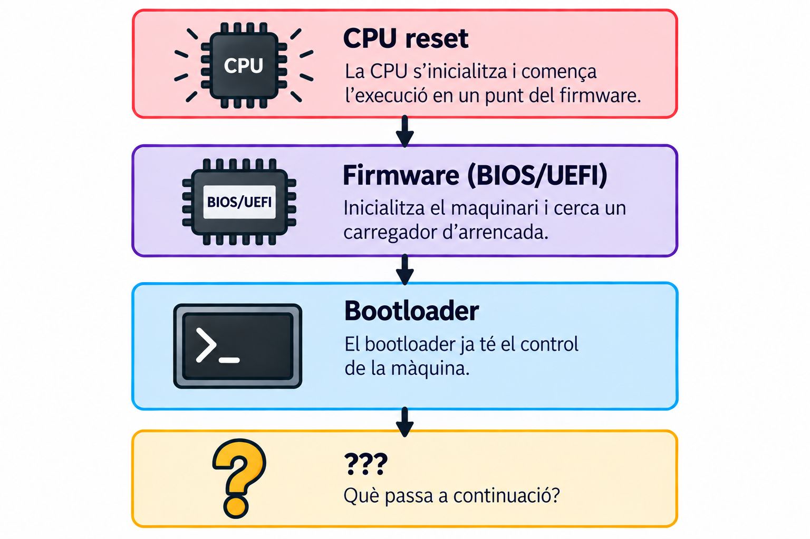{fig-align="center" height="650px" fig-alt="CPU reset: la CPU s'inicialitza i comença l'execució en un punt del firmware. Firmware (BIOS/UEFI): inicialitza el maquinari i cerca un carregador d'arrencada. Bootloader: ja té el control de la màquina. Interrogant: què passa a continuació?"}

::: {.reflexio}
Què falta perquè aparegui la pantalla de `login` de Linux?
:::

## Un disc no és una partició

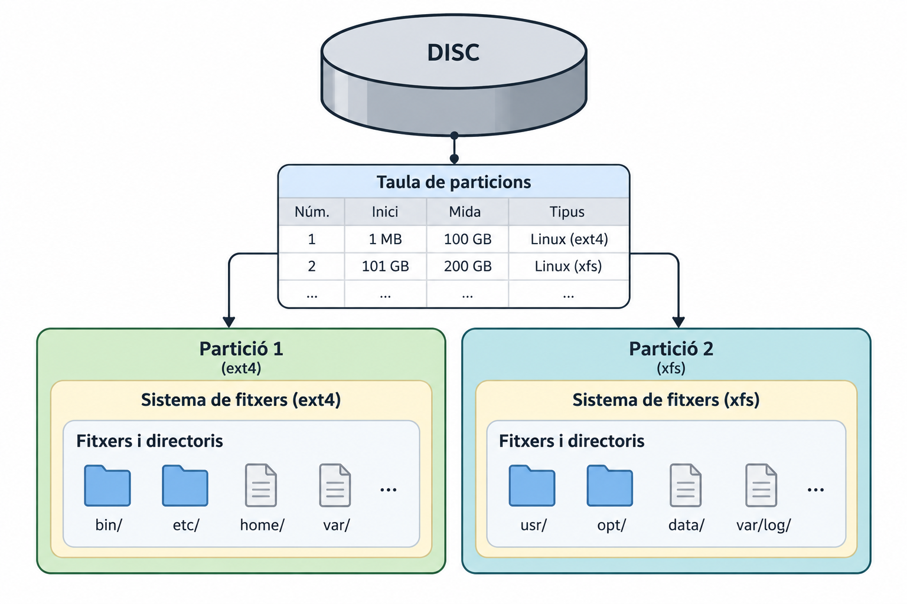{fig-align="center" height="600px" fig-alt="Un disc conté una taula de particions (número, inici, mida, tipus) que descriu dues particions. La partició 1 (ext4) conté fitxers i directoris com bin/, etc/, home/, var/. La partició 2 (xfs) conté usr/, opt/, data/, var/log/."}

::: {.concepte}
Una **partició** és una regió del disc, definida per la taula de particions (mida i posició). El **sistema de fitxers** i els fitxers que hi ha a dins són una capa diferent, per sobre.
:::

## MBR vs GPT

::::::: columns
:::::: {.column width="65%"}
| | MBR | GPT |
|:--|:--|:--|
| esquema | antic | modern |
| identificació | particions numerades | GUID |
| nombre de particions | 4 primàries, o 3 primàries + 1 estesa | limitat per la mida de la taula (habitualment 128 entrades) |
| mida màxima de disc | ~2 TiB (sectors de 512 B, LBA de 32 bits) | molt superior |
| ús amb UEFI | possible (compatibilitat) | l'habitual |
::::::

:::::: {.column width="35%"}
::: {.errorcomu}
**MBR/GPT** són esquemes de particions. **BIOS/UEFI** són firmware. No són el mateix eix: hi ha BIOS+MBR, BIOS+GPT i UEFI+GPT (UEFI+MBR és rar i es desaconsella).
:::
::::::
:::::::

## L'ESP i la BIOS boot partition

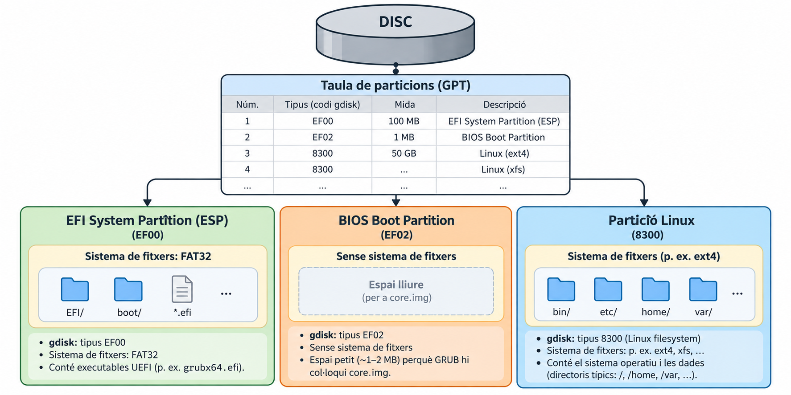{fig-align="center" width="100%" fig-alt="Un disc amb taula de particions GPT: partició 1, codi gdisk EF00, 100 MB, EFI System Partition; partició 2, codi EF02, 1 MB, BIOS Boot Partition; particions 3 i 4, codi 8300, Linux ext4 i Linux xfs. A sota, tres caixes: l'ESP amb sistema de fitxers FAT32 i executables UEFI com grubx64.efi; la BIOS Boot Partition sense sistema de fitxers, amb espai lliure per a core.img; la partició Linux amb sistema de fitxers ext4/xfs i el sistema operatiu."}

::: {.concepte}
`EF00` i `EF02` són **codis de tipus de partició** que `gdisk` mostra com a dreceres per a GUID de tipus GPT. No són flags d'arrencada. En UEFI, el firmware Boot Manager utilitza les entrades de boot emmagatzemades en NVRAM per seleccionar què carregar.
:::

::::: fragment
| | BIOS + MBR | BIOS + GPT | UEFI + GPT |
|:--|:--|:--|:--|
| on va `core.img` | forat post-MBR | BIOS Boot Partition (`EF02`) | — (no cal) |
| què carrega el firmware | el sector 0 | el sector 0 | una aplicació EFI com `grubx64.efi` de l'ESP (`EF00`) |
:::::

## `efibootmgr`: qui decideix què arrenca?

```{.bash}
efibootmgr -v
```

::: {.terminal}
```
BootCurrent: 0002
BootOrder: 0002,0000,0001
Boot0000* Windows Boot Manager
Boot0001* UEFI: USB
Boot0002* ubuntu    HD(1,GPT,...)/File(\EFI\ubuntu\grubx64.efi)
```
:::

::: {.concepte}
En UEFI, el firmware Boot Manager utilitza normalment les entrades de NVRAM (`BootOrder`/`Boot####`) per decidir què carregar. 

- `BootOrder` diu en quin ordre provar les entrades 
- `BootCurrent`, quina s'ha fet servir
- Cada `Boot####` apunta a un executable EFI concret. 

En una instal·lació UEFI normal, el firmware fa servir aquestes entrades **persistents** de la NVRAM. Si no en queda cap d'utilitzable, existeix també un camí de *fallback*, com `\EFI\BOOT\BOOTX64.EFI`.
:::


## Què és GRUB?

::: {.definicio title="GRUB"}
Un **bootloader**: el programa que el firmware carrega i que, al seu torn, localitza i carrega el kernel (i l'initramfs), abans de cedir-los el control.
:::

$$ \text{firmware} \rightarrow \text{GRUB} \rightarrow \text{kernel + initramfs} $$


## El contracte BIOS + GRUB

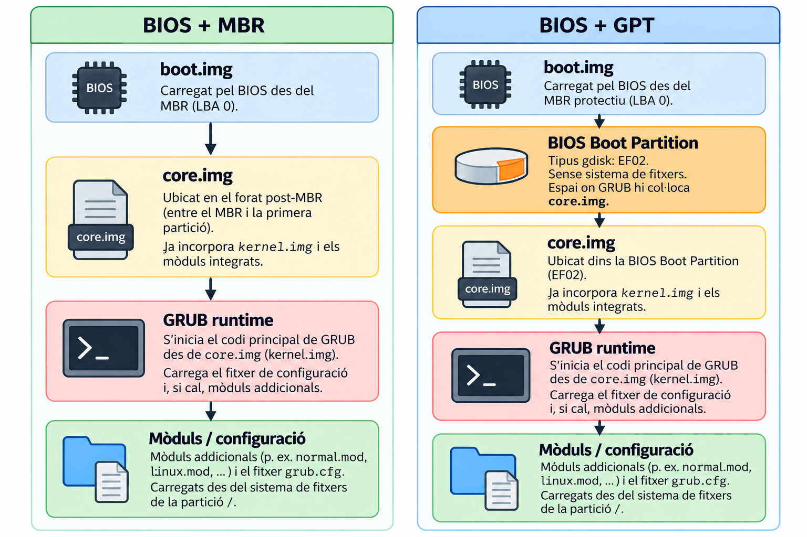{fig-align="center" height="560px" fig-alt="Dues cadenes. BIOS + MBR: boot.img (carregat pel BIOS des del MBR, LBA 0) → core.img (al forat post-MBR) → mòduls de GRUB (normal.mod, grub.cfg, carregats des de la partició /). BIOS + GPT: boot.img (carregat pel BIOS des del MBR protectiu, LBA 0) → BIOS Boot Partition (tipus gdisk EF02, sense sistema de fitxers) → core.img (ubicat dins la BIOS Boot Partition) → mòduls de GRUB."}

::::: fragment
::: {.errorcomu title="«Stage 1/1.5/2» és terminologia antiga"}
GRUB **Legacy** (0.9x) parlava de Stage 1, 1.5 i 2. GRUB **2** (l'actual) parla de `boot.img`, `core.img` i **mòduls**. No digueu «Stage 1 = MBR» com una equivalència universal: en GPT, `core.img` no va al forat post-MBR, va a la BIOS Boot Partition.
:::
:::::


## El contracte UEFI + GRUB

::::::: columns
:::::: {.column width="40%"}

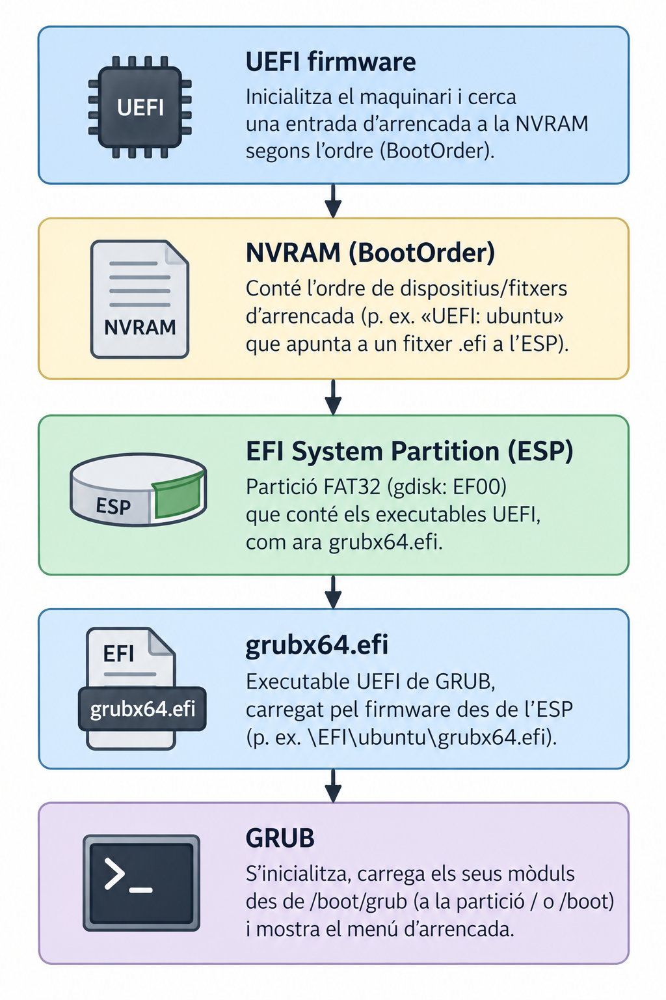{width="100%" fig-alt="UEFI firmware inicialitza el maquinari i cerca una entrada a la NVRAM segons BootOrder. La NVRAM conté l'ordre de dispositius/fitxers d'arrencada, per exemple «UEFI: ubuntu» apuntant a un fitxer .efi a l'ESP. L'ESP és una partició FAT32 (gdisk EF00) amb executables UEFI com grubx64.efi. grubx64.efi és l'executable UEFI de GRUB, carregat pel firmware des de l'ESP (p. ex. \\EFI\\ubuntu\\grubx64.efi). GRUB s'inicialitza, carrega els seus mòduls des de /boot/grub (a la partició / o /boot) i mostra el menú d'arrencada."}
::::::

:::::: {.column width="60%"}
| BIOS | UEFI |
|:--|:--|
| `boot.img` | `grubx64.efi` |
| `core.img` | *(no cal)* |
| GRUB (mòduls) | GRUB (mòduls) |

::: {.concepte}
No hi ha `boot.img` ni `core.img` en la cadena UEFI: el firmware carrega `grubx64.efi` directament de l'ESP, com **qualsevol** aplicació EFI (exactament com el `tetris.efi` del Lab 2).
:::
::::::
:::::::


## `grub.cfg`: no s'edita a mà

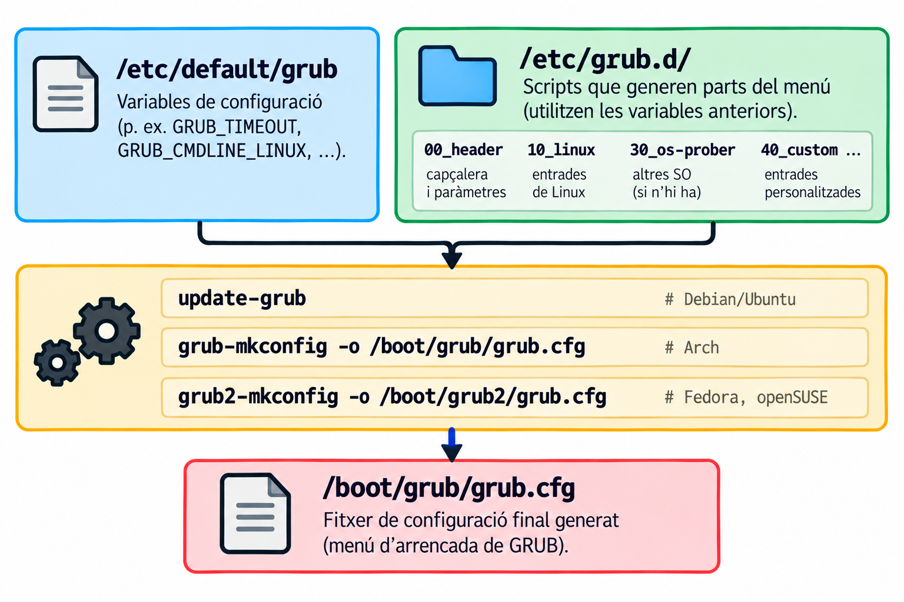{fig-align="center" width="100%" fig-alt="grub.cfg: fitxer de configuració de GRUB, generat automàticament per update-grub. Conté un menú d'arrencada amb entrades com 'Ubuntu' i 'Opcions avançades per a Ubuntu', que carreguen el kernel i l'initramfs amb paràmetres com root=/dev/sda2 ro quiet."}

::: {.errorcomu}
`grub.cfg` es **regenera automàticament**. Si l'editeu a mà, el següent `update-grub` (o una actualització de kernel) ho esborrarà. Els canvis van a `/etc/default/grub` o a `/etc/grub.d/40_custom`.
:::


## Una entrada real


::: {.terminal}
```
menuentry 'Ubuntu' {
    set root='hd0,gpt2'
    linux  /vmlinuz root=/dev/sda2 ro quiet
    initrd /initrd.img
}
```
:::

::: {.reflexio}
Quines **dues coses** carrega GRUB abans de cedir el control?
:::

## Paràmetres del kernel més comuns

| Paràmetre | Funció |
|:--|:--|
| `root=` | partició arrel |
| `ro` | primer muntatge en només lectura |
| `rw` | primer muntatge en lectura-escriptura |
| `init=` | procés `init` alternatiu |
| `nomodeset` | evita el *mode-setting* gràfic (depuració de vídeo) |
| `systemd.unit=` | *target* inicial de systemd |


## Secure Boot

::: {.definicio title="Secure Boot"}
Una funció del firmware UEFI que verifica la **signatura digital** d'un executable EFI abans d'executar-lo.
:::

$$ \text{UEFI} \xrightarrow{\text{verificació del binari EFI}} \text{grubx64.efi / shim} \xrightarrow{\text{verificació de la signatura}} \text{següent component} $$


::: {.errorcomu}
No és una cadena fixa *UEFI verifica GRUB, i GRUB verifica tot*. Sovint hi intervé un component intermedi anomenat **shim**, signat per una autoritat reconeguda pel firmware, que al seu torn verifica GRUB amb una clau pròpia de la distribució. Un executable EFI no signat pot ser rebutjat quan Secure Boot està activat.
:::

## Disc → LBA (Part 1) vs. sistema de fitxers → fitxer (Part 2)

::::::: columns
:::::: {.column width="50%"}
**Part 1**

$$
\text{disc} \xrightarrow{\text{LBA}} \text{memòria}
$$

::::::

:::::: {.column width="50%"}
**Part 2**

$$
\begin{array}{c}
\text{sistema de fitxers}\\
\downarrow\\
\begin{gathered}
\texttt{/boot/vmlinuz-...}\\
\texttt{/boot/initrd.img-...}
\end{gathered}\\
\downarrow\\
\text{memòria}
\end{array}
$$

::::::
:::::::


## `vmlinuz` no és un ELF genèric

::::::: columns
:::::: {.column width="50%"}
**Executable ELF genèric**

$$
\text{ELF} \xrightarrow{\text{program headers}} \text{loader} \xrightarrow{\text{entry point}} \text{execució}
$$

::::::

:::::: {.column width="50%"}
**Imatge de kernel Linux**

$$
\begin{array}{c}
\texttt{vmlinuz}\\[2pt]
\downarrow\\[2pt]
\text{x86 boot protocol}\\[2pt]
\downarrow\\[2pt]
\texttt{paràmetres d'arrencada}\\[2pt]
\downarrow\\[2pt]
\text{entrada del kernel}
\end{array}
$$


::::::
:::::::

::: {.concepte}
`vmlinuz` és una imatge de kernel Linux preparada per a l'arrencada, subjecta al **Linux/x86 boot protocol**; no s'ha de tractar simplement com un executable ELF convencional.
:::


## GRUB carrega dues coses

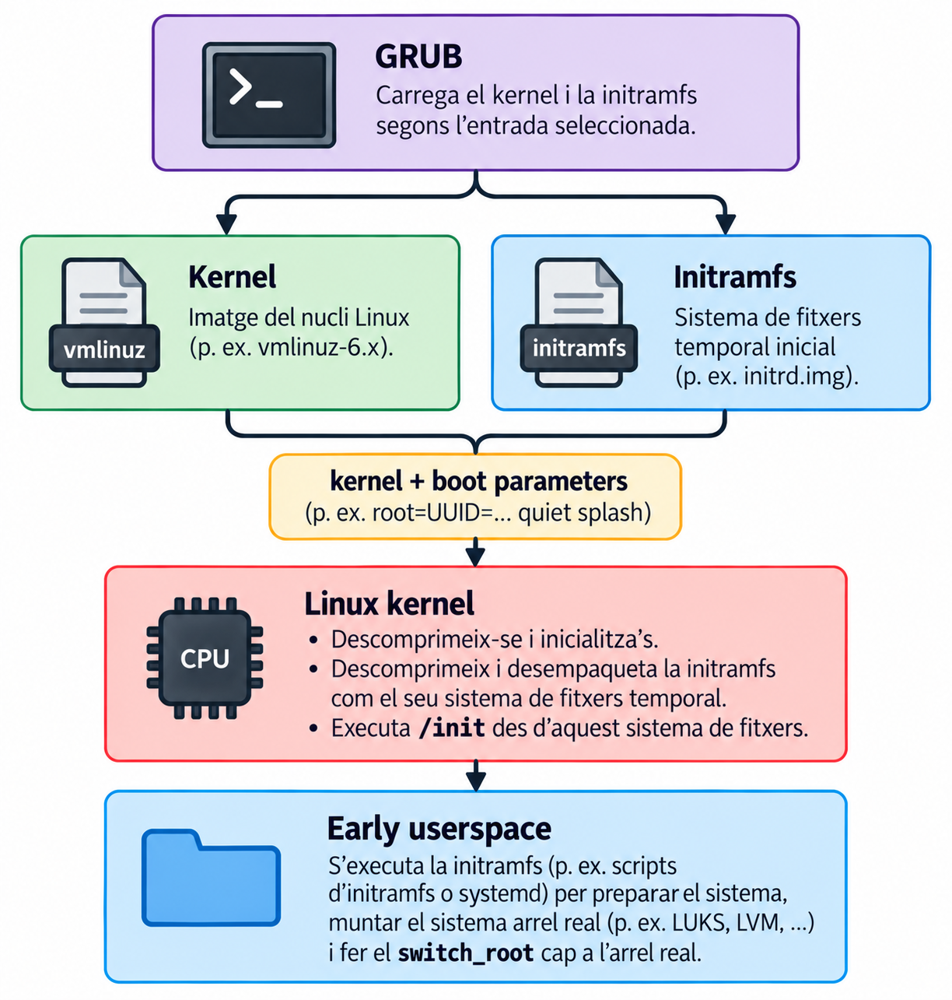{fig-align="center" height="700px" fig-alt="GRUB carrega el kernel (vmlinuz) i la initramfs segons l'entrada seleccionada, i els passa junts com «kernel + boot parameters» (p. ex. root=UUID=... quiet splash). El Linux kernel es descomprimeix i s'inicialitza, descomprimeix i desempaqueta la initramfs com el seu propi sistema de fitxers temporal, i executa /init des d'aquest sistema de fitxers. A l'early userspace s'executa la initramfs (scripts d'initramfs o systemd) per preparar el sistema, muntar el sistema arrel real (p. ex. amb LUKS, LVM) i fer el switch_root cap a l'arrel real."}

::: {.center .fragment}
**El bootloader prepara la informació necessària i transfereix l'execució al kernel.**
:::


## Però el kernel encara no té el seu `/`

Per arribar a l'espai d'usuari normal, el kernel necessita disposar d'un sistema de fitxers arrel real.

:::{.reflexio}
On és el disc? Quin controlador? LVM? RAID? LUKS?
:::

::: {.reflexio}
El kernel necessita controladors i informació per muntar `/`. Però aquests controladors solen ser mòduls... que viuen a `/`. Com se soluciona?
:::


## Què és l'initramfs?

::: {.definicio title="initramfs"}
Un sistema de fitxers temporal, carregat a **RAM**, que dona al kernel un entorn mínim per preparar l'accés a l'arrel real.
:::

::: {.errorcomu}
Normalment és un **fitxer separat** a `/boot` (per exemple `/boot/initrd.img-6.x`), que GRUB carrega junt amb el kernel. Només en casos concrets (nuclis a mida, sistemes encastats) va **incrustat** dins del mateix binari del kernel, amb l'opció de compilació `CONFIG_INITRAMFS_SOURCE`.
:::


## Per què existeix?

::::::: columns
:::::: {.column width="40%"}
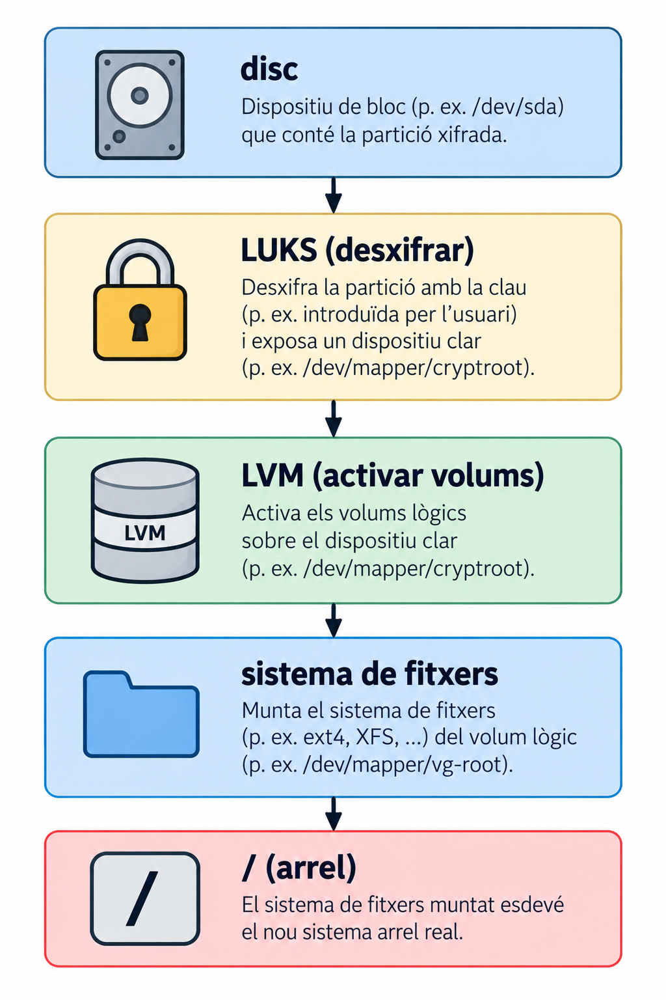{width="100%" fig-alt="Disc: dispositiu de bloc (p. ex. /dev/sda) que conté la partició xifrada. LUKS desxifra la partició amb la clau i exposa un dispositiu clar (p. ex. /dev/mapper/cryptroot). LVM activa els volums lògics sobre el dispositiu clar. El sistema de fitxers (p. ex. ext4, XFS) es munta des del volum lògic (p. ex. /dev/mapper/vg-root). L'arrel (/): el sistema de fitxers muntat esdevé el nou sistema arrel real."}
::::::

:::::: {.column width="60%"}
::: {.concepte}
Per arribar a `/` sovint calen passos que el kernel compilat per defecte **no pot fer sol**: desbloquejar un disc xifrat, activar volums LVM, carregar el controlador correcte. L'initramfs és l'entorn on es fan aquests passos.
:::
::::::
:::::::


## Què conté l'initramfs?

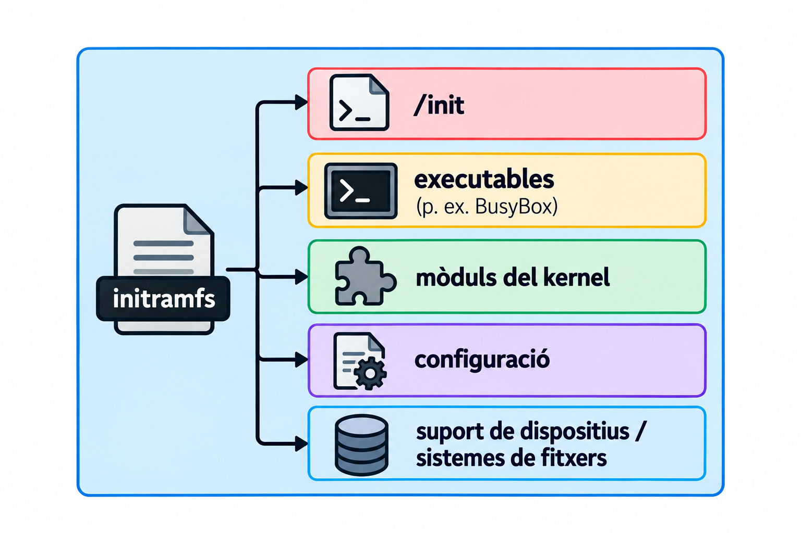{fig-align="center" width="100%" fig-alt="initramfs: sistema de fitxers temporal amb /init (script d'arrencada), /bin, /sbin, /lib, /lib64, /usr, /etc, /proc, /sys, /dev. Conté controladors de maquinari (mòduls del kernel) i eines d'espai d'usuari per preparar l'accés a l'arrel real."}

::: {.concepte}
És un sistema de fitxers temporal que proporciona un entorn *d'early userspace* per preparar i muntar el sistema arrel real.
:::


## Què fa l'initramfs?

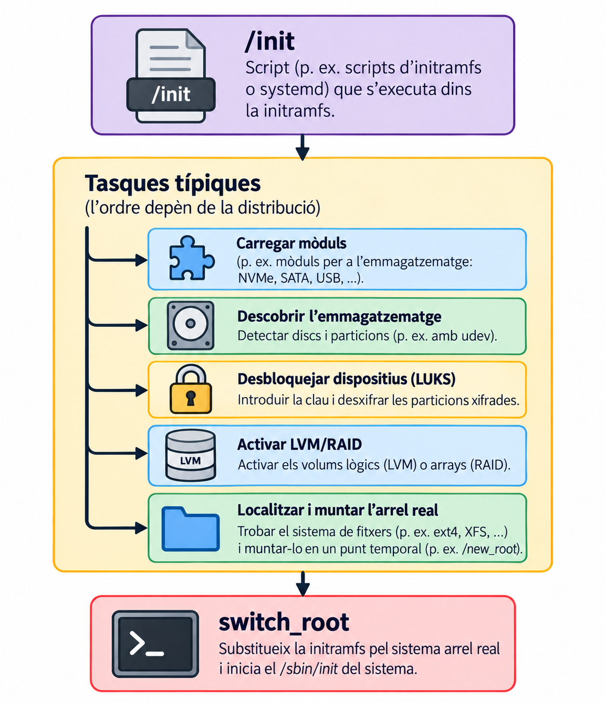{fig-align="center" height="750px" fig-alt="/init és un script (d'initramfs-tools o systemd) que s'executa dins la initramfs. Fa un seguit de tasques típiques, l'ordre de les quals depèn de la distribució: carregar mòduls (p. ex. emmagatzematge NVMe, SATA, USB), descobrir l'emmagatzematge (detectar discs i particions, p. ex. amb udev), desbloquejar dispositius amb LUKS, activar LVM/RAID, i localitzar i muntar l'arrel real en un punt temporal (p. ex. /new_root). Finalment, switch_root substitueix la initramfs pel sistema arrel real i inicia el /sbin/init del sistema."}


## `switch_root`

$$ \text{initramfs} \xrightarrow{\text{switch_root}} \text{sistema de fitxers arrel real} \rightarrow \text{/} $$


::: {.concepte}
`switch_root` està dissenyat per substituir l'arrel inicial de l'initramfs per l'arrel real, un cop aquesta ja està muntada.
:::

::: {.center .fragment}
`pivot_root` ≠ `switch_root`
:::


## `initramfs-tools` vs `dracut`

| | Debian/Ubuntu | Fedora/RHEL |
|:--|:--|:--|
| eina | `initramfs-tools` | `dracut` |
| regenerar | `update-initramfs -u -k <versió>` | `dracut -f /boot/initramfs-<v>.img <v>` |

::: {.bonapractica}
Regenereu l'initramfs sempre que: instal·leu un kernel nou, canvieu la configuració de RAID, o modifiqueu el xifrat de disc (LUKS). Si no, l'initramfs pot no tenir el controlador o la clau que necessita l'arrencada següent.
:::


## Cas d'ús: desbloquejar el `root` durant l'arrencada

::::::: columns
:::::: {.column width="38%"}
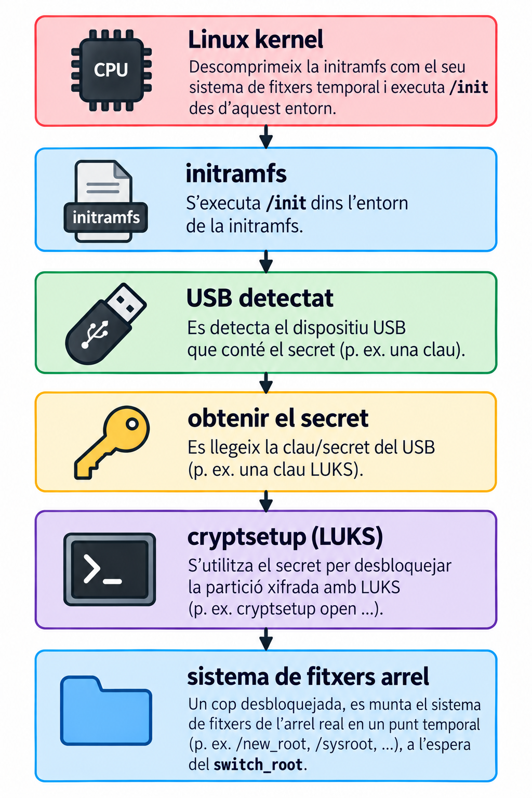{width="100%" fig-alt="El kernel Linux descomprimeix la initramfs com el seu sistema de fitxers temporal i executa /init des d'aquest entorn. Dins la initramfs s'executa /init. Es detecta el dispositiu USB que conté el secret. S'obté el secret llegint la clau del USB. cryptsetup fa servir el secret per desbloquejar la partició xifrada amb LUKS. Un cop desbloquejada, es munta el sistema de fitxers de l'arrel real en un punt temporal (p. ex. /new_root, /sysroot), a l'espera del switch_root."}
::::::

:::::: {.column width="62%"}
<details>
<summary>Exemple</summary>

```bash
#!/bin/busybox sh
mount -t proc  proc /proc
mount -t sysfs sys  /sys
# ... muntar el dispositiu USB, llegir la clau,
#     cryptsetup luksOpen, activar LVM, muntar l'arrel ...
```

</details>
::::::
:::::::


## `/sbin/init` → systemd

$$
\text{/sbin/init} \xrightarrow{\text{symlink}} \text{systemd (PID 1)} \xrightarrow{\text{inicialitza targets, serveis i login}} \text{getty / display manager} \xrightarrow{\text{login}} \text{usuari}
$$


::: {.concepte}
`systemd` s'executa com a **PID 1**: és el primer procés de l'espai d'usuari, i tots els altres en són descendents (directes o indirectes). *En el sistema Linux normal, systemd és PID 1 i actua com a pare/reparellador dels processos que queden orfes*.
:::


## On s'ha trencat?

| Símptoma | Etapa probable |
|:--|:--|
| `No bootable device` | firmware / suport d'arrencada |
| `grub rescue>` | GRUB / sistema de fitxers / configuració |
| *Kernel panic* | kernel / initramfs / arrel |
| Mode d'emergència (`emergency.target`) | systemd / sistema de fitxers / serveis |

::: {.reflexio}
Tres preguntes ràpides:

-   Si veieu `grub rescue>`, hem arribat al kernel? **No.**
-   Si veieu un *kernel panic*, hem passat GRUB? **Sí.**
-   Si arribem a `emergency.target`, el firmware encara té el control? **No.**
:::


## El mapa complet

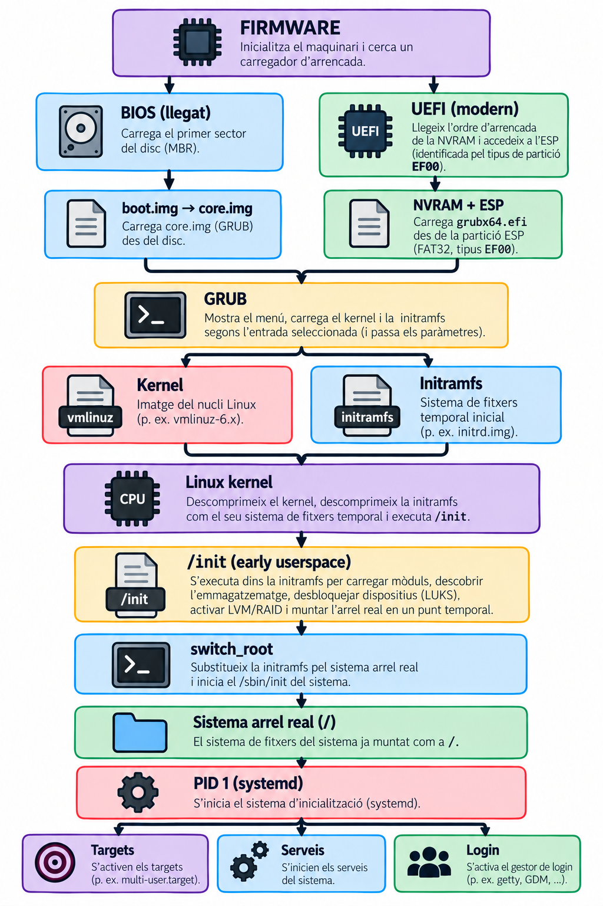{fig-align="center" height="850px" fig-alt="Firmware inicialitza el maquinari i cerca un carregador d'arrencada. BIOS (llegat) carrega el primer sector del disc (MBR) i boot.img carrega core.img (GRUB) des del disc. UEFI (modern) llegeix l'ordre d'arrencada de la NVRAM i accedeix a l'ESP, identificada pel tipus de partició EF00; NVRAM + ESP carrega grubx64.efi des de la partició ESP (FAT32, tipus EF00). Les dues branques convergeixen a GRUB, que mostra el menú, carrega el kernel i la initramfs segons l'entrada seleccionada i passa els paràmetres. El Linux kernel descomprimeix el kernel, descomprimeix la initramfs com el seu sistema de fitxers temporal i executa /init. /init (early userspace) s'executa dins la initramfs per carregar mòduls, descobrir l'emmagatzematge, desbloquejar dispositius amb LUKS, activar LVM/RAID i muntar l'arrel real en un punt temporal. switch_root substitueix la initramfs pel sistema arrel real i inicia el /sbin/init del sistema. El sistema de fitxers del sistema ja queda muntat com a arrel. PID 1 (systemd) inicia el sistema d'inicialització, que activa els targets, inicia els serveis i activa el gestor de login."}

::: {.center .fragment}
**Cada etapa resol un problema que la següent encara no pot resoldre per si mateixa.**
:::


## Resum

::::: {.resum title="Les preguntes de l'inici"}
::: nonincremental
-   **MBR/GPT vs. BIOS/UEFI:** esquemes de particions i firmware són dos eixos independents. L'ESP (`EF00`) i la BIOS boot partition (`EF02`) són particions amb funcions diferents, no *flags d'arrencada*.
-   **GRUB:** el mateix bootloader, dos contractes diferents (`boot.img`/`core.img` en BIOS; `grubx64.efi` a l'ESP en UEFI). `grub.cfg` es genera, no s'edita.
-   **El kernel:** `vmlinuz` no és un ELF genèric; segueix el seu propi *Linux/x86 boot protocol*. GRUB carrega kernel **i** initramfs abans de cedir el control.
-   **L'initramfs:** normalment un fitxer separat que dona al kernel un entorn mínim (mòduls, LUKS, LVM) per arribar a l'arrel real, amb `switch_root`.
-   **systemd:** PID 1, l'arrel de tots els processos posteriors, fins al `login`.
:::
:::::
