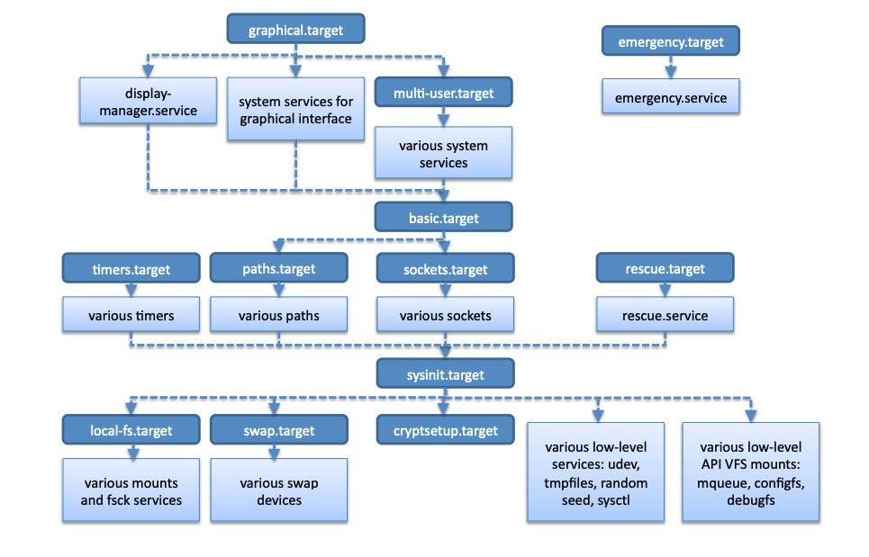
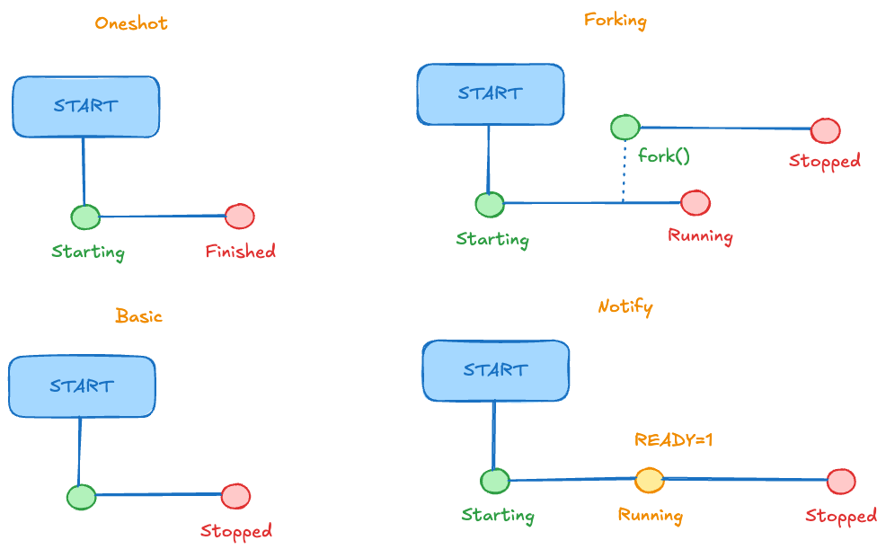

## Del kernel a l'espai d'usuari: PID 1

Quan el kernel ha descomprimit l'initramfs, l'executa i en llança el programa `/init` **com a procés amb PID 1**: és el primer procés de l'espai d'usuari.

::: columns
::: {.column width="50%"}
-   L'`/init` de l'initramfs prepara el sistema d'arxius arrel real (controladors, LUKS, LVM, `fsck`...) i el munta.
-   Després **es substitueix a si mateix** pel *init* definitiu:

``` bash
exec switch_root /mnt /sbin/init
```
:::

::: {.column width="50%"}
-   `switch_root` allibera l'initramfs, canvia l'arrel a la partició real i executa `/sbin/init`.
-   Gràcies a `exec`, el **PID no canvia**: el PID 1 de l'initramfs i el de systemd són el mateix procés, amb un programa diferent.
-   A Debian, `/sbin/init` és un enllaç simbòlic a `systemd`.
:::
:::

::: notes
La ruta de l'arrel real depèn del generador d'initramfs: `/root` a *initramfs-tools* (Debian), `/sysroot` a *dracut* (RHEL/Fedora). Aquí fem servir `/mnt` només com a exemple.

Error comú que cal desmuntar: «el kernel passa el control a systemd i deixa de gestionar processos». No és cert: el kernel continua planificant tots els processos. El que passa és que el primer procés de l'espai d'usuari canvia de programa.
:::

## Comprovem-ho: el PID 1 al sistema

``` bash
ps -o pid,ppid,comm -p 1
ls -l /sbin/init
pstree -p | head -n 5
```

::: {.nonincremental}
-   Mostra que el procés amb PID 1 és `systemd` i que el seu pare (PPID) és 0: el kernel.
-   `/sbin/init` apunta a `systemd`, però el nom `init` es conserva per compatibilitat.
-   `pstree` mostra l'arbre de processos que penja del PID 1.
:::

## Funcions del PID 1

::: columns
::: {.column width="50%"}
1.  **Inicialització de l'espai d'usuari**: arrenca serveis i dimonis en l'ordre i en paral·lel segons les dependències.
2.  **Arrel de l'arbre de processos**: tots els altres processos en pengen, directament o indirectament.
:::

::: {.column width="50%"}
3.  **Recollir orfes**: quan un procés pare mor, el **kernel** reassigna els fills al PID 1. Aquest ha de fer `wait()` quan acabin; si no, queden com a *zombies*.
4.  **Apagat i reinici**: coordina l'aturada ordenada dels serveis, el desmuntatge dels sistemes d'arxius i l'ordre final al kernel.
:::
:::

::: {.callout-warning title="El PID 1 no pot morir"}
Si el PID 1 acaba, el kernel entra en *panic*. Per això és un programa petit, estable i protegit.
:::

## systemd vs SysVinit

El canvi de **SysVinit** a [**systemd**](https://systemd.io/) a la majoria de distribucions va respondre a la necessitat de reduir el temps d'arrencada i de gestionar millor els serveis.

::::: columns
::: {.column width="45%"}
#### SysVinit

-   **Seqüencial**: scripts shell a `/etc/rc?.d/` executats un darrere l'altre (`S##nom`, `K##nom`). L'ordre és numèric, no declaratiu.
-   **Simple**: cada servei és un script llegible i modificable.
-   **Sense supervisió**: no sap si un servei ha mort, no el reinicia, no controla els processos que ha creat.
:::

::: {.column width="55%"}
#### systemd

-   **Paral·lelisme**: dependències declaratives i *socket activation* permeten arrencar molts serveis alhora.
-   **Unitats** (*unit files*) declaratives: dependències, ordre, condicions de reinici...
-   **cgroups**: cada servei té el seu grup de processos i es poden limitar els seus recursos.
-   **journald**: registres estructurats, consultables amb `journalctl`.
:::
:::::

## Crítiques a systemd

-   **Abast i complexitat**: és un projecte que inclou molts components (`journald`, `logind`, `networkd`, `resolved`, `timers`...). Cada component és un binari i un procés separat, però evolucionen acoblats i el PID 1 és el *manager* que els coordina.
-   **Filosofia Unix**: eines petites i composables enfront d'un conjunt d'eines integrades.
-   **Dependència**: molts paquets assumeixen systemd, cosa que dificulta alternatives (SysVinit, OpenRC, runit).

::: fragment
#### El debat

-   **Defensors**: unifica en un sol lloc el que abans calien moltes eines i scripts heterogenis.
-   **Crítics**: massa intrusiu; redueix la flexibilitat en entorns mínims o per a administradors avançats.
:::

## Cas d'estudi: la porta del darrere d'XZ Utils (I)

**CVE-2024-3094** (CVSS 10.0). Una porta del darrere deliberada a la llibreria **liblzma**, dins de `xz-utils`, que permetia execució remota de codi a través de `sshd`.

| Data | Esdeveniment |
|------------|------------------------------------------------------|
| 2021 | Un compte (*JiaT75*) comença a contribuir a `xz` i a altres projectes. |
| 2022 | Comptes sense historial pressionen el mantenidor, Lasse Collin, perquè cedeixi la gestió. |
| 2023 | JiaT75 és co-mantenidor i signa *releases*. |
| feb.-març 2024 | Versions **5.6.0** i **5.6.1** amb el codi maliciós. |
| 29 març 2024 | Andres Freund ho descobreix i ho publica a la llista *oss-security*. |

::: notes
Insistir que NO és una vulnerabilitat (un error accidental) sinó codi introduït expressament: és un atac a la **cadena de subministrament** (*supply chain*). Les dates i detalls s'han de contrastar amb l'avís original d'Andres Freund i amb [l'entrada del NVD](https://nvd.nist.gov/vuln/detail/CVE-2024-3094).
:::

## Cas d'estudi: XZ Utils (II) — com funcionava

::: columns
::: {.column width="45%"}
``` text
sshd  (amb pegat de distribució)
 └─ libsystemd.so
     └─ liblzma.so   ← codi maliciós
```

-   L'**OpenSSH original no enllaça amb `libsystemd`**. Debian i Fedora ho feien per poder cridar `sd_notify`.
-   `libsystemd` depenia de `liblzma`, de manera que `sshd` acabava carregant-la.
:::

::: {.column width="55%"}
-   **Injecció**: el payload era a fitxers de prova binaris del repositori. L'script de compilació que l'extreia només era als *tarballs* de release, no a git.
-   **Condicions**: només s'activava en compilar paquets `.deb`/`.rpm` per a x86-64 Linux amb glibc i GCC.
-   **Execució**: en carregar-se, interceptava la funció criptogràfica `RSA_public_decrypt` d'`sshd`.
-   **Activació**: només si el certificat estava signat amb la clau privada Ed448 de l'atacant; llavors executava ordres amb els privilegis de `sshd`.
:::
:::

## Cas d'estudi: XZ Utils (III) — lliçons

::: columns
::: {.column width="50%"}
-   **No era un defecte de systemd ni d'OpenSSH**. El vector va ser una combinació de dependències transitives que una distribució va afegir per comoditat.
-   **Confiança en els mantenidors**: l'enginyeria social contra persones pot ser un atac tan eficaç com un exploit.
-   **Codi font ≠ tarball de release**: el que es compila pot no coincidir amb el que es revisa a git.
:::

::: {.column width="50%"}
-   **Minimitzar dependències**: `sd_notify` és un missatge trivial, i no calia carregar tota una llibreria per enviar-lo.
-   **Detecció per casualitat**: una anomalia de rendiment (≈500 ms més per iniciar sessió SSH) va delatar l'atac.
-   **Abast limitat**: va afectar versions de desenvolupament (Debian *sid*/*testing*, Fedora Rawhide...). Debian *stable* (bookworm, `xz-utils` 5.4.x) no es va veure afectat.
:::
:::

::: {.callout-note title="Activitat (5 minuts)" .nonincremental}
Al Debian de laboratori, comprova la versió i la cadena de dependències d'`sshd`:

``` bash
dpkg -s xz-utils | grep '^Version'
ldd /usr/sbin/sshd | grep -E 'libsystemd|liblzma'
```

Per què carrega `sshd` la llibreria `liblzma`?
:::

## Executar els targets (o *runlevels*)

El PID 1 activa un **target**: una unitat que agrupa unitats i defineix un estat del sistema (equivalent als *runlevels* de SysVinit).

::: columns
::: {.column width="55%"}
-   **default.target**: enllaç al target d'arrencada per defecte (*graphical* o *multi-user*).
-   **graphical.target**: entorn gràfic (*runlevel* 5).
-   **multi-user.target**: multiusuari sense entorn gràfic, habitual en servidors (*runlevel* 3).
-   **rescue.target**: consola de rescat amb els sistemes d'arxius muntats (*runlevel* 1).
-   **emergency.target**: el mínim imprescindible; arrel en mode lectura.
-   **poweroff.target**, **reboot.target**: apagada i reinici.
:::

::: {.column width="45%"}
``` bash
# Quin és el target per defecte?
systemctl get-default

# Canviar el target per defecte
# (afecta a les PROPERES arrencades)
sudo systemctl set-default multi-user.target

# Passar ara a un altre target
# (afecta al sistema EN EXECUCIÓ)
sudo systemctl isolate rescue.target
```
:::
:::

::: notes
Confusió habitual: `set-default` no canvia l'estat actual i `isolate` no és persistent.
:::

## Unitats de systemd

Una **unitat** és un recurs que systemd gestiona, descrit en un fitxer de configuració.

| Directori | Ús |
|-----------------------|-------------------------------------------|
| `/etc/systemd/system/` | Fitxers de l'administrador (màxima prioritat). |
| `/run/systemd/system/` | Unitats transitòries; es perden en reiniciar. |
| `/usr/lib/systemd/system/` | Fitxers dels paquets de la distribució. A Debian: `/lib/systemd/system/`. |

::: {.fragment}
Si dues unitats tenen el mateix nom, **guanya la del directori de més amunt** a la taula: `/etc` s'imposa a `/usr/lib`.
:::

::: {.fragment}
Per modificar una unitat dels paquets sense tocar-ne l'original, fes servir un *drop-in*: `sudo systemctl edit <unitat>`. Per veure la configuració efectiva: `systemctl cat <unitat>`.
:::

::: {.fragment style="text-align:center"}
Després de canviar fitxers d'unitat a mà, executa `sudo systemctl daemon-reload`.
:::

## Tipus d'unitats

::: columns
::: {.column width="50%"}
-   **Service** (`.service`): defineix com s'inicia, s'atura i es supervisa un servei. Ex.: `ssh.service` (a Debian; `sshd.service` n'és un àlies).
-   **Socket** (`.socket`): sockets d'escolta que poden activar un servei.
-   **Device** (`.device`): dispositius detectats per udev.
-   **Mount** / **Automount**: punts de muntatge.
:::

::: {.column width="50%"}
-   **Path** (`.path`): activa unitats quan canvia un fitxer o directori.
-   **Timer** (`.timer`): activa unitats en moments determinats (alternativa a `cron`).
-   **Target** (`.target`): agrupa unitats en estats del sistema.
-   **Slice** / **Scope**: organitzen processos en *cgroups*.
:::
:::

## Targets i systemd

::: {style="text-align:center"}

:::

## Exemple de fitxer d'unitat

Fitxer simplificat del servei **CUPS** (*Common Unix Printing System*):

::: columns
::: {.column width="50%"}
``` ini
[Unit]
Description=CUPS Scheduler
Documentation=man:cupsd(8)
After=network.target

[Service]
ExecStart=/usr/sbin/cupsd -l
Type=notify

[Install]
Also=cups.socket cups.path
WantedBy=printer.target
```
:::

::: {.column width="50%"}
-   `After=network.target`: **ordre**, no dependència. Si el target de xarxa no és a la transacció, CUPS no el demana.
-   `Type=notify`: CUPS avisa systemd quan està llest.
-   `Also=`: en fer `enable`/`disable` d'aquesta unitat, també s'habiliten/deshabiliten `cups.socket` i `cups.path`.
-   `WantedBy=printer.target`: en habilitar-la es crea un enllaç a `printer.target.wants/`.
:::
:::

::: notes
`printer.target` és un target passiu: no s'activa per defecte, el sol·liciten altres unitats quan és necessari (p. ex. la detecció d'una impressora). A la pràctica CUPS sol arrencar per **socket activation** a través de `cups.socket`; per això la unitat sencera de Debian també declara `Requires=cups.socket`.
:::

## Socket activation

::: columns
::: {.column width="50%"}
systemd pot **crear i escoltar el socket** abans que el servei estigui en marxa.

1.  systemd obre el socket (p. ex. `cups.socket`).
2.  Els clients ja poden connectar-s'hi: el kernel acumula les connexions pendents.
3.  Quan arriba la primera, systemd arrenca el servei i li **passa el socket ja obert**.
:::

::: {.column width="50%"}
**Avantatges**

-   Arrencada més paral·lela: el client no ha d'esperar que el servidor estigui llest.
-   Els serveis rarament utilitzats només s'engeguen quan cal.
-   Reiniciar el servei no perd les connexions pendents.

``` bash
systemctl list-sockets
```
:::
:::

## Dependències entre unitats

Les dependències es declaren a la secció `[Unit]`. Cada tipus d'unitat n'afegeix algunes per defecte.

-   **Requires=**: dependència forta. Si la unitat requerida no s'arrenca amb èxit, aquesta tampoc. Si s'atura la requerida, també s'atura aquesta.
-   **Wants=**: dependència feble. Intenta arrencar l'altra, però ignora el seu fracàs. És la que s'ha de preferir per defecte.
-   **Requisite=**: la unitat ja ha d'estar activa; si no, falla immediatament.
-   **BindsTo=**: com `Requires=`, però si l'altra queda inactiva per qualsevol motiu, aquesta s'atura.
-   **PartOf=**: només propaga aturades i reinicis del pare al fill.
-   **Conflicts=**: dues unitats no poden estar actives alhora; arrencar una atura l'altra.
-   **After=** / **Before=**: només defineixen l'**ordre** d'arrencada (i l'invers en aturar). No creen cap dependència.

::::::: columns 
:::::: {.column width="30%" .fragment}

::: {.callout-important title="Requeriment i ordre són independents"}
`Requires=B` **sense** `After=B` arrenca A i B **en paral·lel**.
:::

:::
::: {.column width="70%" .fragment}
| Declaració a A | Resultat |
|--------------------|----------------------------------------------------|
| `Requires=B` + `After=B` | B s'arrenca primer; A només si B funciona. |
| `Requires=B` | A i B s'arrenquen alhora. |
| `After=B` | Cap dependència: ordena només si les dues ja són a la transacció. |

:::
:::

## Transaccions a systemd

Quan es demana una acció (p. ex. `systemctl start ssh`), systemd construeix una **transacció**: un conjunt de feines (*jobs*) coherent, que es valida abans de tocar res.

1.  **Creació**: una feina per a la unitat demanada (*anchor job*) i, recursivament, per a les seves dependències.
2.  **Fusió**: les feines sobre la mateixa unitat es combinen si són compatibles; si no, la transacció falla.
3.  **Eliminació de redundants**: es descarten feines sense efecte (p. ex. `start` d'una unitat ja activa).
4.  **Verificació de l'ordre**: amb `After=`/`Before=` es construeix un graf. Un **cicle** impedeix trobar un ordre vàlid; systemd intenta trencar-lo eliminant una feina no essencial (ho registra al *journal*) i, si no pot, la transacció falla.
5.  **Activació**: les feines s'encuen i s'executen en paral·lel respectant l'ordre.

::: fragment
La validació prèvia fa que la transacció sigui **tot o res**: o es pot executar de forma coherent, o no s'encua cap feina.
:::

::: notes
L'ordre i el detall exactes dels passos es poden consultar a `src/core/transaction.c` del codi font de systemd. `systemctl list-jobs` només mostra feines en curs; a l'arrencada o amb serveis lents és quan és útil. Per detectar cicles en unitats pròpies: `systemd-analyze verify <fitxer>`.
:::

## `systemctl` (I): gestió de serveis 

Les accions que modifiquen l'estat requereixen privilegis (`sudo`); les de consulta, no.

| Comanda | Descripció |
|-----------------------------|-------------------------------------------|
| `systemctl status <unit>` | Estat, darreres línies del *journal* i arbre de processos (cgroup). |
| `sudo systemctl start <unit>` / `stop` | Arrenca / atura ara. |
| `sudo systemctl restart <unit>` | Atura i torna a arrencar. |
| `sudo systemctl reload <unit>` | Torna a llegir la configuració sense aturar (si el servei ho suporta). |
| `sudo systemctl enable <unit>` | Crea els enllaços de `[Install]`: arrencarà **a la propera arrencada**. No l'arrenca ara. |
| `sudo systemctl enable --now <unit>` | Habilita i arrenca alhora. |
| `sudo systemctl disable <unit>` | Elimina els enllaços de `[Install]`. |
| `sudo systemctl mask <unit>` | Enllaça la unitat a `/dev/null`: ni manual ni per dependència. |

## `systemctl` (II): consulta

| Comanda | Descripció |
|-----------------------------|-------------------------------------------|
| `systemctl is-active <unit>` | Comprova si està activa. |
| `systemctl is-enabled <unit>` | Comprova si arrencarà automàticament. |
| `systemctl list-units` | Unitats carregades actualment. |
| `systemctl list-unit-files` | Fitxers d'unitat disponibles i el seu estat d'habilitació. |
| `systemctl list-dependencies <unit>` | Arbre de dependències d'una unitat. |
| `systemctl list-jobs` | Feines pendents o en execució. |
| `systemctl --failed` | Unitats que han fallat. |
| `systemctl cat <unit>` | Mostra el fitxer d'unitat (amb els *drop-ins*). |

## Diagnosi de l'arrencada

::: columns
::: {.column width="50%"}
``` bash
# Quant ha trigat l'arrencada?
systemd-analyze

# Quines unitats han trigat més?
systemd-analyze blame

# Cadena crítica de l'arrencada
systemd-analyze critical-chain
```
:::

::: {.column width="50%"}
``` bash
# Què ha fallat?
systemctl --failed

# Registres d'aquesta arrencada
journalctl -b

# Només errors o pitjor
journalctl -b -p err

# Registres d'un servei
journalctl -u ssh.service
```
:::
:::

::: {.nonincremental}
Per veure el *journal* del sistema cal ser `root` o pertànyer als grups `adm` o `systemd-journal`.
:::

## Exemple mínim: el nostre primer servei

``` bash
sudo tee /etc/systemd/system/hola.service > /dev/null <<'EOF'
[Unit]
Description=Servei d'exemple: escriu un missatge al journal

[Service]
Type=oneshot
ExecStart=/usr/bin/logger -t hola "Hola des de systemd"

[Install]
WantedBy=multi-user.target
EOF
```

::: {.nonincremental}
-   Es fa servir `sudo tee` perquè la redirecció `>` s'executa amb els privilegis de l'usuari, no els de `sudo`.
-   `<<'EOF'` (amb cometes) evita que el shell interpreti el contingut.
-   `Type=oneshot`: el servei fa una feina i acaba.
:::

## Prova i errors comuns

::: columns
::: {.column width="50%"}
``` bash
sudo systemctl daemon-reload
sudo systemctl start hola.service
systemctl status hola.service
journalctl -t hola -n 3
sudo systemctl enable hola.service
```

:::
::: {.column width="50%"}

::: {.nonincremental}
**Errors típics**

-   Oblidar `daemon-reload` després d'editar el fitxer.
-   Confondre `enable` (futur) amb `start` (ara).
-   Esperar que `status` mostri «active» en un `oneshot`: després d'acabar queda *inactive (dead)* si no hi ha `RemainAfterExit=yes`.
-   Confondre `reload` amb `restart`.
:::

:::
:::

## La secció `[Install]`

``` ini
[Install]
WantedBy=multi-user.target
Also=sysstat-collect.timer
Also=sysstat-summary.timer
Alias=monitoring.service
```

-   `[Install]` només s'utilitza per `enable` i `disable`; systemd no la llegeix per arrencar la unitat.
-   `WantedBy=multi-user.target`: en habilitar-la es crea un enllaç a `multi-user.target.wants/`; arrencarà amb el target multiusuari (*runlevel* 3).
-   `Also=`: en habilitar-la, s'habiliten també les unitats indicades.
-   `Alias=`: nom alternatiu (enllaç simbòlic) amb el mateix tipus d'unitat.

## Opcions de `[Service]` (I) 

| Opció | Descripció |
|--------------------------|----------------------------------------------|
| `Type=` | Quan es considera iniciat el servei: `simple`, `exec`, `forking`, `oneshot`, `notify`, `dbus`, `idle`. |
| `ExecStart=` | Comanda que inicia el servei. |
| `ExecStop=` | Comanda que l'atura (si no, es fa servir `SIGTERM`). |
| `ExecReload=` | Comanda que en recarrega la configuració. |
| `RemainAfterExit=` | Manté la unitat com a activa després que el procés acabi (típic en `oneshot`). |
| `Restart=` | Quan es reinicia: `no`, `on-failure`, `always`... |
| `User=` / `Group=` | Usuari i grup amb què s'executa. |

## Opcions de `[Service]` (II) 

| Opció               | Descripció                                           |
|-----------------------|-------------------------------------------------|
| `Environment=`      | Variables d'entorn del servei.           |
| `WorkingDirectory=` | Directori de treball.         |
| `PIDFile=`          | Fitxer amb el PID del procés principal; només té sentit amb `Type=forking`.    |
| `TimeoutStartSec=`  | Temps màxim d'arrencada.             |
| `TimeoutStopSec=`   | Temps màxim d'aturada.             |
| `StandardOutput=` / `StandardError=` | On van les sortides; per defecte, al *journal*. |

## Tipus de serveis (I)

-   **simple**: el valor per defecte si hi ha `ExecStart=` i no hi ha `Type=` ni `BusName=`. systemd el considera iniciat tan bon punt crea el procés (`fork()`), sense esperar res més.
-   **exec**: com `simple`, però espera que el binari s'hagi executat (`execve()`); detecta errors com un fitxer inexistent.
-   **forking**: el procés fa `fork()` i el pare surt; el servei es considera iniciat quan el pare acaba. Clàssic dels dimonis tradicionals.
-   **oneshot**: tasca única. Mentre s'executa està *activating*; quan acaba, la unitat torna a *inactive* tret que hi hagi `RemainAfterExit=yes`.

## Tipus de serveis (II)

-   **notify**: el servei envia explícitament a systemd un avís de «llest» (`sd_notify`).
-   **dbus**: es considera iniciat quan el servei ocupa el seu nom al bus D-Bus.
-   **idle**: com `simple`, però retarda l'execució fins que s'han enviat les altres feines (màxim 5 s). S'usa per evitar que la sortida a la consola s'entrelliï.

## Efecte del tipus de servei al *runtime*



## Inici de sessió d'un usuari

Quan s'han carregat els serveis, apareix un punt d'entrada (`getty` a la consola, `sshd` per xarxa, un gestor gràfic).

``` text
getty / sshd  →  login  →  PAM  →  systemd-logind  →  shell de login
```

-   **PAM** autentica i prepara la sessió.
-   **`systemd-logind`** registra la sessió i en gestiona el cicle de vida (`loginctl list-sessions`).
-   Es llança un *shell de login*, que llegeix els fitxers de configuració de l'usuari.

## Fitxers de configuració del shell (bash)

| Tipus de shell | Fitxers que llegeix |
|-----------------------|-------------------------------------------|
| **Login** | `/etc/profile` (que carrega `/etc/profile.d/*.sh`) i el primer que existeixi de `~/.bash_profile`, `~/.bash_login`, `~/.profile`. |
| **Interactiu, no login** | `/etc/bash.bashrc` (Debian; `/etc/bashrc` a RHEL) i `~/.bashrc`. |
| **En tancar un shell de login** | `~/.bash_logout`. |

::: {.nonincremental}
-   A Debian, el `~/.profile` per defecte carrega `~/.bashrc`, i així un shell de login també aplica la configuració personal.
-   `~/.bash_history` és un fitxer de **dades** (l'històric); no s'executa.
:::